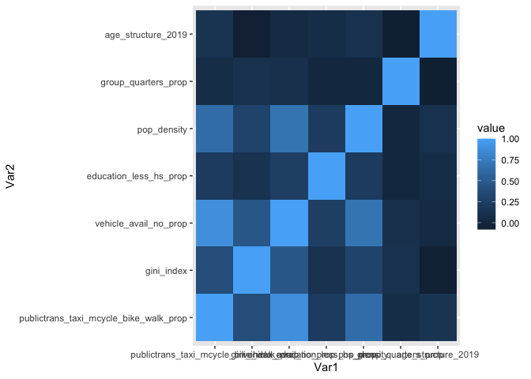
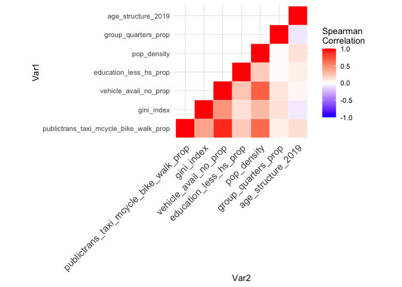
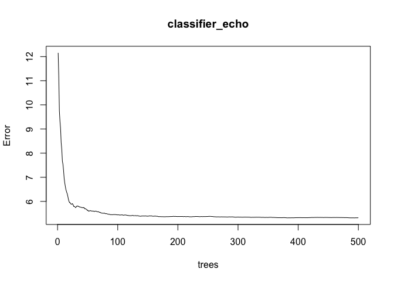
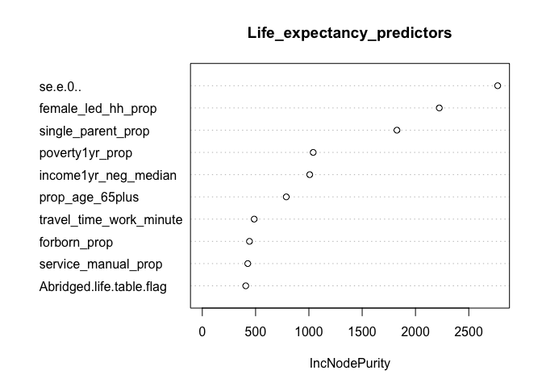
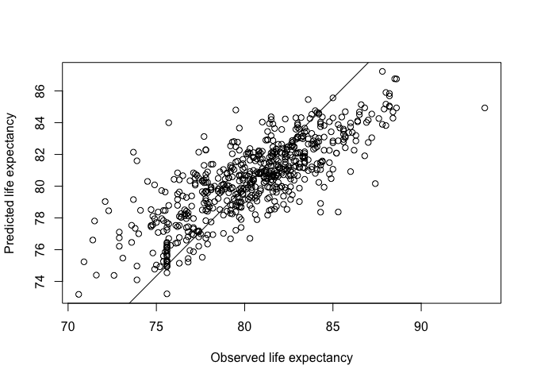

thesis analysis
================
Nhu Nguyen
2024-03-18

``` r
library(tidyverse)
```

    ## ── Attaching core tidyverse packages ──────────────────────── tidyverse 2.0.0 ──
    ## ✔ dplyr     1.1.3     ✔ readr     2.1.4
    ## ✔ forcats   1.0.0     ✔ stringr   1.5.0
    ## ✔ ggplot2   3.4.3     ✔ tibble    3.2.1
    ## ✔ lubridate 1.9.3     ✔ tidyr     1.3.0
    ## ✔ purrr     1.0.2     
    ## ── Conflicts ────────────────────────────────────────── tidyverse_conflicts() ──
    ## ✖ dplyr::filter() masks stats::filter()
    ## ✖ dplyr::lag()    masks stats::lag()
    ## ℹ Use the conflicted package (<http://conflicted.r-lib.org/>) to force all conflicts to become errors

``` r
library(dplyr)
library(janitor)
```

    ## 
    ## Attaching package: 'janitor'
    ## 
    ## The following objects are masked from 'package:stats':
    ## 
    ##     chisq.test, fisher.test

``` r
library(readr)
library(skimr)
```

## loading dataset

``` r
life_expect <- read.csv("/Users/nhunguyen/Desktop/mph_thesis/NYC_A.CSV")
```

``` r
life_expect
```

    ##         Tract.ID STATE2KX CNTY2KX TRACT2KX e.0. se.e.0..
    ## 1    36005000200       36       5      200 84.1   3.2118
    ## 2    36005000400       36       5      400 79.9   1.2545
    ## 3    36005001600       36       5     1600 80.9   1.8034
    ## 4    36005002000       36       5     2000 80.3   2.5833
    ## 5    36005002300       36       5     2300 75.0   1.3207
    ## 6    36005002500       36       5     2500 72.9   1.3746
    ## 7    36005002701       36       5     2701 71.6   1.7400
    ## 8    36005002702       36       5     2702 75.6   1.5453
    ## 9    36005002800       36       5     2800 78.0   1.3217
    ## 10   36005003100       36       5     3100 77.1   2.1819
    ## 11   36005003300       36       5     3300 77.5   2.9852
    ## 12   36005003500       36       5     3500 78.8   3.5915
    ## 13   36005003800       36       5     3800 74.1   3.5019
    ## 14   36005003900       36       5     3900 76.8   1.3407
    ## 15   36005004001       36       5     4001 85.3   3.5987
    ## 16   36005004100       36       5     4100 73.5   1.3528
    ## 17   36005004200       36       5     4200 75.4   1.3697
    ## 18   36005004300       36       5     4300 79.0   2.6594
    ## 19   36005004400       36       5     4400 73.9   1.4264
    ## 20   36005004600       36       5     4600 73.6   3.0846
    ## 21   36005004800       36       5     4800 80.0   2.2584
    ## 22   36005005001       36       5     5001 78.5   2.2230
    ## 23   36005005002       36       5     5002 75.6   1.8264
    ## 24   36005005100       36       5     5100 74.4   1.3771
    ## 25   36005005200       36       5     5200 79.5   3.4118
    ## 26   36005005300       36       5     5300 72.2   1.9131
    ## 27   36005005400       36       5     5400 80.0   2.5018
    ## 28   36005005600       36       5     5600 75.6   0.9381
    ## 29   36005005902       36       5     5902 76.4   1.5350
    ## 30   36005006000       36       5     6000 77.4   2.7494
    ## 31   36005006100       36       5     6100 84.1   2.2287
    ## 32   36005006200       36       5     6200 78.1   2.7842
    ## 33   36005006300       36       5     6300 76.8   1.2675
    ## 34   36005006400       36       5     6400 81.9   3.9820
    ## 35   36005006500       36       5     6500 76.1   1.9936
    ## 36   36005006700       36       5     6700 78.0   2.5589
    ## 37   36005006800       36       5     6800 75.6   1.2627
    ## 38   36005006900       36       5     6900 76.8   1.2393
    ## 39   36005007000       36       5     7000 80.6   3.7150
    ## 40   36005007100       36       5     7100 77.0   2.6384
    ## 41   36005007200       36       5     7200 84.3   3.1541
    ## 42   36005007300       36       5     7300 75.6   1.3431
    ## 43   36005007400       36       5     7400 78.6   2.5331
    ## 44   36005007500       36       5     7500 74.5   1.1711
    ## 45   36005007600       36       5     7600 81.3   2.4677
    ## 46   36005007700       36       5     7700 73.7   3.5823
    ## 47   36005007800       36       5     7800 75.6   1.4127
    ## 48   36005007900       36       5     7900 82.1   3.5458
    ## 49   36005008300       36       5     8300 77.8   2.0655
    ## 50   36005008400       36       5     8400 83.6   2.8616
    ## 51   36005008500       36       5     8500 77.7   2.5661
    ## 52   36005008600       36       5     8600 75.6   1.1033
    ## 53   36005008700       36       5     8700 79.3   2.3050
    ## 54   36005008900       36       5     8900 79.8   2.3603
    ## 55   36005009000       36       5     9000 76.8   1.3241
    ## 56   36005009200       36       5     9200 80.2   2.0698
    ## 57   36005009300       36       5     9300 75.7   1.5442
    ## 58   36005009600       36       5     9600 75.0   1.5497
    ## 59   36005009800       36       5     9800 79.0   1.3371
    ## 60   36005011502       36       5    11502 75.6   1.3105
    ## 61   36005011700       36       5    11700 73.4   3.8235
    ## 62   36005011800       36       5    11800 79.8   1.5398
    ## 63   36005011900       36       5    11900 79.8   2.5284
    ## 64   36005012101       36       5    12101 76.5   2.1716
    ## 65   36005012102       36       5    12102 75.6   2.0389
    ## 66   36005012300       36       5    12300 77.2   1.6902
    ## 67   36005012500       36       5    12500 76.8   1.6616
    ## 68   36005012701       36       5    12701 76.3   2.4510
    ## 69   36005012901       36       5    12901 78.1   3.3008
    ## 70   36005013000       36       5    13000 79.7   1.7373
    ## 71   36005013100       36       5    13100 73.8   1.6897
    ## 72   36005013200       36       5    13200 83.5   3.1252
    ## 73   36005013300       36       5    13300 79.9   2.6301
    ## 74   36005013500       36       5    13500 75.6   1.7243
    ## 75   36005013800       36       5    13800 81.9   2.5948
    ## 76   36005014100       36       5    14100 76.8   1.6260
    ## 77   36005014300       36       5    14300 75.6   2.2785
    ## 78   36005014400       36       5    14400 75.6   1.5119
    ## 79   36005014500       36       5    14500 69.5   1.3651
    ## 80   36005014701       36       5    14701 75.1   3.4828
    ## 81   36005014702       36       5    14702 76.4   3.4103
    ## 82   36005014900       36       5    14900 72.9   1.5589
    ## 83   36005015100       36       5    15100 75.6   1.3864
    ## 84   36005015200       36       5    15200 82.2   1.9194
    ## 85   36005015300       36       5    15300 77.9   2.7172
    ## 86   36005015500       36       5    15500 75.6   1.3079
    ## 87   36005015700       36       5    15700 75.6   2.1922
    ## 88   36005015800       36       5    15800 70.7   1.6815
    ## 89   36005015900       36       5    15900 75.4   1.8188
    ## 90   36005016000       36       5    16000 81.8   1.6892
    ## 91   36005016100       36       5    16100 76.3   1.8311
    ## 92   36005016200       36       5    16200 81.4   0.9132
    ## 93   36005016400       36       5    16400 80.6   1.3363
    ## 94   36005016600       36       5    16600 80.5   2.3945
    ## 95   36005016900       36       5    16900 75.2   3.0008
    ## 96   36005017300       36       5    17300 78.1   3.0358
    ## 97   36005017500       36       5    17500 73.0   2.3994
    ## 98   36005017701       36       5    17701 70.3   1.7484
    ## 99   36005017702       36       5    17702 80.9   3.6085
    ## 100  36005017902       36       5    17902 77.8   3.3833
    ## 101  36005018101       36       5    18101 75.6   2.1533
    ## 102  36005018102       36       5    18102 76.8   1.0779
    ## 103  36005018301       36       5    18301 83.9   2.5886
    ## 104  36005018400       36       5    18400 80.8   1.8068
    ## 105  36005018500       36       5    18500 75.8   1.6799
    ## 106  36005018900       36       5    18900 75.7   1.7545
    ## 107  36005019300       36       5    19300 74.4   1.6794
    ## 108  36005019400       36       5    19400 78.8   1.3490
    ## 109  36005019500       36       5    19500 76.8   1.2891
    ## 110  36005019700       36       5    19700 79.7   3.4059
    ## 111  36005019900       36       5    19900 75.6   1.8736
    ## 112  36005020000       36       5    20000 79.6   2.1205
    ## 113  36005020100       36       5    20100 75.6   1.3814
    ## 114  36005020200       36       5    20200 80.8   3.1063
    ## 115  36005020400       36       5    20400 79.8   2.7805
    ## 116  36005020501       36       5    20501 75.6   1.3094
    ## 117  36005020502       36       5    20502 79.8   3.1769
    ## 118  36005020601       36       5    20601 78.5   1.5202
    ## 119  36005020900       36       5    20900 74.6   1.8627
    ## 120  36005021001       36       5    21001 76.9   0.8641
    ## 121  36005021002       36       5    21002 79.9   1.4679
    ## 122  36005021100       36       5    21100 75.6   1.5323
    ## 123  36005021200       36       5    21200 79.7   2.0888
    ## 124  36005021301       36       5    21301 75.6   3.0542
    ## 125  36005021302       36       5    21302 74.7   1.3223
    ## 126  36005021502       36       5    21502 75.7   2.1104
    ## 127  36005021601       36       5    21601 82.8   3.5027
    ## 128  36005021602       36       5    21602 85.0   3.6693
    ## 129  36005021700       36       5    21700 75.6   1.4133
    ## 130  36005021800       36       5    21800 77.4   1.5374
    ## 131  36005021900       36       5    21900 76.8   1.9966
    ## 132  36005022000       36       5    22000 75.6   2.8617
    ## 133  36005022101       36       5    22101 78.5   3.5190
    ## 134  36005022102       36       5    22102 76.3   1.9220
    ## 135  36005022200       36       5    22200 80.2   2.8425
    ## 136  36005022300       36       5    22300 78.5   3.9021
    ## 137  36005022401       36       5    22401 81.2   2.2822
    ## 138  36005022403       36       5    22403 81.2   2.5722
    ## 139  36005022404       36       5    22404 80.1   2.3345
    ## 140  36005022500       36       5    22500 75.6   1.8782
    ## 141  36005022701       36       5    22701 80.2   3.1374
    ## 142  36005022703       36       5    22703 77.9   3.0074
    ## 143  36005022800       36       5    22800 78.6   1.3822
    ## 144  36005022901       36       5    22901 76.8   1.7242
    ## 145  36005022902       36       5    22902 76.2   3.3516
    ## 146  36005023000       36       5    23000 78.8   1.6982
    ## 147  36005023100       36       5    23100 76.8   2.3221
    ## 148  36005023200       36       5    23200 82.4   2.8461
    ## 149  36005023301       36       5    23301 75.6   1.9640
    ## 150  36005023302       36       5    23302 81.6   3.9854
    ## 151  36005023501       36       5    23501 76.8   2.2769
    ## 152  36005023502       36       5    23502 81.3   2.1357
    ## 153  36005023600       36       5    23600 77.4   1.5865
    ## 154  36005023702       36       5    23702 69.4   3.3019
    ## 155  36005023703       36       5    23703 75.2   2.5669
    ## 156  36005023704       36       5    23704 76.8   2.6032
    ## 157  36005023800       36       5    23800 78.2   2.5164
    ## 158  36005023900       36       5    23900 81.7   3.3188
    ## 159  36005024000       36       5    24000 75.6   1.9430
    ## 160  36005024100       36       5    24100 78.0   2.5740
    ## 161  36005024300       36       5    24300 75.6   1.3909
    ## 162  36005024400       36       5    24400 81.8   2.9441
    ## 163  36005024501       36       5    24501 75.6   2.1910
    ## 164  36005024502       36       5    24502 79.0   3.1665
    ## 165  36005024600       36       5    24600 84.8   2.7300
    ## 166  36005024700       36       5    24700 78.3   2.6411
    ## 167  36005024800       36       5    24800 78.4   1.5819
    ## 168  36005025000       36       5    25000 82.7   2.5333
    ## 169  36005025100       36       5    25100 78.8   3.3435
    ## 170  36005025200       36       5    25200 80.1   1.8636
    ## 171  36005025300       36       5    25300 79.4   3.1427
    ## 172  36005025400       36       5    25400 78.7   0.8760
    ## 173  36005025500       36       5    25500 75.6   1.6364
    ## 174  36005025600       36       5    25600 79.8   3.4547
    ## 175  36005025700       36       5    25700 76.8   1.9515
    ## 176  36005026100       36       5    26100 79.5   2.4094
    ## 177  36005026300       36       5    26300 72.4   1.2070
    ## 178  36005026400       36       5    26400 81.8   1.8091
    ## 179  36005026500       36       5    26500 78.3   2.2895
    ## 180  36005026601       36       5    26601 79.7   1.5315
    ## 181  36005026602       36       5    26602 83.6   2.2750
    ## 182  36005026701       36       5    26701 77.4   2.4744
    ## 183  36005026702       36       5    26702 80.7   2.7301
    ## 184  36005026900       36       5    26900 72.6   1.9594
    ## 185  36005027300       36       5    27300 85.1   3.2438
    ## 186  36005027401       36       5    27401 79.3   2.4426
    ## 187  36005027402       36       5    27402 82.5   1.6730
    ## 188  36005027700       36       5    27700 76.3   1.3814
    ## 189  36005027900       36       5    27900 79.7   1.2148
    ## 190  36005028100       36       5    28100 78.7   1.2896
    ## 191  36005028300       36       5    28300 76.8   2.0552
    ## 192  36005028500       36       5    28500 82.6   2.2598
    ## 193  36005028600       36       5    28600 80.4   1.8001
    ## 194  36005028700       36       5    28700 82.4   2.3623
    ## 195  36005028800       36       5    28800 85.7   2.8079
    ## 196  36005028900       36       5    28900 79.8   1.3146
    ## 197  36005029301       36       5    29301 79.1   1.4648
    ## 198  36005029302       36       5    29302 83.0   1.2842
    ## 199  36005029500       36       5    29500 83.4   2.0250
    ## 200  36005029600       36       5    29600 81.2   1.4036
    ## 201  36005029700       36       5    29700 75.3   1.2498
    ## 202  36005030000       36       5    30000 79.8   1.5581
    ## 203  36005030100       36       5    30100 76.9   1.6589
    ## 204  36005030200       36       5    30200 88.6   3.2369
    ## 205  36005030701       36       5    30701 81.9   1.3736
    ## 206  36005030900       36       5    30900 77.9   1.0395
    ## 207  36005031000       36       5    31000 75.0   1.0896
    ## 208  36005031200       36       5    31200 83.0   2.5995
    ## 209  36005031400       36       5    31400 79.3   1.4152
    ## 210  36005031600       36       5    31600 82.7   2.5753
    ## 211  36005031800       36       5    31800 79.9   1.6249
    ## 212  36005032300       36       5    32300 81.6   1.8449
    ## 213  36005032600       36       5    32600 77.6   2.8070
    ## 214  36005032800       36       5    32800 81.6   2.8060
    ## 215  36005033000       36       5    33000 85.3   3.2910
    ## 216  36005033201       36       5    33201 81.5   1.5143
    ## 217  36005033202       36       5    33202 74.8   1.3572
    ## 218  36005033500       36       5    33500 84.2   2.0064
    ## 219  36005033600       36       5    33600 75.9   1.2922
    ## 220  36005033700       36       5    33700 82.9   2.0410
    ## 221  36005033800       36       5    33800 76.8   1.5581
    ## 222  36005034000       36       5    34000 81.9   3.4817
    ## 223  36005034200       36       5    34200 79.2   1.6199
    ## 224  36005034300       36       5    34300 73.4   1.9647
    ## 225  36005034400       36       5    34400 79.9   1.7883
    ## 226  36005034500       36       5    34500 82.8   2.0812
    ## 227  36005034800       36       5    34800 80.7   1.9046
    ## 228  36005035000       36       5    35000 79.0   1.9420
    ## 229  36005035100       36       5    35100 80.1   2.0561
    ## 230  36005035600       36       5    35600 77.6   1.2289
    ## 231  36005035800       36       5    35800 85.2   2.5629
    ## 232  36005035900       36       5    35900 75.6   2.8419
    ## 233  36005036000       36       5    36000 77.4   1.6855
    ## 234  36005036100       36       5    36100 75.4   1.9755
    ## 235  36005036300       36       5    36300 75.6   1.4233
    ## 236  36005036400       36       5    36400 77.8   2.3597
    ## 237  36005036501       36       5    36501 79.2   3.5005
    ## 238  36005036700       36       5    36700 75.6   1.7831
    ## 239  36005036800       36       5    36800 80.8   2.0070
    ## 240  36005036901       36       5    36901 75.9   2.2334
    ## 241  36005036902       36       5    36902 75.6   1.6471
    ## 242  36005037000       36       5    37000 79.0   1.0962
    ## 243  36005037100       36       5    37100 78.0   2.7139
    ## 244  36005037200       36       5    37200 78.3   1.3282
    ## 245  36005037300       36       5    37300 76.9   1.5588
    ## 246  36005037400       36       5    37400 74.0   1.7697
    ## 247  36005037504       36       5    37504 75.6   1.6703
    ## 248  36005037600       36       5    37600 77.6   2.2881
    ## 249  36005037800       36       5    37800 76.5   1.8517
    ## 250  36005037900       36       5    37900 75.4   3.8232
    ## 251  36005038000       36       5    38000 76.9   1.8040
    ## 252  36005038100       36       5    38100 82.0   2.6406
    ## 253  36005038200       36       5    38200 76.7   1.3920
    ## 254  36005038301       36       5    38301 75.6   2.3233
    ## 255  36005038302       36       5    38302 75.6   1.4268
    ## 256  36005038500       36       5    38500 77.1   2.5535
    ## 257  36005038600       36       5    38600 82.2   2.2982
    ## 258  36005038700       36       5    38700 72.1   3.8471
    ## 259  36005038800       36       5    38800 78.1   1.7352
    ## 260  36005038900       36       5    38900 76.5   2.0627
    ## 261  36005039000       36       5    39000 81.4   3.9455
    ## 262  36005039100       36       5    39100 75.5   2.2200
    ## 263  36005039300       36       5    39300 75.2   1.2899
    ## 264  36005039400       36       5    39400 77.0   1.5385
    ## 265  36005039500       36       5    39500 74.9   2.7265
    ## 266  36005039600       36       5    39600 86.0   3.9502
    ## 267  36005039700       36       5    39700 74.9   1.7644
    ## 268  36005039800       36       5    39800 79.3   3.1174
    ## 269  36005039901       36       5    39901 75.6   1.5204
    ## 270  36005039902       36       5    39902 79.0   2.3143
    ## 271  36005040100       36       5    40100 79.0   2.5694
    ## 272  36005040302       36       5    40302 76.3   1.6156
    ## 273  36005040303       36       5    40303 79.9   3.5518
    ## 274  36005040304       36       5    40304 80.1   3.1570
    ## 275  36005040400       36       5    40400 81.9   2.7249
    ## 276  36005040501       36       5    40501 83.1   3.2332
    ## 277  36005040502       36       5    40502 76.0   3.0237
    ## 278  36005040600       36       5    40600 83.8   3.6023
    ## 279  36005040701       36       5    40701 76.8   2.7386
    ## 280  36005040702       36       5    40702 75.6   1.4046
    ## 281  36005040800       36       5    40800 76.8   1.4353
    ## 282  36005040900       36       5    40900 77.6   1.9971
    ## 283  36005041100       36       5    41100 77.9   2.6599
    ## 284  36005041300       36       5    41300 80.5   1.9032
    ## 285  36005041400       36       5    41400 82.6   2.2548
    ## 286  36005041500       36       5    41500 78.7   2.3305
    ## 287  36005041800       36       5    41800 76.8   1.6144
    ## 288  36005041900       36       5    41900 77.9   1.7069
    ## 289  36005042000       36       5    42000 79.9   2.6692
    ## 290  36005042100       36       5    42100 77.9   1.5175
    ## 291  36005042200       36       5    42200 83.8   3.1107
    ## 292  36005042300       36       5    42300 76.8   1.2205
    ## 293  36005042400       36       5    42400 78.1   2.2032
    ## 294  36005042500       36       5    42500 75.6   2.4839
    ## 295  36005042600       36       5    42600 81.5   2.2301
    ## 296  36005042800       36       5    42800 84.1   3.4202
    ## 297  36005042901       36       5    42901 76.8   1.8663
    ## 298  36005042902       36       5    42902 76.2   1.6887
    ## 299  36005043000       36       5    43000 77.8   1.9720
    ## 300  36005043100       36       5    43100 75.3   1.0341
    ## 301  36005043400       36       5    43400 81.4   1.9821
    ## 302  36005043600       36       5    43600 79.6   2.8953
    ## 303  36005044200       36       5    44200 76.8   1.4302
    ## 304  36005044400       36       5    44400 81.6   3.0123
    ## 305  36005044800       36       5    44800 79.8   1.2892
    ## 306  36005044901       36       5    44901 80.2   2.6901
    ## 307  36005044902       36       5    44902 79.8   2.2441
    ## 308  36005045101       36       5    45101 81.0   2.2289
    ## 309  36005045102       36       5    45102 77.7   1.5993
    ## 310  36005045800       36       5    45800 73.2   1.7074
    ## 311  36005046000       36       5    46000 70.9   1.5236
    ## 312  36005046201       36       5    46201 81.4   0.9574
    ## 313  36005046202       36       5    46202 78.5   1.2794
    ## 314  36005048400       36       5    48400 82.2   2.9859
    ## 315  36005051600       36       5    51600 79.6   1.4440
    ## 316  36047000100       36      47      100 82.3   1.6793
    ## 317  36047000200       36      47      200 76.3   2.3684
    ## 318  36047000301       36      47      301 89.1   3.6336
    ## 319  36047000501       36      47      501 84.2   2.1300
    ## 320  36047000502       36      47      502 80.2   1.3811
    ## 321  36047000700       36      47      700 85.9   3.4130
    ## 322  36047000900       36      47      900 86.6   3.7705
    ## 323  36047001300       36      47     1300 82.8   2.1551
    ## 324  36047001500       36      47     1500 81.5   3.4262
    ## 325  36047002000       36      47     2000 80.1   3.4641
    ## 326  36047002100       36      47     2100 81.6   3.6401
    ## 327  36047002200       36      47     2200 80.3   1.3719
    ## 328  36047002300       36      47     2300 74.8   2.1171
    ## 329  36047002901       36      47     2901 74.4   2.6731
    ## 330  36047003000       36      47     3000 78.8   1.6143
    ## 331  36047003100       36      47     3100 81.1   1.5928
    ## 332  36047003300       36      47     3300 81.2   2.4044
    ## 333  36047003400       36      47     3400 83.4   2.3358
    ## 334  36047003500       36      47     3500 81.2   2.4894
    ## 335  36047003600       36      47     3600 79.9   1.4061
    ## 336  36047003800       36      47     3800 81.6   1.9662
    ## 337  36047003900       36      47     3900 81.2   2.0526
    ## 338  36047004100       36      47     4100 77.8   1.4762
    ## 339  36047004300       36      47     4300 77.8   2.3491
    ## 340  36047004400       36      47     4400 82.6   1.9597
    ## 341  36047004500       36      47     4500 83.2   3.2707
    ## 342  36047004600       36      47     4600 82.6   1.3073
    ## 343  36047004900       36      47     4900 78.4   1.7698
    ## 344  36047005000       36      47     5000 80.9   1.3966
    ## 345  36047005100       36      47     5100 82.6   2.3593
    ## 346  36047005201       36      47     5201 79.7   1.6859
    ## 347  36047005202       36      47     5202 78.1   1.4037
    ## 348  36047005300       36      47     5300 78.2   2.9631
    ## 349  36047005400       36      47     5400 82.5   1.8241
    ## 350  36047005601       36      47     5601 80.4   2.3416
    ## 351  36047005602       36      47     5602 81.7   1.1785
    ## 352  36047005800       36      47     5800 78.7   2.1607
    ## 353  36047005900       36      47     5900 73.4   3.7315
    ## 354  36047006000       36      47     6000 81.3   2.5394
    ## 355  36047006200       36      47     6200 80.5   2.1262
    ## 356  36047006300       36      47     6300 83.0   2.9615
    ## 357  36047006400       36      47     6400 80.5   1.5908
    ## 358  36047006500       36      47     6500 82.1   2.1768
    ## 359  36047006600       36      47     6600 82.6   2.8089
    ## 360  36047006700       36      47     6700 85.2   2.9013
    ## 361  36047006800       36      47     6800 81.6   1.6225
    ## 362  36047006900       36      47     6900 82.7   2.5765
    ## 363  36047007000       36      47     7000 84.5   3.1536
    ## 364  36047007100       36      47     7100 77.4   1.7061
    ## 365  36047007200       36      47     7200 81.1   2.6527
    ## 366  36047007400       36      47     7400 82.9   3.4813
    ## 367  36047007500       36      47     7500 82.6   1.6492
    ## 368  36047007600       36      47     7600 78.8   1.5535
    ## 369  36047007700       36      47     7700 81.8   1.4840
    ## 370  36047007800       36      47     7800 81.5   3.4593
    ## 371  36047008000       36      47     8000 77.7   1.8307
    ## 372  36047008200       36      47     8200 83.3   2.9772
    ## 373  36047008400       36      47     8400 77.7   1.7418
    ## 374  36047008500       36      47     8500 73.4   1.9667
    ## 375  36047008800       36      47     8800 79.1   1.9180
    ## 376  36047009000       36      47     9000 80.8   2.7203
    ## 377  36047009200       36      47     9200 80.4   2.0039
    ## 378  36047009400       36      47     9400 83.3   2.6417
    ## 379  36047009600       36      47     9600 82.7   2.1810
    ## 380  36047009800       36      47     9800 83.0   2.8465
    ## 381  36047010000       36      47    10000 83.4   3.0651
    ## 382  36047010100       36      47    10100 82.9   3.9978
    ## 383  36047010200       36      47    10200 85.1   3.2224
    ## 384  36047010400       36      47    10400 76.6   1.0798
    ## 385  36047010600       36      47    10600 82.1   1.8250
    ## 386  36047010800       36      47    10800 78.5   1.5792
    ## 387  36047011000       36      47    11000 80.3   2.5764
    ## 388  36047011200       36      47    11200 84.0   1.7994
    ## 389  36047011400       36      47    11400 81.2   2.0925
    ## 390  36047011600       36      47    11600 81.6   1.9037
    ## 391  36047011700       36      47    11700 81.2   1.7295
    ## 392  36047011800       36      47    11800 79.6   2.4772
    ## 393  36047011900       36      47    11900 82.6   2.4636
    ## 394  36047012000       36      47    12000 76.0   2.3444
    ## 395  36047012100       36      47    12100 81.3   2.7679
    ## 396  36047012200       36      47    12200 82.8   2.6660
    ## 397  36047012600       36      47    12600 78.9   1.3754
    ## 398  36047012700       36      47    12700 74.8   1.7695
    ## 399  36047012801       36      47    12801 79.7   1.5109
    ## 400  36047012901       36      47    12901 81.7   2.2120
    ## 401  36047012902       36      47    12902 78.5   2.2013
    ## 402  36047013000       36      47    13000 79.8   1.3538
    ## 403  36047013100       36      47    13100 82.2   2.1362
    ## 404  36047013200       36      47    13200 80.8   2.1791
    ## 405  36047013300       36      47    13300 81.9   1.7994
    ## 406  36047013400       36      47    13400 80.3   1.3220
    ## 407  36047013500       36      47    13500 80.8   2.6220
    ## 408  36047013600       36      47    13600 79.8   1.8625
    ## 409  36047013700       36      47    13700 81.6   1.2558
    ## 410  36047013800       36      47    13800 83.6   2.4938
    ## 411  36047013900       36      47    13900 78.8   1.4588
    ## 412  36047014000       36      47    14000 79.6   2.2553
    ## 413  36047014100       36      47    14100 79.9   2.1745
    ## 414  36047014200       36      47    14200 81.3   2.5894
    ## 415  36047014300       36      47    14300 81.7   2.1487
    ## 416  36047014500       36      47    14500 81.7   2.0040
    ## 417  36047014700       36      47    14700 82.6   1.7405
    ## 418  36047014800       36      47    14800 80.9   1.6055
    ## 419  36047014900       36      47    14900 82.6   1.8876
    ## 420  36047015000       36      47    15000 86.2   3.2815
    ## 421  36047015100       36      47    15100 82.9   2.5604
    ## 422  36047015200       36      47    15200 80.8   1.2608
    ## 423  36047015300       36      47    15300 82.2   1.5433
    ## 424  36047015500       36      47    15500 85.7   3.8842
    ## 425  36047015700       36      47    15700 85.3   3.8424
    ## 426  36047015900       36      47    15900 82.7   2.1686
    ## 427  36047016000       36      47    16000 83.4   2.2891
    ## 428  36047016100       36      47    16100 83.3   2.7491
    ## 429  36047016200       36      47    16200 81.0   2.2715
    ## 430  36047016300       36      47    16300 72.7   1.8444
    ## 431  36047016500       36      47    16500 81.6   1.4169
    ## 432  36047016600       36      47    16600 81.0   1.4663
    ## 433  36047016700       36      47    16700 84.1   2.0991
    ## 434  36047016800       36      47    16800 85.0   2.5032
    ## 435  36047016900       36      47    16900 80.3   1.3468
    ## 436  36047017000       36      47    17000 83.2   1.6369
    ## 437  36047017100       36      47    17100 84.5   2.4295
    ## 438  36047017200       36      47    17200 82.4   1.4591
    ## 439  36047017400       36      47    17400 80.3   1.1891
    ## 440  36047017600       36      47    17600 82.8   2.5812
    ## 441  36047017800       36      47    17800 79.2   1.6282
    ## 442  36047017900       36      47    17900 79.8   1.7030
    ## 443  36047018000       36      47    18000 82.1   1.9146
    ## 444  36047018100       36      47    18100 81.5   3.2952
    ## 445  36047018200       36      47    18200 77.2   1.6831
    ## 446  36047018300       36      47    18300 78.2   2.9005
    ## 447  36047018400       36      47    18400 81.5   1.4407
    ## 448  36047018501       36      47    18501 72.8   1.3252
    ## 449  36047018600       36      47    18600 82.3   1.6855
    ## 450  36047018700       36      47    18700 82.2   2.5489
    ## 451  36047018800       36      47    18800 81.6   2.0000
    ## 452  36047019000       36      47    19000 83.8   2.5642
    ## 453  36047019100       36      47    19100 78.3   3.8929
    ## 454  36047019200       36      47    19200 78.3   1.1847
    ## 455  36047019300       36      47    19300 80.2   1.7036
    ## 456  36047019400       36      47    19400 82.2   1.6387
    ## 457  36047019500       36      47    19500 81.2   1.6749
    ## 458  36047019600       36      47    19600 78.8   1.3969
    ## 459  36047019700       36      47    19700 82.7   3.0738
    ## 460  36047019800       36      47    19800 81.7   1.1864
    ## 461  36047019900       36      47    19900 79.9   1.8435
    ## 462  36047020000       36      47    20000 78.7   1.1551
    ## 463  36047020100       36      47    20100 81.2   1.8101
    ## 464  36047020200       36      47    20200 82.4   2.2672
    ## 465  36047020400       36      47    20400 83.1   1.9102
    ## 466  36047020500       36      47    20500 81.2   1.7033
    ## 467  36047020600       36      47    20600 83.0   1.6239
    ## 468  36047020700       36      47    20700 79.0   1.8002
    ## 469  36047020800       36      47    20800 85.7   2.9745
    ## 470  36047021000       36      47    21000 89.5   3.1697
    ## 471  36047021100       36      47    21100 79.2   2.0162
    ## 472  36047021200       36      47    21200 88.1   3.5735
    ## 473  36047021300       36      47    21300 77.3   1.5553
    ## 474  36047021400       36      47    21400 84.0   3.9725
    ## 475  36047021500       36      47    21500 82.3   3.6053
    ## 476  36047021600       36      47    21600 84.1   1.9968
    ## 477  36047021700       36      47    21700 86.2   3.4818
    ## 478  36047021800       36      47    21800 83.8   2.2143
    ## 479  36047021900       36      47    21900 79.7   1.9257
    ## 480  36047022000       36      47    22000 81.8   1.4932
    ## 481  36047022100       36      47    22100 78.6   1.4524
    ## 482  36047022200       36      47    22200 82.5   1.9250
    ## 483  36047022400       36      47    22400 80.4   2.3988
    ## 484  36047022600       36      47    22600 82.1   3.2988
    ## 485  36047022700       36      47    22700 79.6   1.4712
    ## 486  36047022800       36      47    22800 76.2   1.5095
    ## 487  36047022900       36      47    22900 79.2   3.0022
    ## 488  36047023000       36      47    23000 79.3   2.1123
    ## 489  36047023100       36      47    23100 80.1   2.6684
    ## 490  36047023200       36      47    23200 85.6   2.5555
    ## 491  36047023300       36      47    23300 72.7   1.3182
    ## 492  36047023400       36      47    23400 85.0   1.9831
    ## 493  36047023500       36      47    23500 79.8   2.6587
    ## 494  36047023600       36      47    23600 81.7   1.4663
    ## 495  36047023800       36      47    23800 87.0   2.3559
    ## 496  36047024000       36      47    24000 80.5   1.6301
    ## 497  36047024100       36      47    24100 77.4   2.3954
    ## 498  36047024200       36      47    24200 91.9   3.5398
    ## 499  36047024300       36      47    24300 82.1   3.4441
    ## 500  36047024400       36      47    24400 81.7   1.7481
    ## 501  36047024500       36      47    24500 79.7   3.0513
    ## 502  36047024600       36      47    24600 81.8   2.1077
    ## 503  36047024700       36      47    24700 74.1   2.3091
    ## 504  36047024800       36      47    24800 82.4   2.1331
    ## 505  36047024900       36      47    24900 79.6   1.5269
    ## 506  36047025000       36      47    25000 78.7   1.4643
    ## 507  36047025100       36      47    25100 78.1   2.1775
    ## 508  36047025200       36      47    25200 83.1   1.9802
    ## 509  36047025300       36      47    25300 78.6   3.6569
    ## 510  36047025400       36      47    25400 88.5   3.2604
    ## 511  36047025500       36      47    25500 73.9   1.3568
    ## 512  36047025600       36      47    25600 85.6   2.9822
    ## 513  36047025700       36      47    25700 79.2   2.5140
    ## 514  36047025800       36      47    25800 84.3   2.6493
    ## 515  36047025902       36      47    25902 75.6   2.1961
    ## 516  36047026000       36      47    26000 83.0   2.1233
    ## 517  36047026100       36      47    26100 75.4   1.6459
    ## 518  36047026200       36      47    26200 82.6   2.1030
    ## 519  36047026300       36      47    26300 77.8   1.6457
    ## 520  36047026400       36      47    26400 83.9   2.4139
    ## 521  36047026500       36      47    26500 76.4   2.3090
    ## 522  36047026600       36      47    26600 84.3   2.7438
    ## 523  36047026700       36      47    26700 75.4   1.6211
    ## 524  36047026800       36      47    26800 78.7   1.2500
    ## 525  36047026900       36      47    26900 80.7   3.6799
    ## 526  36047027000       36      47    27000 85.9   2.4824
    ## 527  36047027100       36      47    27100 71.6   1.8513
    ## 528  36047027200       36      47    27200 79.0   1.4379
    ## 529  36047027300       36      47    27300 77.7   2.2631
    ## 530  36047027400       36      47    27400 85.0   2.5050
    ## 531  36047027500       36      47    27500 82.1   2.8475
    ## 532  36047027600       36      47    27600 81.2   1.8839
    ## 533  36047027700       36      47    27700 75.0   2.0467
    ## 534  36047027800       36      47    27800 80.0   1.9953
    ## 535  36047027900       36      47    27900 78.3   2.2719
    ## 536  36047028000       36      47    28000 81.7   2.2736
    ## 537  36047028100       36      47    28100 74.7   2.9535
    ## 538  36047028200       36      47    28200 83.0   2.3364
    ## 539  36047028300       36      47    28300 75.6   1.8364
    ## 540  36047028400       36      47    28400 82.0   1.6936
    ## 541  36047028502       36      47    28502 75.6   1.3939
    ## 542  36047028600       36      47    28600 78.4   1.7302
    ## 543  36047028700       36      47    28700 79.3   3.1490
    ## 544  36047028800       36      47    28800 81.5   2.4742
    ## 545  36047028900       36      47    28900 72.4   1.8155
    ## 546  36047029000       36      47    29000 83.1   1.4297
    ## 547  36047029100       36      47    29100 76.7   1.6915
    ## 548  36047029200       36      47    29200 80.8   2.0067
    ## 549  36047029300       36      47    29300 76.8   2.2765
    ## 550  36047029400       36      47    29400 77.2   2.0379
    ## 551  36047029500       36      47    29500 81.3   3.0224
    ## 552  36047029600       36      47    29600 82.1   1.8386
    ## 553  36047029700       36      47    29700 80.0   2.3313
    ## 554  36047029800       36      47    29800 82.6   3.2114
    ## 555  36047029900       36      47    29900 75.2   2.3986
    ## 556  36047030000       36      47    30000 84.1   2.0541
    ## 557  36047030100       36      47    30100 75.5   1.7702
    ## 558  36047030200       36      47    30200 84.6   2.0751
    ## 559  36047030300       36      47    30300 79.1   3.2680
    ## 560  36047030400       36      47    30400 82.9   1.6232
    ## 561  36047030500       36      47    30500 79.6   1.3181
    ## 562  36047030600       36      47    30600 80.4   2.0357
    ## 563  36047030700       36      47    30700 73.7   2.2717
    ## 564  36047030800       36      47    30800 75.2   1.5288
    ## 565  36047030900       36      47    30900 73.8   3.2326
    ## 566  36047031100       36      47    31100 77.8   1.8551
    ## 567  36047031300       36      47    31300 80.2   2.9138
    ## 568  36047031400       36      47    31400 81.5   1.8316
    ## 569  36047031500       36      47    31500 78.1   2.1475
    ## 570  36047031701       36      47    31701 75.2   2.5390
    ## 571  36047031702       36      47    31702 84.4   3.4645
    ## 572  36047031900       36      47    31900 81.4   2.2200
    ## 573  36047032100       36      47    32100 81.1   2.7768
    ## 574  36047032300       36      47    32300 79.2   2.4751
    ## 575  36047032500       36      47    32500 76.7   1.2792
    ## 576  36047032600       36      47    32600 77.3   2.2054
    ## 577  36047032700       36      47    32700 77.8   1.4274
    ## 578  36047032800       36      47    32800 75.6   1.5599
    ## 579  36047032900       36      47    32900 80.4   2.0905
    ## 580  36047033000       36      47    33000 79.3   3.0595
    ## 581  36047033100       36      47    33100 81.8   2.3668
    ## 582  36047033300       36      47    33300 83.1   2.3947
    ## 583  36047033500       36      47    33500 82.3   2.3724
    ## 584  36047033600       36      47    33600 79.9   1.5728
    ## 585  36047033700       36      47    33700 82.3   2.7687
    ## 586  36047033900       36      47    33900 77.1   1.7443
    ## 587  36047034000       36      47    34000 74.7   3.1109
    ## 588  36047034100       36      47    34100 75.1   1.8500
    ## 589  36047034200       36      47    34200 71.6   1.3790
    ## 590  36047034300       36      47    34300 76.8   1.0578
    ## 591  36047034500       36      47    34500 80.9   2.6477
    ## 592  36047034700       36      47    34700 75.3   2.7462
    ## 593  36047034900       36      47    34900 79.5   2.0598
    ## 594  36047035000       36      47    35000 82.7   2.1464
    ## 595  36047035100       36      47    35100 79.8   2.9063
    ## 596  36047035300       36      47    35300 79.6   2.4792
    ## 597  36047035400       36      47    35400 81.8   0.9773
    ## 598  36047035500       36      47    35500 76.7   1.4715
    ## 599  36047035602       36      47    35602 80.5   1.2781
    ## 600  36047035700       36      47    35700 73.8   1.3900
    ## 601  36047035900       36      47    35900 75.6   1.7962
    ## 602  36047036001       36      47    36001 82.3   1.3388
    ## 603  36047036002       36      47    36002 77.9   1.3561
    ## 604  36047036100       36      47    36100 72.9   2.5604
    ## 605  36047036200       36      47    36200 77.0   1.7385
    ## 606  36047036300       36      47    36300 77.0   1.6411
    ## 607  36047036400       36      47    36400 85.6   2.8611
    ## 608  36047036501       36      47    36501 71.4   1.8248
    ## 609  36047036502       36      47    36502 77.1   2.5543
    ## 610  36047036600       36      47    36600 78.0   1.3022
    ## 611  36047036900       36      47    36900 72.7   1.6070
    ## 612  36047037000       36      47    37000 80.9   1.2476
    ## 613  36047037100       36      47    37100 74.6   1.7738
    ## 614  36047037300       36      47    37300 73.1   1.5037
    ## 615  36047037401       36      47    37401 81.6   1.3096
    ## 616  36047037402       36      47    37402 84.2   2.4686
    ## 617  36047037500       36      47    37500 75.1   2.1652
    ## 618  36047037700       36      47    37700 77.8   1.1335
    ## 619  36047037900       36      47    37900 74.2   3.1101
    ## 620  36047038100       36      47    38100 77.3   2.0930
    ## 621  36047038200       36      47    38200 81.4   2.7323
    ## 622  36047038300       36      47    38300 79.9   1.8300
    ## 623  36047038500       36      47    38500 76.0   1.3889
    ## 624  36047038600       36      47    38600 81.5   2.1874
    ## 625  36047038700       36      47    38700 76.8   1.6000
    ## 626  36047038800       36      47    38800 84.7   2.5793
    ## 627  36047038900       36      47    38900 79.8   2.8006
    ## 628  36047039000       36      47    39000 82.6   1.5934
    ## 629  36047039100       36      47    39100 80.5   2.5871
    ## 630  36047039200       36      47    39200 80.5   1.7458
    ## 631  36047039300       36      47    39300 79.2   2.3769
    ## 632  36047039400       36      47    39400 79.8   2.0609
    ## 633  36047039500       36      47    39500 76.8   1.2465
    ## 634  36047039600       36      47    39600 79.8   1.5206
    ## 635  36047039700       36      47    39700 76.8   1.7429
    ## 636  36047039800       36      47    39800 86.9   3.2091
    ## 637  36047039900       36      47    39900 76.1   1.7529
    ## 638  36047040000       36      47    40000 81.4   1.6913
    ## 639  36047040100       36      47    40100 77.0   1.3671
    ## 640  36047040200       36      47    40200 86.0   2.8342
    ## 641  36047040300       36      47    40300 76.8   1.6862
    ## 642  36047040400       36      47    40400 82.3   3.0262
    ## 643  36047040500       36      47    40500 76.5   2.2595
    ## 644  36047040800       36      47    40800 81.5   1.5193
    ## 645  36047040900       36      47    40900 76.5   2.8928
    ## 646  36047041000       36      47    41000 80.4   1.7164
    ## 647  36047041100       36      47    41100 80.3   2.7786
    ## 648  36047041200       36      47    41200 80.8   1.7462
    ## 649  36047041300       36      47    41300 80.4   2.4115
    ## 650  36047041401       36      47    41401 84.1   3.5707
    ## 651  36047041402       36      47    41402 80.3   1.9180
    ## 652  36047041500       36      47    41500 74.7   2.0122
    ## 653  36047041600       36      47    41600 86.9   3.4406
    ## 654  36047041700       36      47    41700 79.3   2.5705
    ## 655  36047041800       36      47    41800 80.6   1.6237
    ## 656  36047041900       36      47    41900 77.4   2.5733
    ## 657  36047042000       36      47    42000 82.7   2.4788
    ## 658  36047042100       36      47    42100 76.8   1.5873
    ## 659  36047042200       36      47    42200 81.0   1.4662
    ## 660  36047042300       36      47    42300 77.4   1.2131
    ## 661  36047042400       36      47    42400 83.9   2.8563
    ## 662  36047042600       36      47    42600 86.5   2.8937
    ## 663  36047042700       36      47    42700 77.4   3.0337
    ## 664  36047042800       36      47    42800 85.2   2.1960
    ## 665  36047042900       36      47    42900 76.4   2.5233
    ## 666  36047043000       36      47    43000 80.6   2.1203
    ## 667  36047043100       36      47    43100 80.2   3.8989
    ## 668  36047043200       36      47    43200 88.0   2.3927
    ## 669  36047043300       36      47    43300 77.4   1.4823
    ## 670  36047043400       36      47    43400 81.3   1.8402
    ## 671  36047043500       36      47    43500 84.1   3.6733
    ## 672  36047043600       36      47    43600 84.9   2.2445
    ## 673  36047043700       36      47    43700 82.4   3.6506
    ## 674  36047043800       36      47    43800 80.1   1.0863
    ## 675  36047043900       36      47    43900 84.1   3.4023
    ## 676  36047044000       36      47    44000 82.7   1.6504
    ## 677  36047044100       36      47    44100 84.3   2.3611
    ## 678  36047044200       36      47    44200 84.8   1.8713
    ## 679  36047044300       36      47    44300 78.3   1.8754
    ## 680  36047044400       36      47    44400 82.1   1.6783
    ## 681  36047044500       36      47    44500 78.8   1.4083
    ## 682  36047044600       36      47    44600 80.9   1.0756
    ## 683  36047044700       36      47    44700 81.2   2.9233
    ## 684  36047044800       36      47    44800 82.0   1.9368
    ## 685  36047044900       36      47    44900 78.2   2.2934
    ## 686  36047045200       36      47    45200 84.3   1.7475
    ## 687  36047045400       36      47    45400 80.1   2.1131
    ## 688  36047045600       36      47    45600 84.4   2.4383
    ## 689  36047045800       36      47    45800 85.6   2.9407
    ## 690  36047046000       36      47    46000 82.0   1.3089
    ## 691  36047046201       36      47    46201 87.1   2.5629
    ## 692  36047046202       36      47    46202 81.2   1.1616
    ## 693  36047046400       36      47    46400 82.8   3.1520
    ## 694  36047046800       36      47    46800 79.6   2.8151
    ## 695  36047047000       36      47    47000 88.2   2.6814
    ## 696  36047047200       36      47    47200 84.2   2.1334
    ## 697  36047047400       36      47    47400 81.2   1.5614
    ## 698  36047047600       36      47    47600 81.8   1.4257
    ## 699  36047047700       36      47    47700 82.0   3.0356
    ## 700  36047047800       36      47    47800 83.6   3.0361
    ## 701  36047048000       36      47    48000 82.1   2.4247
    ## 702  36047048100       36      47    48100 82.1   2.8932
    ## 703  36047048200       36      47    48200 80.5   1.5660
    ## 704  36047048400       36      47    48400 80.4   1.6005
    ## 705  36047048500       36      47    48500 75.2   3.1714
    ## 706  36047048600       36      47    48600 79.4   1.7723
    ## 707  36047048800       36      47    48800 82.5   1.8299
    ## 708  36047048900       36      47    48900 77.2   3.0893
    ## 709  36047049000       36      47    49000 78.8   1.6654
    ## 710  36047049100       36      47    49100 81.9   1.6826
    ## 711  36047049200       36      47    49200 79.8   1.5851
    ## 712  36047049300       36      47    49300 77.6   1.9033
    ## 713  36047049400       36      47    49400 79.0   1.0420
    ## 714  36047049500       36      47    49500 78.1   2.6898
    ## 715  36047049600       36      47    49600 80.8   1.5866
    ## 716  36047049700       36      47    49700 80.2   2.5237
    ## 717  36047049800       36      47    49800 86.3   2.3941
    ## 718  36047049900       36      47    49900 77.4   2.3639
    ## 719  36047050000       36      47    50000 81.7   1.6318
    ## 720  36047050100       36      47    50100 83.0   2.5250
    ## 721  36047050202       36      47    50202 81.3   2.6114
    ## 722  36047050300       36      47    50300 80.9   2.6735
    ## 723  36047050400       36      47    50400 81.6   1.7798
    ## 724  36047050500       36      47    50500 77.9   1.3457
    ## 725  36047050600       36      47    50600 80.8   2.4011
    ## 726  36047050801       36      47    50801 76.4   1.9967
    ## 727  36047050803       36      47    50803 75.2   2.0237
    ## 728  36047050804       36      47    50804 79.2   2.0285
    ## 729  36047051001       36      47    51001 76.5   1.6112
    ## 730  36047051002       36      47    51002 78.3   1.5138
    ## 731  36047051100       36      47    51100 78.9   1.9228
    ## 732  36047051200       36      47    51200 81.6   3.9707
    ## 733  36047051300       36      47    51300 80.4   1.7638
    ## 734  36047051400       36      47    51400 78.3   1.4114
    ## 735  36047051500       36      47    51500 77.2   3.0431
    ## 736  36047051601       36      47    51601 76.8   1.4612
    ## 737  36047051602       36      47    51602 75.4   1.8695
    ## 738  36047051700       36      47    51700 82.6   2.8828
    ## 739  36047051800       36      47    51800 82.4   2.4037
    ## 740  36047051900       36      47    51900 81.8   1.9507
    ## 741  36047052000       36      47    52000 84.3   2.3667
    ## 742  36047052300       36      47    52300 82.2   3.1958
    ## 743  36047052500       36      47    52500 82.1   2.4951
    ## 744  36047052600       36      47    52600 78.5   1.2347
    ## 745  36047052700       36      47    52700 78.8   2.5426
    ## 746  36047052800       36      47    52800 81.6   1.1290
    ## 747  36047052900       36      47    52900 77.2   1.7163
    ## 748  36047053000       36      47    53000 80.8   2.2932
    ## 749  36047053100       36      47    53100 83.0   3.7468
    ## 750  36047053200       36      47    53200 80.7   1.1143
    ## 751  36047053300       36      47    53300 83.2   2.1697
    ## 752  36047053400       36      47    53400 78.0   1.1647
    ## 753  36047053500       36      47    53500 80.7   2.0617
    ## 754  36047053700       36      47    53700 73.9   2.1992
    ## 755  36047053800       36      47    53800 84.0   1.7643
    ## 756  36047053900       36      47    53900 74.5   1.1033
    ## 757  36047054200       36      47    54200 84.3   1.9070
    ## 758  36047054400       36      47    54400 86.6   2.3040
    ## 759  36047054500       36      47    54500 79.0   1.7049
    ## 760  36047054600       36      47    54600 81.2   1.5149
    ## 761  36047054700       36      47    54700 77.0   3.2832
    ## 762  36047054800       36      47    54800 88.6   3.5871
    ## 763  36047055000       36      47    55000 80.7   1.6555
    ## 764  36047055100       36      47    55100 81.7   3.3815
    ## 765  36047055200       36      47    55200 81.5   1.4402
    ## 766  36047055300       36      47    55300 79.1   2.1223
    ## 767  36047055400       36      47    55400 82.2   1.5500
    ## 768  36047055600       36      47    55600 81.3   1.5400
    ## 769  36047055700       36      47    55700 81.0   2.4589
    ## 770  36047055800       36      47    55800 81.0   1.8167
    ## 771  36047056000       36      47    56000 79.9   1.2601
    ## 772  36047056100       36      47    56100 78.3   1.8921
    ## 773  36047056200       36      47    56200 81.1   2.4091
    ## 774  36047056300       36      47    56300 83.9   3.2967
    ## 775  36047056400       36      47    56400 79.3   1.3892
    ## 776  36047056500       36      47    56500 83.0   3.8034
    ## 777  36047056600       36      47    56600 81.1   1.4446
    ## 778  36047056800       36      47    56800 82.5   2.1901
    ## 779  36047056900       36      47    56900 82.6   1.7709
    ## 780  36047057000       36      47    57000 80.8   1.0592
    ## 781  36047057100       36      47    57100 77.7   1.7176
    ## 782  36047057200       36      47    57200 76.8   1.2265
    ## 783  36047057300       36      47    57300 80.3   3.1361
    ## 784  36047057400       36      47    57400 82.2   1.6831
    ## 785  36047057500       36      47    57500 77.6   2.3712
    ## 786  36047057600       36      47    57600 86.7   2.8075
    ## 787  36047057800       36      47    57800 85.4   3.2843
    ## 788  36047058000       36      47    58000 81.7   1.6727
    ## 789  36047058200       36      47    58200 77.9   1.8640
    ## 790  36047058400       36      47    58400 80.2   1.7205
    ## 791  36047058600       36      47    58600 87.9   3.6231
    ## 792  36047058800       36      47    58800 82.9   1.7855
    ## 793  36047058900       36      47    58900 82.5   3.2162
    ## 794  36047059000       36      47    59000 80.3   1.5765
    ## 795  36047059100       36      47    59100 78.8   1.5453
    ## 796  36047059200       36      47    59200 78.9   0.7804
    ## 797  36047059300       36      47    59300 79.7   2.5595
    ## 798  36047059401       36      47    59401 79.8   1.2618
    ## 799  36047059402       36      47    59402 81.5   0.7952
    ## 800  36047059600       36      47    59600 78.5   1.8896
    ## 801  36047059800       36      47    59800 79.7   1.6291
    ## 802  36047060000       36      47    60000 84.4   1.8915
    ## 803  36047060600       36      47    60600 82.0   1.8955
    ## 804  36047060800       36      47    60800 77.6   1.0556
    ## 805  36047061002       36      47    61002 81.4   2.0288
    ## 806  36047061003       36      47    61003 80.6   1.8436
    ## 807  36047061004       36      47    61004 81.8   1.2428
    ## 808  36047061200       36      47    61200 81.1   1.4368
    ## 809  36047061600       36      47    61600 80.1   1.9497
    ## 810  36047062000       36      47    62000 84.7   2.0731
    ## 811  36047062200       36      47    62200 78.1   1.7724
    ## 812  36047062600       36      47    62600 77.8   1.5839
    ## 813  36047062800       36      47    62800 78.8   1.6544
    ## 814  36047063600       36      47    63600 82.6   1.2739
    ## 815  36047063800       36      47    63800 82.7   2.0555
    ## 816  36047064000       36      47    64000 85.6   2.5359
    ## 817  36047064200       36      47    64200 87.0   2.7806
    ## 818  36047064400       36      47    64400 82.8   3.0834
    ## 819  36047064600       36      47    64600 83.5   3.9362
    ## 820  36047064800       36      47    64800 78.6   1.6274
    ## 821  36047065200       36      47    65200 83.3   3.3829
    ## 822  36047065400       36      47    65400 80.9   1.3070
    ## 823  36047065600       36      47    65600 79.5   1.3651
    ## 824  36047065800       36      47    65800 85.6   2.8836
    ## 825  36047066000       36      47    66000 82.0   2.1440
    ## 826  36047066200       36      47    66200 82.9   2.1005
    ## 827  36047067000       36      47    67000 80.4   2.0250
    ## 828  36047067200       36      47    67200 78.5   3.4682
    ## 829  36047067400       36      47    67400 79.8   1.4180
    ## 830  36047067600       36      47    67600 78.6   1.3892
    ## 831  36047067800       36      47    67800 82.1   2.3643
    ## 832  36047068000       36      47    68000 78.9   2.0435
    ## 833  36047068200       36      47    68200 83.5   2.7989
    ## 834  36047068600       36      47    68600 80.9   1.9931
    ## 835  36047068800       36      47    68800 80.3   2.8500
    ## 836  36047069000       36      47    69000 78.6   2.0864
    ## 837  36047069200       36      47    69200 79.8   1.7928
    ## 838  36047069601       36      47    69601 84.6   2.9444
    ## 839  36047069602       36      47    69602 87.2   3.8036
    ## 840  36047069800       36      47    69800 76.8   1.7627
    ## 841  36047070000       36      47    70000 80.8   2.4829
    ## 842  36047070201       36      47    70201 85.3   1.9162
    ## 843  36047070600       36      47    70600 82.7   1.7474
    ## 844  36047072000       36      47    72000 78.1   1.3562
    ## 845  36047072200       36      47    72200 86.6   3.3942
    ## 846  36047072400       36      47    72400 79.3   1.6132
    ## 847  36047072600       36      47    72600 79.8   2.4358
    ## 848  36047072800       36      47    72800 78.6   1.0009
    ## 849  36047073000       36      47    73000 83.9   2.8730
    ## 850  36047073200       36      47    73200 78.6   1.1832
    ## 851  36047073400       36      47    73400 79.8   1.4888
    ## 852  36047073600       36      47    73600 77.7   1.9577
    ## 853  36047073800       36      47    73800 79.6   1.8730
    ## 854  36047074000       36      47    74000 77.8   1.2940
    ## 855  36047074200       36      47    74200 85.2   3.4048
    ## 856  36047074400       36      47    74400 82.7   2.1981
    ## 857  36047074600       36      47    74600 86.7   3.9948
    ## 858  36047074800       36      47    74800 82.2   3.0271
    ## 859  36047075000       36      47    75000 82.3   1.7997
    ## 860  36047075200       36      47    75200 86.2   3.2625
    ## 861  36047075400       36      47    75400 79.6   2.2379
    ## 862  36047075600       36      47    75600 81.4   1.7819
    ## 863  36047075800       36      47    75800 81.5   1.1188
    ## 864  36047076000       36      47    76000 79.1   1.4820
    ## 865  36047076200       36      47    76200 84.8   2.0163
    ## 866  36047076400       36      47    76400 89.2   3.9030
    ## 867  36047076600       36      47    76600 77.8   1.4800
    ## 868  36047076800       36      47    76800 82.7   1.6886
    ## 869  36047077000       36      47    77000 77.8   1.6862
    ## 870  36047077200       36      47    77200 80.3   1.2912
    ## 871  36047077400       36      47    77400 78.7   2.5350
    ## 872  36047077600       36      47    77600 82.3   2.2789
    ## 873  36047078000       36      47    78000 81.5   2.6323
    ## 874  36047078200       36      47    78200 76.1   1.2243
    ## 875  36047078400       36      47    78400 79.8   1.2784
    ## 876  36047078600       36      47    78600 80.1   1.8521
    ## 877  36047078800       36      47    78800 80.2   3.2293
    ## 878  36047079000       36      47    79000 84.2   3.3386
    ## 879  36047079200       36      47    79200 80.2   3.0963
    ## 880  36047079601       36      47    79601 77.8   1.6089
    ## 881  36047079602       36      47    79602 76.7   1.4281
    ## 882  36047079801       36      47    79801 81.2   3.6479
    ## 883  36047079802       36      47    79802 82.7   3.7603
    ## 884  36047080000       36      47    80000 84.2   2.7436
    ## 885  36047080200       36      47    80200 82.5   2.3503
    ## 886  36047080400       36      47    80400 83.5   3.8793
    ## 887  36047080600       36      47    80600 82.8   3.8898
    ## 888  36047081000       36      47    81000 81.8   2.3900
    ## 889  36047081400       36      47    81400 77.1   1.2779
    ## 890  36047081600       36      47    81600 79.4   1.6938
    ## 891  36047081800       36      47    81800 77.8   1.2411
    ## 892  36047082000       36      47    82000 81.9   2.5787
    ## 893  36047082200       36      47    82200 78.3   1.9881
    ## 894  36047082400       36      47    82400 81.8   3.1557
    ## 895  36047082600       36      47    82600 83.5   2.9887
    ## 896  36047082800       36      47    82800 80.9   3.6556
    ## 897  36047083000       36      47    83000 76.4   1.2697
    ## 898  36047083200       36      47    83200 84.8   3.5802
    ## 899  36047083400       36      47    83400 79.3   1.3773
    ## 900  36047083600       36      47    83600 78.1   1.2319
    ## 901  36047083800       36      47    83800 79.3   1.5263
    ## 902  36047084000       36      47    84000 78.7   2.4374
    ## 903  36047084600       36      47    84600 78.1   1.1499
    ## 904  36047084800       36      47    84800 78.1   1.2770
    ## 905  36047085000       36      47    85000 80.7   2.8306
    ## 906  36047085400       36      47    85400 78.6   2.9409
    ## 907  36047085600       36      47    85600 82.3   2.6299
    ## 908  36047085800       36      47    85800 84.0   3.2631
    ## 909  36047086200       36      47    86200 80.4   3.6380
    ## 910  36047086400       36      47    86400 78.1   1.2263
    ## 911  36047086600       36      47    86600 76.1   1.2116
    ## 912  36047086800       36      47    86800 80.8   2.5929
    ## 913  36047087000       36      47    87000 74.5   1.1189
    ## 914  36047087200       36      47    87200 83.0   3.5862
    ## 915  36047087401       36      47    87401 76.6   1.5513
    ## 916  36047087600       36      47    87600 80.8   3.8657
    ## 917  36047087800       36      47    87800 75.5   2.4190
    ## 918  36047088000       36      47    88000 77.3   1.1501
    ## 919  36047088200       36      47    88200 76.1   1.4559
    ## 920  36047088400       36      47    88400 73.1   1.0839
    ## 921  36047088600       36      47    88600 75.5   1.0643
    ## 922  36047088800       36      47    88800 82.7   2.8749
    ## 923  36047089000       36      47    89000 78.2   1.9276
    ## 924  36047089200       36      47    89200 79.7   3.5868
    ## 925  36047089400       36      47    89400 75.2   1.5519
    ## 926  36047089600       36      47    89600 77.8   3.0147
    ## 927  36047089800       36      47    89800 73.8   2.2053
    ## 928  36047090000       36      47    90000 73.8   1.6281
    ## 929  36047090200       36      47    90200 76.2   2.3794
    ## 930  36047090600       36      47    90600 70.5   1.4175
    ## 931  36047090800       36      47    90800 75.6   1.7542
    ## 932  36047091000       36      47    91000 70.6   1.5520
    ## 933  36047091200       36      47    91200 71.0   1.2882
    ## 934  36047091600       36      47    91600 73.8   1.1966
    ## 935  36047091800       36      47    91800 77.9   2.2459
    ## 936  36047092000       36      47    92000 75.2   1.3190
    ## 937  36047092200       36      47    92200 79.8   2.2483
    ## 938  36047092400       36      47    92400 73.0   2.5518
    ## 939  36047092800       36      47    92800 78.9   2.5708
    ## 940  36047093000       36      47    93000 83.5   3.4974
    ## 941  36047093200       36      47    93200 78.4   3.2577
    ## 942  36047093400       36      47    93400 83.8   3.8157
    ## 943  36047093600       36      47    93600 79.3   1.2780
    ## 944  36047093800       36      47    93800 74.5   1.0431
    ## 945  36047094401       36      47    94401 78.1   1.5166
    ## 946  36047094600       36      47    94600 77.1   1.4218
    ## 947  36047095000       36      47    95000 78.1   1.3263
    ## 948  36047095400       36      47    95400 78.1   1.5596
    ## 949  36047095600       36      47    95600 84.9   3.8136
    ## 950  36047095800       36      47    95800 77.1   1.2589
    ## 951  36047096200       36      47    96200 77.3   3.5291
    ## 952  36047096400       36      47    96400 79.8   2.3681
    ## 953  36047096600       36      47    96600 77.6   1.1683
    ## 954  36047096800       36      47    96800 77.8   1.4510
    ## 955  36047097400       36      47    97400 73.0   1.7762
    ## 956  36047098200       36      47    98200 72.0   1.6484
    ## 957  36047098400       36      47    98400 79.3   1.6638
    ## 958  36047098600       36      47    98600 84.4   3.2265
    ## 959  36047098800       36      47    98800 75.4   1.5926
    ## 960  36047099000       36      47    99000 79.8   2.6950
    ## 961  36047099200       36      47    99200 78.6   1.2453
    ## 962  36047099400       36      47    99400 78.1   2.0480
    ## 963  36047099600       36      47    99600 78.1   1.3942
    ## 964  36047099800       36      47    99800 83.1   2.9539
    ## 965  36047100400       36      47   100400 81.5   2.4352
    ## 966  36047100600       36      47   100600 81.4   3.7836
    ## 967  36047100800       36      47   100800 78.2   2.2162
    ## 968  36047101000       36      47   101000 77.7   3.9342
    ## 969  36047101200       36      47   101200 79.2   2.0095
    ## 970  36047101400       36      47   101400 81.1   2.1526
    ## 971  36047101600       36      47   101600 88.3   3.9807
    ## 972  36047102000       36      47   102000 80.4   2.3621
    ## 973  36047102400       36      47   102400 77.8   1.6708
    ## 974  36047102600       36      47   102600 79.1   2.2034
    ## 975  36047102800       36      47   102800 81.2   3.1936
    ## 976  36047103400       36      47   103400 72.0   1.3045
    ## 977  36047105804       36      47   105804 76.3   1.3607
    ## 978  36047107800       36      47   107800 77.1   1.9443
    ## 979  36047109800       36      47   109800 77.8   2.4129
    ## 980  36047110400       36      47   110400 75.5   1.1900
    ## 981  36047110600       36      47   110600 71.7   1.2193
    ## 982  36047111000       36      47   111000 74.3   2.6857
    ## 983  36047111600       36      47   111600 74.5   1.9198
    ## 984  36047111800       36      47   111800 75.6   2.4731
    ## 985  36047112000       36      47   112000 81.0   3.8915
    ## 986  36047112200       36      47   112200 75.6   1.9327
    ## 987  36047112400       36      47   112400 75.7   3.1120
    ## 988  36047112800       36      47   112800 76.8   1.3148
    ## 989  36047113000       36      47   113000 75.6   1.8740
    ## 990  36047113200       36      47   113200 76.9   3.2310
    ## 991  36047113400       36      47   113400 75.6   2.1490
    ## 992  36047114201       36      47   114201 77.4   2.0704
    ## 993  36047114202       36      47   114202 77.1   1.7436
    ## 994  36047114400       36      47   114400 74.0   2.0842
    ## 995  36047114600       36      47   114600 81.8   3.1433
    ## 996  36047115000       36      47   115000 77.1   2.0722
    ## 997  36047115200       36      47   115200 75.7   1.9145
    ## 998  36047115600       36      47   115600 70.6   1.9993
    ## 999  36047115800       36      47   115800 81.1   3.7411
    ## 1000 36047116000       36      47   116000 74.8   2.5703
    ## 1001 36047116200       36      47   116200 76.2   2.1219
    ## 1002 36047116400       36      47   116400 75.6   1.2069
    ## 1003 36047116600       36      47   116600 73.6   1.5604
    ## 1004 36047116800       36      47   116800 74.4   2.9821
    ## 1005 36047117201       36      47   117201 83.4   3.9114
    ## 1006 36047117202       36      47   117202 76.5   2.5799
    ## 1007 36047117400       36      47   117400 77.1   1.7386
    ## 1008 36047117601       36      47   117601 81.5   2.8777
    ## 1009 36047117602       36      47   117602 78.1   2.2146
    ## 1010 36047117800       36      47   117800 76.8   2.0719
    ## 1011 36047118201       36      47   118201 77.5   2.3716
    ## 1012 36047118202       36      47   118202 78.6   2.1141
    ## 1013 36047118400       36      47   118400 79.3   2.2559
    ## 1014 36047118600       36      47   118600 80.4   2.6517
    ## 1015 36047118800       36      47   118800 75.6   1.6312
    ## 1016 36047119200       36      47   119200 75.6   1.4018
    ## 1017 36047119400       36      47   119400 76.8   1.6993
    ## 1018 36047119600       36      47   119600 75.6   1.4174
    ## 1019 36047119800       36      47   119800 71.4   1.6631
    ## 1020 36047120000       36      47   120000 74.6   2.8583
    ## 1021 36047120800       36      47   120800 79.9   2.2778
    ## 1022 36047121000       36      47   121000 75.6   1.2835
    ## 1023 36047121400       36      47   121400 72.6   2.1295
    ## 1024 36047122000       36      47   122000 75.5   1.8763
    ## 1025 36047123700       36      47   123700 73.7   3.3804
    ## 1026 36047150200       36      47   150200 80.3   2.1332
    ## 1027 36047152200       36      47   152200 86.9   3.4191
    ## 1028 36061000201       36      61      201 77.4   1.4034
    ## 1029 36061000202       36      61      202 79.5   1.2631
    ## 1030 36061000600       36      61      600 84.3   1.9314
    ## 1031 36061001001       36      61     1001 81.8   0.9759
    ## 1032 36061001002       36      61     1002 75.6   1.0248
    ## 1033 36061001200       36      61     1200 88.9   2.4736
    ## 1034 36061001401       36      61     1401 83.6   1.5559
    ## 1035 36061001402       36      61     1402 80.0   1.5838
    ## 1036 36061001501       36      61     1501 84.0   1.5938
    ## 1037 36061001502       36      61     1502 81.8   3.2296
    ## 1038 36061001600       36      61     1600 93.6   3.7672
    ## 1039 36061001800       36      61     1800 79.2   1.1626
    ## 1040 36061002000       36      61     2000 77.3   2.0406
    ## 1041 36061002201       36      61     2201 82.4   1.7375
    ## 1042 36061002400       36      61     2400 79.4   2.5628
    ## 1043 36061002500       36      61     2500 77.1   1.6431
    ## 1044 36061002601       36      61     2601 76.8   1.9150
    ## 1045 36061002602       36      61     2602 78.6   1.6601
    ## 1046 36061002700       36      61     2700 82.8   2.1660
    ## 1047 36061002800       36      61     2800 78.9   1.9885
    ## 1048 36061002900       36      61     2900 87.4   1.7270
    ## 1049 36061003002       36      61     3002 79.8   1.5575
    ## 1050 36061003400       36      61     3400 81.8   1.7904
    ## 1051 36061003601       36      61     3601 77.3   1.5632
    ## 1052 36061003602       36      61     3602 81.6   1.8913
    ## 1053 36061003700       36      61     3700 81.5   1.3237
    ## 1054 36061003900       36      61     3900 83.4   2.9518
    ## 1055 36061004000       36      61     4000 78.6   1.3880
    ## 1056 36061004100       36      61     4100 84.3   1.5395
    ## 1057 36061004300       36      61     4300 82.4   2.0886
    ## 1058 36061004700       36      61     4700 81.4   2.1844
    ## 1059 36061004800       36      61     4800 84.5   2.6347
    ## 1060 36061004900       36      61     4900 83.0   2.6191
    ## 1061 36061005000       36      61     5000 84.3   2.4053
    ## 1062 36061005200       36      61     5200 86.1   3.6270
    ## 1063 36061005400       36      61     5400 84.4   2.8656
    ## 1064 36061005501       36      61     5501 86.1   2.5369
    ## 1065 36061005700       36      61     5700 88.0   2.7337
    ## 1066 36061005900       36      61     5900 93.3   3.1022
    ## 1067 36061006000       36      61     6000 85.5   1.4093
    ## 1068 36061006100       36      61     6100 81.8   2.1111
    ## 1069 36061006200       36      61     6200 81.5   2.1888
    ## 1070 36061006300       36      61     6300 83.9   1.4308
    ## 1071 36061006400       36      61     6400 84.0   2.4255
    ## 1072 36061006500       36      61     6500 83.4   2.8228
    ## 1073 36061006600       36      61     6600 80.3   1.9564
    ## 1074 36061006800       36      61     6800 77.4   1.9541
    ## 1075 36061006900       36      61     6900 81.5   2.0681
    ## 1076 36061007000       36      61     7000 83.8   2.5319
    ## 1077 36061007100       36      61     7100 86.4   2.9966
    ## 1078 36061007200       36      61     7200 81.5   1.8403
    ## 1079 36061007300       36      61     7300 80.0   1.1286
    ## 1080 36061007400       36      61     7400 82.5   3.4375
    ## 1081 36061007500       36      61     7500 82.9   2.8928
    ## 1082 36061007700       36      61     7700 81.7   1.7297
    ## 1083 36061007800       36      61     7800 82.3   2.1335
    ## 1084 36061007900       36      61     7900 88.2   3.0584
    ## 1085 36061008000       36      61     8000 88.0   2.5282
    ## 1086 36061008100       36      61     8100 81.8   1.3182
    ## 1087 36061008200       36      61     8200 81.8   1.2556
    ## 1088 36061008300       36      61     8300 81.2   1.6842
    ## 1089 36061008601       36      61     8601 81.5   2.7557
    ## 1090 36061008603       36      61     8603 85.8   1.9351
    ## 1091 36061008700       36      61     8700 81.5   2.1255
    ## 1092 36061008800       36      61     8800 88.7   3.7127
    ## 1093 36061008900       36      61     8900 81.6   1.4974
    ## 1094 36061009000       36      61     9000 85.0   3.7211
    ## 1095 36061009100       36      61     9100 79.3   2.8662
    ## 1096 36061009200       36      61     9200 79.5   3.6525
    ## 1097 36061009700       36      61     9700 81.3   1.5611
    ## 1098 36061009800       36      61     9800 87.8   3.9553
    ## 1099 36061009900       36      61     9900 81.5   3.1147
    ## 1100 36061010000       36      61    10000 84.1   3.0144
    ## 1101 36061010100       36      61    10100 81.2   3.3592
    ## 1102 36061010300       36      61    10300 81.6   2.6160
    ## 1103 36061010400       36      61    10400 81.5   1.2745
    ## 1104 36061010601       36      61    10601 89.9   2.3282
    ## 1105 36061010602       36      61    10602 84.4   2.2206
    ## 1106 36061010800       36      61    10800 85.3   1.6466
    ## 1107 36061011000       36      61    11000 87.0   2.5797
    ## 1108 36061011100       36      61    11100 77.6   1.7715
    ## 1109 36061011203       36      61    11203 84.1   2.2396
    ## 1110 36061011402       36      61    11402 87.0   2.7902
    ## 1111 36061011600       36      61    11600 83.5   3.7538
    ## 1112 36061011800       36      61    11800 88.5   2.4988
    ## 1113 36061012000       36      61    12000 84.6   1.5948
    ## 1114 36061012100       36      61    12100 81.6   1.5618
    ## 1115 36061012200       36      61    12200 82.1   0.8609
    ## 1116 36061012500       36      61    12500 78.6   2.8101
    ## 1117 36061012600       36      61    12600 83.0   1.1477
    ## 1118 36061012700       36      61    12700 81.7   1.8878
    ## 1119 36061012800       36      61    12800 87.2   1.7423
    ## 1120 36061012900       36      61    12900 78.9   2.3991
    ## 1121 36061013000       36      61    13000 84.7   1.9798
    ## 1122 36061013100       36      61    13100 83.3   2.4222
    ## 1123 36061013200       36      61    13200 87.7   3.7895
    ## 1124 36061013300       36      61    13300 84.9   3.0955
    ## 1125 36061013400       36      61    13400 81.5   1.3743
    ## 1126 36061013500       36      61    13500 84.2   2.5504
    ## 1127 36061013600       36      61    13600 85.2   1.7572
    ## 1128 36061013700       36      61    13700 86.0   3.0035
    ## 1129 36061013800       36      61    13800 83.0   1.5696
    ## 1130 36061013900       36      61    13900 79.3   1.5710
    ## 1131 36061014000       36      61    14000 88.2   1.9651
    ## 1132 36061014200       36      61    14200 89.5   2.9987
    ## 1133 36061014401       36      61    14401 89.9   3.0765
    ## 1134 36061014402       36      61    14402 81.5   1.1220
    ## 1135 36061014500       36      61    14500 88.0   2.8595
    ## 1136 36061014601       36      61    14601 81.8   1.7169
    ## 1137 36061014602       36      61    14602 85.3   3.3410
    ## 1138 36061014801       36      61    14801 86.7   2.2439
    ## 1139 36061014802       36      61    14802 88.8   2.4691
    ## 1140 36061014900       36      61    14900 89.1   2.3664
    ## 1141 36061015002       36      61    15002 88.6   2.4191
    ## 1142 36061015100       36      61    15100 84.0   3.4093
    ## 1143 36061015200       36      61    15200 87.8   2.9432
    ## 1144 36061015300       36      61    15300 87.8   2.5291
    ## 1145 36061015400       36      61    15400 84.6   2.1023
    ## 1146 36061015500       36      61    15500 87.9   1.8229
    ## 1147 36061015601       36      61    15601 81.6   1.7018
    ## 1148 36061015602       36      61    15602 78.9   2.9825
    ## 1149 36061015700       36      61    15700 87.5   2.8832
    ## 1150 36061015801       36      61    15801 85.2   2.2374
    ## 1151 36061015802       36      61    15802 79.3   1.6495
    ## 1152 36061015900       36      61    15900 84.3   2.0752
    ## 1153 36061016001       36      61    16001 84.9   1.6226
    ## 1154 36061016002       36      61    16002 84.0   1.8852
    ## 1155 36061016100       36      61    16100 81.5   1.6352
    ## 1156 36061016200       36      61    16200 81.4   2.8105
    ## 1157 36061016300       36      61    16300 85.7   1.9754
    ## 1158 36061016400       36      61    16400 78.7   2.5801
    ## 1159 36061016500       36      61    16500 85.3   1.6872
    ## 1160 36061016600       36      61    16600 82.4   3.4360
    ## 1161 36061016700       36      61    16700 87.0   2.0542
    ## 1162 36061016800       36      61    16800 66.2   2.3494
    ## 1163 36061016900       36      61    16900 83.4   1.6093
    ## 1164 36061017000       36      61    17000 81.8   1.5270
    ## 1165 36061017100       36      61    17100 82.1   1.5536
    ## 1166 36061017300       36      61    17300 83.4   1.8094
    ## 1167 36061017401       36      61    17401 75.5   1.8268
    ## 1168 36061017402       36      61    17402 71.2   2.3473
    ## 1169 36061017500       36      61    17500 81.5   1.0986
    ## 1170 36061017700       36      61    17700 80.5   1.1461
    ## 1171 36061017800       36      61    17800 76.2   1.5748
    ## 1172 36061017900       36      61    17900 86.1   2.7789
    ## 1173 36061018000       36      61    18000 77.4   1.7003
    ## 1174 36061018100       36      61    18100 88.5   2.6721
    ## 1175 36061018200       36      61    18200 76.6   2.1862
    ## 1176 36061018300       36      61    18300 81.3   1.5272
    ## 1177 36061018400       36      61    18400 82.4   2.9562
    ## 1178 36061018500       36      61    18500 88.2   3.0857
    ## 1179 36061018600       36      61    18600 76.3   1.8348
    ## 1180 36061018700       36      61    18700 82.6   1.9703
    ## 1181 36061018800       36      61    18800 77.8   2.2451
    ## 1182 36061018900       36      61    18900 79.2   1.2322
    ## 1183 36061019000       36      61    19000 77.7   2.0128
    ## 1184 36061019100       36      61    19100 88.6   3.6118
    ## 1185 36061019200       36      61    19200 72.7   1.8809
    ## 1186 36061019300       36      61    19300 82.2   3.0747
    ## 1187 36061019400       36      61    19400 78.8   3.0179
    ## 1188 36061019500       36      61    19500 82.2   1.9467
    ## 1189 36061019600       36      61    19600 75.6   1.2431
    ## 1190 36061019701       36      61    19701 78.4   1.9492
    ## 1191 36061019702       36      61    19702 76.7   2.6337
    ## 1192 36061019800       36      61    19800 74.4   1.5371
    ## 1193 36061019900       36      61    19900 81.6   0.8271
    ## 1194 36061020000       36      61    20000 80.7   2.8736
    ## 1195 36061020102       36      61    20102 82.4   3.5548
    ## 1196 36061020500       36      61    20500 81.6   0.8564
    ## 1197 36061020600       36      61    20600 79.2   2.2900
    ## 1198 36061020701       36      61    20701 83.1   2.9438
    ## 1199 36061020800       36      61    20800 77.8   1.7611
    ## 1200 36061020901       36      61    20901 75.3   1.6145
    ## 1201 36061021000       36      61    21000 74.9   1.5437
    ## 1202 36061021100       36      61    21100 81.5   1.7597
    ## 1203 36061021200       36      61    21200 76.4   1.3444
    ## 1204 36061021303       36      61    21303 76.4   1.4668
    ## 1205 36061021400       36      61    21400 79.9   1.9713
    ## 1206 36061021500       36      61    21500 72.9   1.5190
    ## 1207 36061021600       36      61    21600 78.8   2.1547
    ## 1208 36061021800       36      61    21800 82.7   3.1029
    ## 1209 36061021900       36      61    21900 80.6   3.6248
    ## 1210 36061022000       36      61    22000 79.6   2.6268
    ## 1211 36061022102       36      61    22102 76.2   2.1090
    ## 1212 36061022200       36      61    22200 76.2   2.6563
    ## 1213 36061022301       36      61    22301 82.3   2.2310
    ## 1214 36061022302       36      61    22302 80.6   2.5513
    ## 1215 36061022400       36      61    22400 72.9   1.2462
    ## 1216 36061022500       36      61    22500 81.3   1.5379
    ## 1217 36061022600       36      61    22600 78.0   1.8908
    ## 1218 36061022700       36      61    22700 79.7   2.0020
    ## 1219 36061022800       36      61    22800 75.9   2.2914
    ## 1220 36061022900       36      61    22900 80.9   1.9432
    ## 1221 36061023000       36      61    23000 78.8   2.2385
    ## 1222 36061023100       36      61    23100 78.3   1.6211
    ## 1223 36061023200       36      61    23200 72.7   1.6134
    ## 1224 36061023300       36      61    23300 81.3   2.1348
    ## 1225 36061023501       36      61    23501 77.9   1.6235
    ## 1226 36061023502       36      61    23502 72.6   2.1254
    ## 1227 36061023600       36      61    23600 75.4   1.3443
    ## 1228 36061023700       36      61    23700 80.0   1.8266
    ## 1229 36061023801       36      61    23801 81.2   0.9922
    ## 1230 36061023802       36      61    23802 59.0   2.3306
    ## 1231 36061024100       36      61    24100 81.4   1.5594
    ## 1232 36061024200       36      61    24200 76.0   1.8970
    ## 1233 36061024301       36      61    24301 77.9   1.4555
    ## 1234 36061024302       36      61    24302 75.6   1.2519
    ## 1235 36061024500       36      61    24500 88.0   2.9759
    ## 1236 36061024700       36      61    24700 86.6   3.2909
    ## 1237 36061024900       36      61    24900 76.8   1.9032
    ## 1238 36061025100       36      61    25100 81.4   2.8561
    ## 1239 36061025300       36      61    25300 87.2   2.3878
    ## 1240 36061025500       36      61    25500 81.7   1.4541
    ## 1241 36061025700       36      61    25700 81.6   2.2775
    ## 1242 36061025900       36      61    25900 82.3   3.5710
    ## 1243 36061026100       36      61    26100 82.2   1.8340
    ## 1244 36061026300       36      61    26300 82.8   1.4539
    ## 1245 36061026500       36      61    26500 86.0   2.5545
    ## 1246 36061026700       36      61    26700 82.2   2.4315
    ## 1247 36061026900       36      61    26900 76.6   1.0955
    ## 1248 36061027100       36      61    27100 80.0   1.3609
    ## 1249 36061027300       36      61    27300 85.7   2.3481
    ## 1250 36061027500       36      61    27500 86.5   2.3704
    ## 1251 36061027700       36      61    27700 82.7   1.6878
    ## 1252 36061027900       36      61    27900 84.9   1.9431
    ## 1253 36061028100       36      61    28100 82.4   1.6634
    ## 1254 36061028300       36      61    28300 81.9   1.9927
    ## 1255 36061028500       36      61    28500 81.6   1.2405
    ## 1256 36061028700       36      61    28700 83.0   2.7908
    ## 1257 36061029100       36      61    29100 89.1   3.7331
    ## 1258 36061029300       36      61    29300 87.2   3.7537
    ## 1259 36061029500       36      61    29500 81.7   1.2084
    ## 1260 36061029900       36      61    29900 80.3   2.2040
    ## 1261 36061030300       36      61    30300 82.6   2.2322
    ## 1262 36061030700       36      61    30700 86.4   3.4282
    ## 1263 36061030900       36      61    30900 80.9   1.6154
    ## 1264 36061031703       36      61    31703 85.8   1.4771
    ## 1265 36081000100       36      81      100 81.6   2.4926
    ## 1266 36081000200       36      81      200 83.5   2.1787
    ## 1267 36081000400       36      81      400 82.7   3.0699
    ## 1268 36081000600       36      81      600 79.8   1.7486
    ## 1269 36081000700       36      81      700 87.0   3.4397
    ## 1270 36081000800       36      81      800 80.0   1.8119
    ## 1271 36081001000       36      81     1000 84.0   3.2849
    ## 1272 36081001200       36      81     1200 83.7   2.8556
    ## 1273 36081001400       36      81     1400 87.7   3.2552
    ## 1274 36081001600       36      81     1600 82.1   2.1362
    ## 1275 36081001800       36      81     1800 81.5   2.4484
    ## 1276 36081001900       36      81     1900 82.4   2.6900
    ## 1277 36081002000       36      81     2000 81.0   3.3329
    ## 1278 36081002200       36      81     2200 82.2   2.1090
    ## 1279 36081002400       36      81     2400 80.4   2.2421
    ## 1280 36081002500       36      81     2500 75.3   2.0309
    ## 1281 36081002600       36      81     2600 80.1   3.1509
    ## 1282 36081002800       36      81     2800 76.2   1.7388
    ## 1283 36081003000       36      81     3000 79.8   1.6036
    ## 1284 36081003200       36      81     3200 76.9   2.4445
    ## 1285 36081003300       36      81     3300 80.4   1.3125
    ## 1286 36081003400       36      81     3400 81.7   3.7174
    ## 1287 36081003600       36      81     3600 82.4   2.5012
    ## 1288 36081003800       36      81     3800 79.5   1.6096
    ## 1289 36081003900       36      81     3900 78.5   2.1049
    ## 1290 36081004001       36      81     4001 82.2   2.8193
    ## 1291 36081004002       36      81     4002 78.8   2.6444
    ## 1292 36081004200       36      81     4200 80.6   2.5964
    ## 1293 36081004300       36      81     4300 75.6   1.5506
    ## 1294 36081004401       36      81     4401 78.8   1.1506
    ## 1295 36081004500       36      81     4500 84.8   1.7503
    ## 1296 36081004700       36      81     4700 77.7   1.5799
    ## 1297 36081005100       36      81     5100 79.7   2.1034
    ## 1298 36081005200       36      81     5200 80.6   2.4420
    ## 1299 36081005300       36      81     5300 84.1   3.1067
    ## 1300 36081005400       36      81     5400 84.2   2.5580
    ## 1301 36081005500       36      81     5500 81.5   2.8635
    ## 1302 36081005700       36      81     5700 81.7   3.1264
    ## 1303 36081005800       36      81     5800 82.8   2.1233
    ## 1304 36081005900       36      81     5900 81.8   1.6360
    ## 1305 36081006100       36      81     6100 81.4   1.3817
    ## 1306 36081006201       36      81     6201 82.5   1.6232
    ## 1307 36081006202       36      81     6202 82.7   2.2976
    ## 1308 36081006300       36      81     6300 83.6   2.5223
    ## 1309 36081006501       36      81     6501 80.1   1.2445
    ## 1310 36081006502       36      81     6502 78.7   1.5463
    ## 1311 36081006900       36      81     6900 84.0   1.8962
    ## 1312 36081007100       36      81     7100 80.2   1.8022
    ## 1313 36081007300       36      81     7300 83.7   2.8615
    ## 1314 36081007500       36      81     7500 81.6   1.3550
    ## 1315 36081007700       36      81     7700 81.4   3.5562
    ## 1316 36081007900       36      81     7900 79.0   1.6186
    ## 1317 36081008100       36      81     8100 80.4   2.3312
    ## 1318 36081008300       36      81     8300 81.8   3.9217
    ## 1319 36081008500       36      81     8500 78.3   3.6937
    ## 1320 36081008600       36      81     8600 77.8   1.6416
    ## 1321 36081008700       36      81     8700 75.6   1.3661
    ## 1322 36081008800       36      81     8800 80.3   2.8459
    ## 1323 36081009100       36      81     9100 81.4   1.4446
    ## 1324 36081009400       36      81     9400 79.9   2.5512
    ## 1325 36081009500       36      81     9500 83.5   2.7018
    ## 1326 36081009600       36      81     9600 79.0   1.7576
    ## 1327 36081009700       36      81     9700 82.7   1.2008
    ## 1328 36081009800       36      81     9800 77.6   2.4832
    ## 1329 36081010000       36      81    10000 82.8   3.8557
    ## 1330 36081010100       36      81    10100 81.6   2.0179
    ## 1331 36081010200       36      81    10200 78.3   1.7432
    ## 1332 36081010300       36      81    10300 84.9   2.5870
    ## 1333 36081010400       36      81    10400 81.6   1.9949
    ## 1334 36081010500       36      81    10500 80.9   2.2016
    ## 1335 36081010600       36      81    10600 84.9   3.0942
    ## 1336 36081010800       36      81    10800 83.4   2.9880
    ## 1337 36081011000       36      81    11000 83.8   2.7434
    ## 1338 36081011100       36      81    11100 82.1   1.9134
    ## 1339 36081011200       36      81    11200 82.1   2.8290
    ## 1340 36081011300       36      81    11300 77.7   3.3338
    ## 1341 36081011400       36      81    11400 78.2   2.8129
    ## 1342 36081011500       36      81    11500 79.2   1.7775
    ## 1343 36081011600       36      81    11600 82.7   2.6389
    ## 1344 36081011700       36      81    11700 79.4   1.1571
    ## 1345 36081011800       36      81    11800 81.8   3.2112
    ## 1346 36081011900       36      81    11900 81.4   1.5927
    ## 1347 36081012000       36      81    12000 82.7   3.0775
    ## 1348 36081012100       36      81    12100 82.2   1.7288
    ## 1349 36081012200       36      81    12200 83.1   2.9496
    ## 1350 36081012301       36      81    12301 77.0   3.8740
    ## 1351 36081012400       36      81    12400 81.7   2.6671
    ## 1352 36081012500       36      81    12500 82.9   2.2426
    ## 1353 36081012601       36      81    12601 77.2   2.1739
    ## 1354 36081012602       36      81    12602 77.7   1.7757
    ## 1355 36081012800       36      81    12800 83.6   3.6690
    ## 1356 36081013000       36      81    13000 83.2   3.0592
    ## 1357 36081013200       36      81    13200 79.2   2.8420
    ## 1358 36081013400       36      81    13400 81.2   1.0588
    ## 1359 36081013500       36      81    13500 83.9   2.2020
    ## 1360 36081013600       36      81    13600 88.2   2.7766
    ## 1361 36081013700       36      81    13700 80.3   1.2413
    ## 1362 36081013800       36      81    13800 86.2   3.0902
    ## 1363 36081014000       36      81    14000 81.0   1.7076
    ## 1364 36081014100       36      81    14100 77.9   2.6126
    ## 1365 36081014201       36      81    14201 78.2   2.5467
    ## 1366 36081014202       36      81    14202 85.5   2.6058
    ## 1367 36081014300       36      81    14300 85.3   2.7465
    ## 1368 36081014400       36      81    14400 78.8   1.8951
    ## 1369 36081014500       36      81    14500 80.9   1.0521
    ## 1370 36081014700       36      81    14700 88.7   3.4550
    ## 1371 36081014800       36      81    14800 79.5   1.5379
    ## 1372 36081014900       36      81    14900 81.4   2.5569
    ## 1373 36081015000       36      81    15000 79.5   1.4480
    ## 1374 36081015100       36      81    15100 81.9   1.1662
    ## 1375 36081015200       36      81    15200 79.2   1.9988
    ## 1376 36081015300       36      81    15300 84.5   3.8177
    ## 1377 36081015400       36      81    15400 79.9   1.6684
    ## 1378 36081015500       36      81    15500 85.1   3.6568
    ## 1379 36081015600       36      81    15600 84.1   2.9905
    ## 1380 36081015700       36      81    15700 79.5   3.9760
    ## 1381 36081015801       36      81    15801 77.8   1.5136
    ## 1382 36081015802       36      81    15802 83.3   3.6328
    ## 1383 36081015900       36      81    15900 80.4   1.3302
    ## 1384 36081016100       36      81    16100 78.8   1.2155
    ## 1385 36081016300       36      81    16300 78.1   2.5736
    ## 1386 36081016400       36      81    16400 79.9   1.9099
    ## 1387 36081016600       36      81    16600 77.7   2.3978
    ## 1388 36081016800       36      81    16800 78.0   1.7390
    ## 1389 36081016900       36      81    16900 85.0   2.1062
    ## 1390 36081017000       36      81    17000 83.0   3.3089
    ## 1391 36081017200       36      81    17200 77.6   1.2834
    ## 1392 36081017400       36      81    17400 79.2   1.6944
    ## 1393 36081017600       36      81    17600 80.9   2.4512
    ## 1394 36081017800       36      81    17800 80.9   3.5049
    ## 1395 36081017900       36      81    17900 80.0   3.4724
    ## 1396 36081018000       36      81    18000 76.7   2.7608
    ## 1397 36081018101       36      81    18101 78.7   1.3896
    ## 1398 36081018102       36      81    18102 81.5   1.6982
    ## 1399 36081018200       36      81    18200 78.8   3.3486
    ## 1400 36081018300       36      81    18300 80.7   1.1867
    ## 1401 36081018401       36      81    18401 75.1   2.1955
    ## 1402 36081018402       36      81    18402 79.5   2.3055
    ## 1403 36081018501       36      81    18501 82.4   2.1146
    ## 1404 36081018502       36      81    18502 77.9   1.7698
    ## 1405 36081018600       36      81    18600 80.1   3.2453
    ## 1406 36081018700       36      81    18700 83.8   2.6758
    ## 1407 36081018800       36      81    18800 80.8   2.3776
    ## 1408 36081018900       36      81    18900 86.8   3.2855
    ## 1409 36081019200       36      81    19200 79.4   3.8652
    ## 1410 36081019400       36      81    19400 79.3   2.5836
    ## 1411 36081019600       36      81    19600 76.5   1.4501
    ## 1412 36081019800       36      81    19800 75.7   1.8580
    ## 1413 36081020200       36      81    20200 80.9   3.9809
    ## 1414 36081020400       36      81    20400 78.3   1.2246
    ## 1415 36081020500       36      81    20500 79.3   3.8868
    ## 1416 36081020600       36      81    20600 77.1   2.9455
    ## 1417 36081020800       36      81    20800 81.5   3.6572
    ## 1418 36081021200       36      81    21200 78.8   1.8025
    ## 1419 36081021400       36      81    21400 81.2   2.0745
    ## 1420 36081021600       36      81    21600 88.2   3.9925
    ## 1421 36081022001       36      81    22001 84.5   2.1701
    ## 1422 36081022002       36      81    22002 81.5   1.6923
    ## 1423 36081023000       36      81    23000 82.8   1.6673
    ## 1424 36081023200       36      81    23200 82.5   1.6559
    ## 1425 36081023500       36      81    23500 82.7   2.3405
    ## 1426 36081023600       36      81    23600 79.8   1.3757
    ## 1427 36081023800       36      81    23800 80.3   3.0469
    ## 1428 36081024000       36      81    24000 76.8   1.4579
    ## 1429 36081024300       36      81    24300 85.8   2.0064
    ## 1430 36081024500       36      81    24500 83.2   1.3743
    ## 1431 36081024700       36      81    24700 78.8   2.1004
    ## 1432 36081024900       36      81    24900 81.9   1.7444
    ## 1433 36081025100       36      81    25100 81.1   3.6811
    ## 1434 36081025301       36      81    25301 83.6   2.2595
    ## 1435 36081025302       36      81    25302 80.5   2.3116
    ## 1436 36081025400       36      81    25400 78.5   2.1230
    ## 1437 36081025500       36      81    25500 80.6   2.9077
    ## 1438 36081025700       36      81    25700 82.4   2.0370
    ## 1439 36081025900       36      81    25900 81.3   2.8034
    ## 1440 36081026000       36      81    26000 77.4   2.0900
    ## 1441 36081026100       36      81    26100 80.3   1.6752
    ## 1442 36081026200       36      81    26200 79.7   3.8629
    ## 1443 36081026300       36      81    26300 85.3   3.7143
    ## 1444 36081026400       36      81    26400 77.9   2.0375
    ## 1445 36081026500       36      81    26500 80.9   1.8240
    ## 1446 36081026600       36      81    26600 74.4   2.6761
    ## 1447 36081026700       36      81    26700 81.3   1.8071
    ## 1448 36081026901       36      81    26901 82.2   2.3857
    ## 1449 36081026902       36      81    26902 86.3   3.0706
    ## 1450 36081027000       36      81    27000 73.8   1.5732
    ## 1451 36081027100       36      81    27100 88.4   2.4661
    ## 1452 36081027200       36      81    27200 75.5   1.3501
    ## 1453 36081027300       36      81    27300 80.6   1.6437
    ## 1454 36081027400       36      81    27400 82.6   2.7893
    ## 1455 36081027500       36      81    27500 87.5   2.8234
    ## 1456 36081027600       36      81    27600 75.7   2.5343
    ## 1457 36081027700       36      81    27700 84.8   2.9028
    ## 1458 36081027800       36      81    27800 76.7   1.7045
    ## 1459 36081027900       36      81    27900 88.0   3.1638
    ## 1460 36081028000       36      81    28000 76.3   2.4921
    ## 1461 36081028100       36      81    28100 82.9   2.0481
    ## 1462 36081028200       36      81    28200 79.0   2.7790
    ## 1463 36081028300       36      81    28300 83.3   1.8153
    ## 1464 36081028400       36      81    28400 76.7   1.4848
    ## 1465 36081028500       36      81    28500 82.3   2.5098
    ## 1466 36081028700       36      81    28700 82.9   1.7534
    ## 1467 36081028800       36      81    28800 81.9   2.1727
    ## 1468 36081028900       36      81    28900 82.8   1.3742
    ## 1469 36081029100       36      81    29100 81.9   1.5390
    ## 1470 36081029300       36      81    29300 81.5   1.9638
    ## 1471 36081029400       36      81    29400 82.4   2.4286
    ## 1472 36081029500       36      81    29500 80.7   2.9109
    ## 1473 36081029700       36      81    29700 81.9   1.3748
    ## 1474 36081030600       36      81    30600 79.3   3.2990
    ## 1475 36081030902       36      81    30902 84.9   2.6727
    ## 1476 36081030903       36      81    30903 89.6   3.9257
    ## 1477 36081030904       36      81    30904 87.4   2.4191
    ## 1478 36081031700       36      81    31700 85.2   2.6066
    ## 1479 36081032000       36      81    32000 84.5   3.1925
    ## 1480 36081032700       36      81    32700 86.3   3.1494
    ## 1481 36081032800       36      81    32800 77.1   1.4314
    ## 1482 36081032900       36      81    32900 79.5   1.2574
    ## 1483 36081033000       36      81    33000 77.6   0.9672
    ## 1484 36081033401       36      81    33401 81.8   2.6195
    ## 1485 36081033402       36      81    33402 80.2   1.7392
    ## 1486 36081033700       36      81    33700 79.0   2.0521
    ## 1487 36081033900       36      81    33900 81.4   1.7603
    ## 1488 36081034700       36      81    34700 82.9   2.2943
    ## 1489 36081035100       36      81    35100 82.3   1.4463
    ## 1490 36081035200       36      81    35200 80.0   2.0016
    ## 1491 36081035300       36      81    35300 77.1   1.2072
    ## 1492 36081035700       36      81    35700 77.8   1.5302
    ## 1493 36081035800       36      81    35800 84.7   3.5419
    ## 1494 36081036100       36      81    36100 82.5   2.3659
    ## 1495 36081036300       36      81    36300 77.0   2.2130
    ## 1496 36081036500       36      81    36500 78.3   1.7016
    ## 1497 36081036600       36      81    36600 78.5   1.5126
    ## 1498 36081036700       36      81    36700 83.4   2.7179
    ## 1499 36081036800       36      81    36800 84.8   3.2945
    ## 1500 36081037100       36      81    37100 87.3   3.7623
    ## 1501 36081037300       36      81    37300 83.0   3.7687
    ## 1502 36081037500       36      81    37500 76.3   1.3072
    ## 1503 36081037600       36      81    37600 79.8   1.5910
    ## 1504 36081037700       36      81    37700 84.1   2.9615
    ## 1505 36081037900       36      81    37900 76.3   1.5682
    ## 1506 36081038100       36      81    38100 77.7   1.1914
    ## 1507 36081038400       36      81    38400 77.2   2.0653
    ## 1508 36081039400       36      81    39400 84.0   2.7181
    ## 1509 36081039800       36      81    39800 79.6   3.2069
    ## 1510 36081040000       36      81    40000 80.8   3.6616
    ## 1511 36081040100       36      81    40100 76.6   2.1754
    ## 1512 36081040200       36      81    40200 79.6   2.0352
    ## 1513 36081040300       36      81    40300 76.6   1.5576
    ## 1514 36081040400       36      81    40400 77.9   1.4287
    ## 1515 36081040500       36      81    40500 76.6   1.7311
    ## 1516 36081040700       36      81    40700 85.1   2.8621
    ## 1517 36081040900       36      81    40900 76.6   1.4346
    ## 1518 36081041100       36      81    41100 82.5   3.3906
    ## 1519 36081041300       36      81    41300 85.9   3.8494
    ## 1520 36081041400       36      81    41400 76.7   1.4081
    ## 1521 36081041500       36      81    41500 82.1   2.2637
    ## 1522 36081042400       36      81    42400 83.4   2.7166
    ## 1523 36081042700       36      81    42700 82.5   2.5852
    ## 1524 36081043200       36      81    43200 80.1   3.0937
    ## 1525 36081043400       36      81    43400 80.7   2.0064
    ## 1526 36081043701       36      81    43701 78.0   1.6687
    ## 1527 36081043702       36      81    43702 82.9   2.9248
    ## 1528 36081043900       36      81    43900 76.6   1.9912
    ## 1529 36081044000       36      81    44000 79.1   2.7608
    ## 1530 36081044301       36      81    44301 85.3   3.2129
    ## 1531 36081044302       36      81    44302 78.8   1.1820
    ## 1532 36081044400       36      81    44400 82.0   2.2113
    ## 1533 36081044601       36      81    44601 79.7   2.6841
    ## 1534 36081044602       36      81    44602 78.4   2.0929
    ## 1535 36081044800       36      81    44800 81.6   2.5361
    ## 1536 36081045000       36      81    45000 84.3   2.4079
    ## 1537 36081045200       36      81    45200 77.8   1.1070
    ## 1538 36081045400       36      81    45400 82.1   2.7335
    ## 1539 36081045500       36      81    45500 82.9   2.4586
    ## 1540 36081045600       36      81    45600 80.7   1.4313
    ## 1541 36081045700       36      81    45700 84.7   2.0611
    ## 1542 36081045800       36      81    45800 85.1   3.3965
    ## 1543 36081045900       36      81    45900 83.7   2.3954
    ## 1544 36081046000       36      81    46000 81.7   2.3409
    ## 1545 36081046100       36      81    46100 78.8   1.7164
    ## 1546 36081046200       36      81    46200 79.9   1.5465
    ## 1547 36081046300       36      81    46300 82.8   3.0307
    ## 1548 36081046400       36      81    46400 80.9   2.3716
    ## 1549 36081046500       36      81    46500 81.0   2.5047
    ## 1550 36081046600       36      81    46600 81.9   2.0203
    ## 1551 36081046700       36      81    46700 84.4   2.4550
    ## 1552 36081046800       36      81    46800 82.1   2.5587
    ## 1553 36081046900       36      81    46900 86.2   2.6788
    ## 1554 36081047000       36      81    47000 78.3   1.4187
    ## 1555 36081047100       36      81    47100 85.0   3.7206
    ## 1556 36081047200       36      81    47200 86.8   2.0030
    ## 1557 36081047300       36      81    47300 88.4   3.0162
    ## 1558 36081047500       36      81    47500 84.6   2.4972
    ## 1559 36081047600       36      81    47600 80.5   2.9400
    ## 1560 36081047800       36      81    47800 83.4   2.0015
    ## 1561 36081047900       36      81    47900 88.3   2.8459
    ## 1562 36081048000       36      81    48000 79.9   1.3462
    ## 1563 36081048100       36      81    48100 80.0   1.8731
    ## 1564 36081048200       36      81    48200 81.3   3.4099
    ## 1565 36081048300       36      81    48300 80.9   1.6864
    ## 1566 36081048400       36      81    48400 82.0   2.1198
    ## 1567 36081048500       36      81    48500 85.5   2.8564
    ## 1568 36081048900       36      81    48900 81.5   2.2630
    ## 1569 36081049200       36      81    49200 81.7   2.5948
    ## 1570 36081049301       36      81    49301 81.5   1.2709
    ## 1571 36081049302       36      81    49302 77.9   1.8096
    ## 1572 36081049500       36      81    49500 76.3   2.1182
    ## 1573 36081049600       36      81    49600 77.6   1.1838
    ## 1574 36081049700       36      81    49700 83.0   2.7171
    ## 1575 36081049900       36      81    49900 82.6   1.2852
    ## 1576 36081050000       36      81    50000 80.3   2.3019
    ## 1577 36081050201       36      81    50201 77.1   2.6933
    ## 1578 36081050202       36      81    50202 81.1   3.3901
    ## 1579 36081050400       36      81    50400 77.6   1.0610
    ## 1580 36081050500       36      81    50500 80.9   3.4754
    ## 1581 36081050600       36      81    50600 81.1   3.1148
    ## 1582 36081050700       36      81    50700 85.1   2.7993
    ## 1583 36081050800       36      81    50800 79.6   2.2975
    ## 1584 36081051000       36      81    51000 79.8   2.2854
    ## 1585 36081051100       36      81    51100 85.5   3.5148
    ## 1586 36081051200       36      81    51200 80.6   2.6552
    ## 1587 36081051300       36      81    51300 79.8   1.3587
    ## 1588 36081051500       36      81    51500 80.2   1.5775
    ## 1589 36081051600       36      81    51600 78.6   2.4092
    ## 1590 36081051700       36      81    51700 80.1   1.6441
    ## 1591 36081051800       36      81    51800 79.6   1.9977
    ## 1592 36081052000       36      81    52000 77.8   3.8124
    ## 1593 36081052100       36      81    52100 79.3   1.7544
    ## 1594 36081052200       36      81    52200 82.8   3.3354
    ## 1595 36081052400       36      81    52400 78.1   1.5144
    ## 1596 36081052500       36      81    52500 74.5   1.5724
    ## 1597 36081052600       36      81    52600 78.9   2.0559
    ## 1598 36081052800       36      81    52800 80.7   3.5851
    ## 1599 36081053000       36      81    53000 80.4   1.7722
    ## 1600 36081053100       36      81    53100 81.4   2.4270
    ## 1601 36081053200       36      81    53200 77.4   2.1242
    ## 1602 36081053401       36      81    53401 79.3   1.1957
    ## 1603 36081053500       36      81    53500 77.7   2.7296
    ## 1604 36081053601       36      81    53601 79.8   1.6352
    ## 1605 36081053800       36      81    53800 79.3   3.2311
    ## 1606 36081053900       36      81    53900 84.8   2.7319
    ## 1607 36081054000       36      81    54000 77.4   1.2783
    ## 1608 36081054200       36      81    54200 80.1   1.5249
    ## 1609 36081054500       36      81    54500 81.6   3.4212
    ## 1610 36081054700       36      81    54700 79.1   1.8730
    ## 1611 36081054800       36      81    54800 81.5   1.8248
    ## 1612 36081054900       36      81    54900 76.6   1.3213
    ## 1613 36081055100       36      81    55100 78.3   1.2669
    ## 1614 36081055200       36      81    55200 80.2   2.1604
    ## 1615 36081055400       36      81    55400 82.0   2.5880
    ## 1616 36081055500       36      81    55500 80.3   3.0692
    ## 1617 36081055600       36      81    55600 88.3   3.7463
    ## 1618 36081055700       36      81    55700 79.9   3.4283
    ## 1619 36081055800       36      81    55800 85.2   2.2117
    ## 1620 36081056000       36      81    56000 83.8   3.9838
    ## 1621 36081056200       36      81    56200 78.3   1.5172
    ## 1622 36081056400       36      81    56400 77.8   2.2918
    ## 1623 36081056500       36      81    56500 78.0   2.0016
    ## 1624 36081056600       36      81    56600 80.3   2.6020
    ## 1625 36081056700       36      81    56700 81.9   2.1029
    ## 1626 36081056800       36      81    56800 80.9   1.9630
    ## 1627 36081057700       36      81    57700 80.6   1.4414
    ## 1628 36081057900       36      81    57900 77.2   2.4771
    ## 1629 36081058000       36      81    58000 82.0   2.7050
    ## 1630 36081058100       36      81    58100 77.7   1.6893
    ## 1631 36081058200       36      81    58200 77.6   1.7585
    ## 1632 36081058300       36      81    58300 80.5   2.3334
    ## 1633 36081058500       36      81    58500 82.9   3.0585
    ## 1634 36081058700       36      81    58700 80.9   1.9403
    ## 1635 36081058900       36      81    58900 80.3   2.4981
    ## 1636 36081059000       36      81    59000 79.3   1.3168
    ## 1637 36081059100       36      81    59100 79.0   2.0930
    ## 1638 36081059200       36      81    59200 77.6   2.0225
    ## 1639 36081059300       36      81    59300 84.5   2.5438
    ## 1640 36081059400       36      81    59400 79.3   1.7244
    ## 1641 36081059500       36      81    59500 80.6   1.2035
    ## 1642 36081059600       36      81    59600 79.3   1.8462
    ## 1643 36081059800       36      81    59800 82.6   3.4798
    ## 1644 36081059900       36      81    59900 83.6   2.8791
    ## 1645 36081060000       36      81    60000 81.9   2.4638
    ## 1646 36081060100       36      81    60100 80.1   2.9786
    ## 1647 36081060300       36      81    60300 81.1   1.8936
    ## 1648 36081060600       36      81    60600 80.6   2.2301
    ## 1649 36081060800       36      81    60800 85.3   2.9485
    ## 1650 36081061000       36      81    61000 81.9   3.6293
    ## 1651 36081061301       36      81    61301 83.2   2.3807
    ## 1652 36081061400       36      81    61400 83.2   2.5607
    ## 1653 36081061601       36      81    61601 82.6   2.4407
    ## 1654 36081061602       36      81    61602 79.3   1.2017
    ## 1655 36081061800       36      81    61800 83.4   3.4289
    ## 1656 36081061900       36      81    61900 75.9   1.7298
    ## 1657 36081062000       36      81    62000 80.8   1.6949
    ## 1658 36081062100       36      81    62100 80.8   2.1527
    ## 1659 36081062200       36      81    62200 81.9   2.5470
    ## 1660 36081062300       36      81    62300 82.8   2.0355
    ## 1661 36081062500       36      81    62500 76.3   1.4080
    ## 1662 36081062600       36      81    62600 82.8   2.4973
    ## 1663 36081062700       36      81    62700 79.1   1.9894
    ## 1664 36081062900       36      81    62900 79.7   1.3406
    ## 1665 36081063000       36      81    63000 79.3   1.1809
    ## 1666 36081063200       36      81    63200 80.2   1.9918
    ## 1667 36081063301       36      81    63301 83.9   2.7762
    ## 1668 36081063302       36      81    63302 80.7   1.9684
    ## 1669 36081063500       36      81    63500 82.1   1.9465
    ## 1670 36081063700       36      81    63700 80.6   1.3113
    ## 1671 36081063800       36      81    63800 84.9   2.3521
    ## 1672 36081063900       36      81    63900 80.8   1.9599
    ## 1673 36081064101       36      81    64101 82.0   1.2845
    ## 1674 36081064500       36      81    64500 83.7   2.0856
    ## 1675 36081064600       36      81    64600 81.9   1.4183
    ## 1676 36081065000       36      81    65000 79.3   1.3497
    ## 1677 36081065400       36      81    65400 79.6   2.2531
    ## 1678 36081065600       36      81    65600 85.8   3.3264
    ## 1679 36081065702       36      81    65702 82.5   1.7741
    ## 1680 36081065703       36      81    65703 80.5   2.0101
    ## 1681 36081065900       36      81    65900 81.2   2.0695
    ## 1682 36081066000       36      81    66000 83.2   2.5033
    ## 1683 36081066100       36      81    66100 82.9   2.5039
    ## 1684 36081066300       36      81    66300 82.7   1.5950
    ## 1685 36081066400       36      81    66400 82.8   2.0180
    ## 1686 36081066501       36      81    66501 81.4   1.7572
    ## 1687 36081066701       36      81    66701 78.4   1.4053
    ## 1688 36081066900       36      81    66900 82.6   1.0363
    ## 1689 36081067100       36      81    67100 84.5   2.2134
    ## 1690 36081067700       36      81    67700 82.6   1.3563
    ## 1691 36081067900       36      81    67900 80.4   1.9602
    ## 1692 36081068000       36      81    68000 79.6   1.8528
    ## 1693 36081068200       36      81    68200 79.9   3.2512
    ## 1694 36081068300       36      81    68300 88.4   2.9273
    ## 1695 36081068700       36      81    68700 88.2   2.9763
    ## 1696 36081069000       36      81    69000 79.7   1.9818
    ## 1697 36081069300       36      81    69300 83.2   3.5798
    ## 1698 36081069400       36      81    69400 81.1   3.8257
    ## 1699 36081069500       36      81    69500 80.4   1.1960
    ## 1700 36081069701       36      81    69701 81.3   1.2781
    ## 1701 36081069702       36      81    69702 88.3   3.4964
    ## 1702 36081070300       36      81    70300 84.2   2.9459
    ## 1703 36081070700       36      81    70700 86.3   2.6084
    ## 1704 36081070900       36      81    70900 84.3   2.6569
    ## 1705 36081071100       36      81    71100 84.5   1.7435
    ## 1706 36081071303       36      81    71303 82.3   1.6884
    ## 1707 36081071304       36      81    71304 83.9   1.8378
    ## 1708 36081071305       36      81    71305 83.3   1.6606
    ## 1709 36081071306       36      81    71306 83.6   2.0597
    ## 1710 36081071701       36      81    71701 82.9   1.6485
    ## 1711 36081071900       36      81    71900 86.1   3.0569
    ## 1712 36081072100       36      81    72100 83.8   1.5148
    ## 1713 36081072900       36      81    72900 81.7   2.9185
    ## 1714 36081073100       36      81    73100 83.2   1.9336
    ## 1715 36081073700       36      81    73700 86.5   2.7344
    ## 1716 36081073900       36      81    73900 84.2   1.5449
    ## 1717 36081074100       36      81    74100 84.4   2.2482
    ## 1718 36081074300       36      81    74300 85.1   1.9600
    ## 1719 36081074500       36      81    74500 82.1   1.5525
    ## 1720 36081074700       36      81    74700 80.7   1.6604
    ## 1721 36081074900       36      81    74900 88.5   3.6146
    ## 1722 36081075701       36      81    75701 88.0   3.5017
    ## 1723 36081075702       36      81    75702 81.6   1.7525
    ## 1724 36081076901       36      81    76901 83.7   2.9922
    ## 1725 36081076902       36      81    76902 83.6   3.3554
    ## 1726 36081077300       36      81    77300 86.5   3.7798
    ## 1727 36081077500       36      81    77500 80.2   1.2733
    ## 1728 36081077902       36      81    77902 82.2   0.9628
    ## 1729 36081077903       36      81    77903 85.8   3.0773
    ## 1730 36081077904       36      81    77904 82.0   1.5200
    ## 1731 36081077905       36      81    77905 86.0   3.0698
    ## 1732 36081077906       36      81    77906 83.2   2.1076
    ## 1733 36081077907       36      81    77907 80.1   1.5222
    ## 1734 36081077908       36      81    77908 79.0   1.8174
    ## 1735 36081078800       36      81    78800 77.6   1.6678
    ## 1736 36081079000       36      81    79000 77.2   2.0254
    ## 1737 36081079200       36      81    79200 83.1   2.7287
    ## 1738 36081079702       36      81    79702 83.6   2.0259
    ## 1739 36081079900       36      81    79900 83.3   1.8377
    ## 1740 36081080301       36      81    80301 86.4   2.4119
    ## 1741 36081080302       36      81    80302 87.1   3.0536
    ## 1742 36081080900       36      81    80900 88.6   2.9334
    ## 1743 36081081400       36      81    81400 76.7   1.5044
    ## 1744 36081081800       36      81    81800 80.3   2.7482
    ## 1745 36081083700       36      81    83700 86.1   2.4446
    ## 1746 36081083800       36      81    83800 83.2   2.3038
    ## 1747 36081084000       36      81    84000 79.9   1.2234
    ## 1748 36081084601       36      81    84601 86.0   3.5142
    ## 1749 36081084602       36      81    84602 77.7   2.0819
    ## 1750 36081084900       36      81    84900 74.9   1.6548
    ## 1751 36081085300       36      81    85300 85.4   2.9299
    ## 1752 36081085500       36      81    85500 84.1   2.1002
    ## 1753 36081085700       36      81    85700 82.6   1.8891
    ## 1754 36081085900       36      81    85900 85.7   2.3389
    ## 1755 36081086100       36      81    86100 79.7   1.2151
    ## 1756 36081086300       36      81    86300 87.3   3.2192
    ## 1757 36081086400       36      81    86400 77.7   1.3425
    ## 1758 36081086500       36      81    86500 81.4   2.0113
    ## 1759 36081086900       36      81    86900 86.3   3.8360
    ## 1760 36081087100       36      81    87100 79.1   2.4347
    ## 1761 36081088901       36      81    88901 81.3   1.3826
    ## 1762 36081089200       36      81    89200 83.6   1.8563
    ## 1763 36081090700       36      81    90700 79.6   1.5735
    ## 1764 36081091601       36      81    91601 78.7   1.2791
    ## 1765 36081091900       36      81    91900 78.5   1.2789
    ## 1766 36081092200       36      81    92200 85.6   1.9359
    ## 1767 36081092500       36      81    92500 81.6   2.6089
    ## 1768 36081092900       36      81    92900 79.5   1.2190
    ## 1769 36081093401       36      81    93401 83.7   2.1537
    ## 1770 36081093402       36      81    93402 84.4   3.0242
    ## 1771 36081093800       36      81    93800 72.1   1.2367
    ## 1772 36081093900       36      81    93900 86.8   3.4626
    ## 1773 36081094201       36      81    94201 77.7   2.8840
    ## 1774 36081094203       36      81    94203 75.7   3.5876
    ## 1775 36081094500       36      81    94500 79.7   1.4194
    ## 1776 36081094700       36      81    94700 85.7   2.9301
    ## 1777 36081095400       36      81    95400 72.4   1.1138
    ## 1778 36081096400       36      81    96400 76.7   1.0744
    ## 1779 36081097202       36      81    97202 75.2   2.4010
    ## 1780 36081097203       36      81    97203 74.3   2.3784
    ## 1781 36081097204       36      81    97204 75.6   0.8949
    ## 1782 36081097300       36      81    97300 81.4   1.0762
    ## 1783 36081098100       36      81    98100 82.3   1.3114
    ## 1784 36081098700       36      81    98700 81.9   1.6937
    ## 1785 36081099100       36      81    99100 82.3   1.2608
    ## 1786 36081099200       36      81    99200 78.1   2.6758
    ## 1787 36081099701       36      81    99701 81.6   1.6100
    ## 1788 36081099703       36      81    99703 84.8   1.6385
    ## 1789 36081099704       36      81    99704 83.7   1.4253
    ## 1790 36081099705       36      81    99705 81.8   1.7032
    ## 1791 36081099801       36      81    99801 77.0   1.2082
    ## 1792 36081099802       36      81    99802 78.2   1.3919
    ## 1793 36081100801       36      81   100801 81.2   1.5432
    ## 1794 36081100802       36      81   100802 79.2   1.5008
    ## 1795 36081101001       36      81   101001 76.8   0.7327
    ## 1796 36081101002       36      81   101002 79.0   1.4019
    ## 1797 36081101700       36      81   101700 82.3   1.2220
    ## 1798 36081102900       36      81   102900 84.8   1.9626
    ## 1799 36081103201       36      81   103201 75.6   1.6428
    ## 1800 36081103202       36      81   103202 80.3   1.6603
    ## 1801 36081103300       36      81   103300 82.6   1.4127
    ## 1802 36081103900       36      81   103900 83.4   1.5827
    ## 1803 36081104700       36      81   104700 82.6   1.3389
    ## 1804 36081105900       36      81   105900 84.3   1.7730
    ## 1805 36081107201       36      81   107201 75.8   1.4817
    ## 1806 36081108500       36      81   108500 85.0   2.6126
    ## 1807 36081109700       36      81   109700 83.9   2.2346
    ## 1808 36081109900       36      81   109900 82.2   1.4502
    ## 1809 36081111300       36      81   111300 82.9   2.0797
    ## 1810 36081112300       36      81   112300 82.4   2.5514
    ## 1811 36081112900       36      81   112900 81.9   2.5564
    ## 1812 36081113300       36      81   113300 88.2   3.6458
    ## 1813 36081113900       36      81   113900 87.6   2.6779
    ## 1814 36081114100       36      81   114100 82.5   1.9169
    ## 1815 36081114700       36      81   114700 86.7   2.5225
    ## 1816 36081115100       36      81   115100 87.8   3.7838
    ## 1817 36081115500       36      81   115500 80.6   1.5211
    ## 1818 36081115700       36      81   115700 88.5   3.4144
    ## 1819 36081115900       36      81   115900 81.5   1.7983
    ## 1820 36081116100       36      81   116100 80.5   1.1206
    ## 1821 36081116300       36      81   116300 82.3   1.1900
    ## 1822 36081116700       36      81   116700 79.1   1.9306
    ## 1823 36081117100       36      81   117100 81.7   1.6692
    ## 1824 36081117500       36      81   117500 84.8   1.8062
    ## 1825 36081118100       36      81   118100 80.3   1.5127
    ## 1826 36081118500       36      81   118500 83.2   2.9910
    ## 1827 36081118700       36      81   118700 77.7   1.1874
    ## 1828 36081118900       36      81   118900 85.1   2.9273
    ## 1829 36081119100       36      81   119100 79.3   1.4638
    ## 1830 36081119300       36      81   119300 82.3   1.8524
    ## 1831 36081119500       36      81   119500 82.4   1.7416
    ## 1832 36081119900       36      81   119900 83.0   2.5536
    ## 1833 36081120100       36      81   120100 78.8   1.4925
    ## 1834 36081120500       36      81   120500 85.8   2.6985
    ## 1835 36081120700       36      81   120700 82.9   3.0947
    ## 1836 36081121500       36      81   121500 85.0   1.9600
    ## 1837 36081122300       36      81   122300 85.4   2.2220
    ## 1838 36081122701       36      81   122701 84.9   2.2234
    ## 1839 36081122702       36      81   122702 76.0   1.2006
    ## 1840 36081124100       36      81   124100 82.6   1.4440
    ## 1841 36081124700       36      81   124700 85.3   2.4596
    ## 1842 36081125700       36      81   125700 77.8   1.4671
    ## 1843 36081126700       36      81   126700 81.2   1.2104
    ## 1844 36081127700       36      81   127700 85.7   2.1080
    ## 1845 36081129102       36      81   129102 83.8   1.2908
    ## 1846 36081129103       36      81   129103 86.7   2.1667
    ## 1847 36081129104       36      81   129104 80.3   1.2215
    ## 1848 36081130100       36      81   130100 81.7   1.4195
    ## 1849 36081133300       36      81   133300 83.7   1.3691
    ## 1850 36081133900       36      81   133900 82.6   0.9699
    ## 1851 36081134100       36      81   134100 81.2   1.3117
    ## 1852 36081134700       36      81   134700 80.7   0.8065
    ## 1853 36081136700       36      81   136700 83.7   1.5289
    ## 1854 36081137700       36      81   137700 84.8   2.7038
    ## 1855 36081138501       36      81   138501 88.6   3.2087
    ## 1856 36081139900       36      81   139900 83.0   2.4651
    ## 1857 36081140300       36      81   140300 86.8   2.3733
    ## 1858 36081140901       36      81   140901 81.5   2.8426
    ## 1859 36081140902       36      81   140902 82.9   1.4323
    ## 1860 36081141700       36      81   141700 86.9   2.0008
    ## 1861 36081142900       36      81   142900 86.0   3.2234
    ## 1862 36081143500       36      81   143500 81.0   2.5900
    ## 1863 36081144100       36      81   144100 83.2   1.9554
    ## 1864 36081144700       36      81   144700 83.1   2.3526
    ## 1865 36081145101       36      81   145101 80.3   2.1160
    ## 1866 36081145102       36      81   145102 85.3   2.5814
    ## 1867 36081145900       36      81   145900 82.4   1.5396
    ## 1868 36081146700       36      81   146700 78.7   1.3024
    ## 1869 36081147100       36      81   147100 83.3   1.7693
    ## 1870 36081147900       36      81   147900 84.3   2.2792
    ## 1871 36081148300       36      81   148300 81.7   2.0284
    ## 1872 36081150701       36      81   150701 84.2   1.8004
    ## 1873 36081150702       36      81   150702 82.9   1.1847
    ## 1874 36081152901       36      81   152901 88.3   2.1616
    ## 1875 36081152902       36      81   152902 84.0   1.7027
    ## 1876 36081155102       36      81   155102 83.7   1.5184
    ## 1877 36081156700       36      81   156700 79.6   1.3519
    ## 1878 36081157101       36      81   157101 85.3   1.8262
    ## 1879 36081157102       36      81   157102 80.9   1.8587
    ## 1880 36081157901       36      81   157901 82.8   1.5405
    ## 1881 36081157902       36      81   157902 81.2   1.9035
    ## 1882 36081157903       36      81   157903 82.5   1.4902
    ## 1883 36081161700       36      81   161700 85.6   2.2421
    ## 1884 36081162100       36      81   162100 85.5   2.2178
    ## 1885 36085000300       36      85      300 75.9   2.7139
    ## 1886 36085000600       36      85      600 80.0   1.9019
    ## 1887 36085000700       36      85      700 77.9   1.8540
    ## 1888 36085000800       36      85      800 82.1   2.4014
    ## 1889 36085001100       36      85     1100 75.6   1.7557
    ## 1890 36085002001       36      85     2001 79.7   2.4899
    ## 1891 36085002002       36      85     2002 83.2   2.1483
    ## 1892 36085002100       36      85     2100 74.7   2.8549
    ## 1893 36085002700       36      85     2700 61.9   1.5254
    ## 1894 36085002900       36      85     2900 74.7   1.7647
    ## 1895 36085003300       36      85     3300 83.6   2.8948
    ## 1896 36085003600       36      85     3600 80.3   2.0880
    ## 1897 36085003900       36      85     3900 82.7   2.8191
    ## 1898 36085004000       36      85     4000 76.8   1.5784
    ## 1899 36085004700       36      85     4700 78.6   1.5267
    ## 1900 36085005000       36      85     5000 79.2   1.4121
    ## 1901 36085005900       36      85     5900 80.7   2.1322
    ## 1902 36085006400       36      85     6400 76.0   1.6920
    ## 1903 36085006700       36      85     6700 79.5   2.1777
    ## 1904 36085007000       36      85     7000 80.2   1.2440
    ## 1905 36085007400       36      85     7400 78.6   1.9938
    ## 1906 36085007500       36      85     7500 71.5   1.1470
    ## 1907 36085008100       36      85     8100 72.3   1.2487
    ## 1908 36085009601       36      85     9601 81.1   1.5235
    ## 1909 36085009602       36      85     9602 80.1   2.0833
    ## 1910 36085009700       36      85     9700 78.9   1.6250
    ## 1911 36085010500       36      85    10500 80.1   1.8435
    ## 1912 36085011201       36      85    11201 81.8   2.3947
    ## 1913 36085011202       36      85    11202 80.8   2.2344
    ## 1914 36085011401       36      85    11401 75.6   1.8614
    ## 1915 36085011402       36      85    11402 77.9   1.7540
    ## 1916 36085012100       36      85    12100 81.6   1.4264
    ## 1917 36085012200       36      85    12200 80.4   1.7005
    ## 1918 36085012500       36      85    12500 77.4   2.3442
    ## 1919 36085012804       36      85    12804 78.6   1.8428
    ## 1920 36085012805       36      85    12805 83.1   2.6670
    ## 1921 36085012806       36      85    12806 77.3   1.1588
    ## 1922 36085013201       36      85    13201 84.5   2.1416
    ## 1923 36085013203       36      85    13203 81.1   1.6975
    ## 1924 36085013204       36      85    13204 81.2   1.7703
    ## 1925 36085013301       36      85    13301 73.6   3.6542
    ## 1926 36085013302       36      85    13302 76.6   2.7608
    ## 1927 36085013400       36      85    13400 78.9   1.3192
    ## 1928 36085013800       36      85    13800 84.8   2.0022
    ## 1929 36085014100       36      85    14100 79.7   1.8007
    ## 1930 36085014604       36      85    14604 79.6   1.5269
    ## 1931 36085014605       36      85    14605 81.7   1.8134
    ## 1932 36085014606       36      85    14606 80.7   1.5745
    ## 1933 36085014607       36      85    14607 80.5   1.4726
    ## 1934 36085014608       36      85    14608 85.1   2.8509
    ## 1935 36085014700       36      85    14700 79.9   1.5362
    ## 1936 36085015100       36      85    15100 82.3   1.9555
    ## 1937 36085015601       36      85    15601 85.2   2.2583
    ## 1938 36085015602       36      85    15602 81.1   1.2826
    ## 1939 36085015603       36      85    15603 77.8   1.2007
    ## 1940 36085016901       36      85    16901 84.1   3.1386
    ## 1941 36085017005       36      85    17005 81.1   1.5081
    ## 1942 36085017007       36      85    17007 80.0   1.9192
    ## 1943 36085017008       36      85    17008 81.5   1.3986
    ## 1944 36085017009       36      85    17009 79.3   1.3936
    ## 1945 36085017010       36      85    17010 80.9   1.7237
    ## 1946 36085017011       36      85    17011 83.3   2.5640
    ## 1947 36085017012       36      85    17012 83.3   2.0077
    ## 1948 36085017300       36      85    17300 80.7   2.6629
    ## 1949 36085017600       36      85    17600 80.1   0.9894
    ## 1950 36085018100       36      85    18100 77.2   1.2294
    ## 1951 36085018701       36      85    18701 79.9   2.2960
    ## 1952 36085018702       36      85    18702 78.5   0.8706
    ## 1953 36085018901       36      85    18901 81.9   1.7021
    ## 1954 36085018902       36      85    18902 83.4   1.6791
    ## 1955 36085019700       36      85    19700 81.7   2.4901
    ## 1956 36085019800       36      85    19800 81.0   2.1366
    ## 1957 36085020100       36      85    20100 77.0   1.2993
    ## 1958 36085020700       36      85    20700 75.0   1.7774
    ## 1959 36085020801       36      85    20801 80.1   1.2507
    ## 1960 36085020803       36      85    20803 77.1   1.0817
    ## 1961 36085020804       36      85    20804 80.1   0.9576
    ## 1962 36085021300       36      85    21300 75.8   1.8933
    ## 1963 36085022300       36      85    22300 76.3   2.3311
    ## 1964 36085022600       36      85    22600 79.8   1.6586
    ## 1965 36085023100       36      85    23100 75.8   1.9563
    ## 1966 36085023900       36      85    23900 74.0   1.9967
    ## 1967 36085024401       36      85    24401 81.3   1.9882
    ## 1968 36085024402       36      85    24402 82.2   2.0334
    ## 1969 36085024700       36      85    24700 78.8   1.6736
    ## 1970 36085024800       36      85    24800 77.6   0.8688
    ## 1971 36085025100       36      85    25100 79.9   1.4801
    ## 1972 36085027301       36      85    27301 81.0   2.8544
    ## 1973 36085027302       36      85    27302 83.3   2.8165
    ## 1974 36085027702       36      85    27702 82.1   1.9119
    ## 1975 36085027704       36      85    27704 86.9   3.1648
    ## 1976 36085027705       36      85    27705 81.6   1.4843
    ## 1977 36085027706       36      85    27706 83.3   2.5674
    ## 1978 36085027900       36      85    27900 78.8   1.4327
    ## 1979 36085029102       36      85    29102 80.1   2.0345
    ## 1980 36085029103       36      85    29103 82.5   1.7176
    ## 1981 36085029104       36      85    29104 80.1   1.2580
    ## 1982 36085030301       36      85    30301 84.0   2.9582
    ## 1983 36085030302       36      85    30302 79.5   1.6200
    ## 1984 36085031901       36      85    31901 76.8   1.5945
    ## 1985 36085031902       36      85    31902 75.8   1.3153
    ## 1986 36085032300       36      85    32300 78.9   3.3524
    ##      Abridged.life.table.flag
    ## 1                           3
    ## 2                           2
    ## 3                           3
    ## 4                           1
    ## 5                           3
    ## 6                           3
    ## 7                           3
    ## 8                           2
    ## 9                           1
    ## 10                          2
    ## 11                          3
    ## 12                          3
    ## 13                          3
    ## 14                          2
    ## 15                          3
    ## 16                          3
    ## 17                          3
    ## 18                          3
    ## 19                          3
    ## 20                          3
    ## 21                          3
    ## 22                          1
    ## 23                          2
    ## 24                          3
    ## 25                          3
    ## 26                          1
    ## 27                          3
    ## 28                          2
    ## 29                          3
    ## 30                          2
    ## 31                          3
    ## 32                          1
    ## 33                          2
    ## 34                          3
    ## 35                          3
    ## 36                          3
    ## 37                          2
    ## 38                          2
    ## 39                          3
    ## 40                          3
    ## 41                          1
    ## 42                          2
    ## 43                          3
    ## 44                          3
    ## 45                          3
    ## 46                          3
    ## 47                          2
    ## 48                          3
    ## 49                          3
    ## 50                          3
    ## 51                          3
    ## 52                          2
    ## 53                          1
    ## 54                          3
    ## 55                          2
    ## 56                          3
    ## 57                          3
    ## 58                          3
    ## 59                          2
    ## 60                          2
    ## 61                          3
    ## 62                          3
    ## 63                          3
    ## 64                          3
    ## 65                          2
    ## 66                          3
    ## 67                          2
    ## 68                          3
    ## 69                          3
    ## 70                          2
    ## 71                          3
    ## 72                          3
    ## 73                          1
    ## 74                          2
    ## 75                          3
    ## 76                          2
    ## 77                          2
    ## 78                          3
    ## 79                          3
    ## 80                          3
    ## 81                          1
    ## 82                          3
    ## 83                          2
    ## 84                          3
    ## 85                          3
    ## 86                          2
    ## 87                          2
    ## 88                          3
    ## 89                          3
    ## 90                          3
    ## 91                          3
    ## 92                          2
    ## 93                          2
    ## 94                          3
    ## 95                          3
    ## 96                          3
    ## 97                          3
    ## 98                          3
    ## 99                          3
    ## 100                         3
    ## 101                         2
    ## 102                         2
    ## 103                         3
    ## 104                         3
    ## 105                         1
    ## 106                         1
    ## 107                         3
    ## 108                         2
    ## 109                         2
    ## 110                         1
    ## 111                         2
    ## 112                         3
    ## 113                         2
    ## 114                         3
    ## 115                         3
    ## 116                         2
    ## 117                         3
    ## 118                         2
    ## 119                         3
    ## 120                         3
    ## 121                         2
    ## 122                         2
    ## 123                         3
    ## 124                         2
    ## 125                         3
    ## 126                         3
    ## 127                         3
    ## 128                         3
    ## 129                         2
    ## 130                         3
    ## 131                         2
    ## 132                         2
    ## 133                         3
    ## 134                         2
    ## 135                         3
    ## 136                         3
    ## 137                         3
    ## 138                         3
    ## 139                         3
    ## 140                         1
    ## 141                         3
    ## 142                         2
    ## 143                         3
    ## 144                         2
    ## 145                         3
    ## 146                         2
    ## 147                         2
    ## 148                         3
    ## 149                         2
    ## 150                         3
    ## 151                         2
    ## 152                         3
    ## 153                         2
    ## 154                         3
    ## 155                         3
    ## 156                         2
    ## 157                         3
    ## 158                         1
    ## 159                         2
    ## 160                         3
    ## 161                         2
    ## 162                         3
    ## 163                         2
    ## 164                         3
    ## 165                         3
    ## 166                         2
    ## 167                         3
    ## 168                         3
    ## 169                         3
    ## 170                         3
    ## 171                         3
    ## 172                         2
    ## 173                         2
    ## 174                         3
    ## 175                         2
    ## 176                         3
    ## 177                         3
    ## 178                         3
    ## 179                         1
    ## 180                         3
    ## 181                         3
    ## 182                         2
    ## 183                         3
    ## 184                         3
    ## 185                         3
    ## 186                         3
    ## 187                         3
    ## 188                         2
    ## 189                         3
    ## 190                         3
    ## 191                         2
    ## 192                         3
    ## 193                         2
    ## 194                         3
    ## 195                         3
    ## 196                         3
    ## 197                         3
    ## 198                         3
    ## 199                         3
    ## 200                         2
    ## 201                         3
    ## 202                         3
    ## 203                         3
    ## 204                         3
    ## 205                         3
    ## 206                         3
    ## 207                         3
    ## 208                         3
    ## 209                         3
    ## 210                         3
    ## 211                         3
    ## 212                         3
    ## 213                         3
    ## 214                         1
    ## 215                         3
    ## 216                         3
    ## 217                         3
    ## 218                         3
    ## 219                         1
    ## 220                         3
    ## 221                         2
    ## 222                         3
    ## 223                         2
    ## 224                         3
    ## 225                         2
    ## 226                         3
    ## 227                         3
    ## 228                         2
    ## 229                         3
    ## 230                         2
    ## 231                         3
    ## 232                         2
    ## 233                         3
    ## 234                         3
    ## 235                         2
    ## 236                         2
    ## 237                         3
    ## 238                         2
    ## 239                         3
    ## 240                         3
    ## 241                         2
    ## 242                         2
    ## 243                         1
    ## 244                         2
    ## 245                         1
    ## 246                         3
    ## 247                         2
    ## 248                         3
    ## 249                         3
    ## 250                         3
    ## 251                         3
    ## 252                         3
    ## 253                         2
    ## 254                         2
    ## 255                         2
    ## 256                         3
    ## 257                         3
    ## 258                         3
    ## 259                         3
    ## 260                         3
    ## 261                         3
    ## 262                         3
    ## 263                         1
    ## 264                         1
    ## 265                         3
    ## 266                         3
    ## 267                         3
    ## 268                         3
    ## 269                         2
    ## 270                         3
    ## 271                         3
    ## 272                         2
    ## 273                         3
    ## 274                         3
    ## 275                         3
    ## 276                         3
    ## 277                         3
    ## 278                         3
    ## 279                         3
    ## 280                         2
    ## 281                         2
    ## 282                         3
    ## 283                         3
    ## 284                         3
    ## 285                         3
    ## 286                         3
    ## 287                         2
    ## 288                         2
    ## 289                         3
    ## 290                         2
    ## 291                         3
    ## 292                         2
    ## 293                         3
    ## 294                         3
    ## 295                         3
    ## 296                         3
    ## 297                         2
    ## 298                         3
    ## 299                         2
    ## 300                         1
    ## 301                         3
    ## 302                         3
    ## 303                         2
    ## 304                         3
    ## 305                         2
    ## 306                         3
    ## 307                         3
    ## 308                         3
    ## 309                         3
    ## 310                         3
    ## 311                         3
    ## 312                         1
    ## 313                         1
    ## 314                         3
    ## 315                         3
    ## 316                         3
    ## 317                         2
    ## 318                         3
    ## 319                         3
    ## 320                         3
    ## 321                         3
    ## 322                         3
    ## 323                         3
    ## 324                         3
    ## 325                         3
    ## 326                         2
    ## 327                         3
    ## 328                         3
    ## 329                         3
    ## 330                         3
    ## 331                         3
    ## 332                         2
    ## 333                         3
    ## 334                         2
    ## 335                         3
    ## 336                         3
    ## 337                         2
    ## 338                         3
    ## 339                         3
    ## 340                         3
    ## 341                         3
    ## 342                         2
    ## 343                         3
    ## 344                         3
    ## 345                         2
    ## 346                         3
    ## 347                         3
    ## 348                         3
    ## 349                         3
    ## 350                         3
    ## 351                         2
    ## 352                         3
    ## 353                         3
    ## 354                         3
    ## 355                         3
    ## 356                         3
    ## 357                         3
    ## 358                         3
    ## 359                         3
    ## 360                         3
    ## 361                         3
    ## 362                         3
    ## 363                         3
    ## 364                         3
    ## 365                         3
    ## 366                         3
    ## 367                         3
    ## 368                         2
    ## 369                         2
    ## 370                         3
    ## 371                         3
    ## 372                         3
    ## 373                         2
    ## 374                         3
    ## 375                         2
    ## 376                         3
    ## 377                         3
    ## 378                         3
    ## 379                         3
    ## 380                         3
    ## 381                         1
    ## 382                         3
    ## 383                         1
    ## 384                         2
    ## 385                         3
    ## 386                         3
    ## 387                         3
    ## 388                         1
    ## 389                         3
    ## 390                         1
    ## 391                         2
    ## 392                         3
    ## 393                         2
    ## 394                         2
    ## 395                         3
    ## 396                         3
    ## 397                         3
    ## 398                         3
    ## 399                         3
    ## 400                         2
    ## 401                         3
    ## 402                         3
    ## 403                         2
    ## 404                         3
    ## 405                         3
    ## 406                         3
    ## 407                         3
    ## 408                         3
    ## 409                         2
    ## 410                         3
    ## 411                         3
    ## 412                         3
    ## 413                         3
    ## 414                         3
    ## 415                         2
    ## 416                         2
    ## 417                         2
    ## 418                         2
    ## 419                         2
    ## 420                         3
    ## 421                         3
    ## 422                         3
    ## 423                         3
    ## 424                         3
    ## 425                         3
    ## 426                         3
    ## 427                         3
    ## 428                         3
    ## 429                         3
    ## 430                         3
    ## 431                         2
    ## 432                         3
    ## 433                         3
    ## 434                         3
    ## 435                         3
    ## 436                         3
    ## 437                         3
    ## 438                         3
    ## 439                         2
    ## 440                         3
    ## 441                         3
    ## 442                         3
    ## 443                         3
    ## 444                         3
    ## 445                         2
    ## 446                         3
    ## 447                         3
    ## 448                         3
    ## 449                         3
    ## 450                         2
    ## 451                         3
    ## 452                         3
    ## 453                         3
    ## 454                         2
    ## 455                         3
    ## 456                         3
    ## 457                         2
    ## 458                         3
    ## 459                         3
    ## 460                         2
    ## 461                         3
    ## 462                         2
    ## 463                         2
    ## 464                         3
    ## 465                         3
    ## 466                         2
    ## 467                         3
    ## 468                         3
    ## 469                         3
    ## 470                         3
    ## 471                         2
    ## 472                         3
    ## 473                         3
    ## 474                         3
    ## 475                         3
    ## 476                         3
    ## 477                         3
    ## 478                         3
    ## 479                         3
    ## 480                         3
    ## 481                         2
    ## 482                         3
    ## 483                         3
    ## 484                         3
    ## 485                         2
    ## 486                         2
    ## 487                         3
    ## 488                         3
    ## 489                         3
    ## 490                         3
    ## 491                         3
    ## 492                         3
    ## 493                         2
    ## 494                         3
    ## 495                         3
    ## 496                         3
    ## 497                         3
    ## 498                         3
    ## 499                         3
    ## 500                         3
    ## 501                         3
    ## 502                         3
    ## 503                         3
    ## 504                         3
    ## 505                         2
    ## 506                         2
    ## 507                         3
    ## 508                         3
    ## 509                         3
    ## 510                         3
    ## 511                         3
    ## 512                         3
    ## 513                         2
    ## 514                         3
    ## 515                         2
    ## 516                         3
    ## 517                         3
    ## 518                         3
    ## 519                         2
    ## 520                         3
    ## 521                         2
    ## 522                         3
    ## 523                         3
    ## 524                         2
    ## 525                         3
    ## 526                         3
    ## 527                         3
    ## 528                         3
    ## 529                         3
    ## 530                         3
    ## 531                         3
    ## 532                         3
    ## 533                         3
    ## 534                         3
    ## 535                         3
    ## 536                         3
    ## 537                         3
    ## 538                         3
    ## 539                         2
    ## 540                         3
    ## 541                         2
    ## 542                         3
    ## 543                         3
    ## 544                         3
    ## 545                         3
    ## 546                         3
    ## 547                         2
    ## 548                         3
    ## 549                         3
    ## 550                         3
    ## 551                         3
    ## 552                         3
    ## 553                         3
    ## 554                         3
    ## 555                         3
    ## 556                         3
    ## 557                         2
    ## 558                         3
    ## 559                         1
    ## 560                         3
    ## 561                         2
    ## 562                         3
    ## 563                         3
    ## 564                         3
    ## 565                         2
    ## 566                         2
    ## 567                         3
    ## 568                         3
    ## 569                         1
    ## 570                         3
    ## 571                         3
    ## 572                         3
    ## 573                         3
    ## 574                         3
    ## 575                         2
    ## 576                         3
    ## 577                         2
    ## 578                         3
    ## 579                         3
    ## 580                         3
    ## 581                         3
    ## 582                         3
    ## 583                         3
    ## 584                         3
    ## 585                         3
    ## 586                         3
    ## 587                         3
    ## 588                         3
    ## 589                         1
    ## 590                         2
    ## 591                         3
    ## 592                         3
    ## 593                         3
    ## 594                         3
    ## 595                         3
    ## 596                         3
    ## 597                         3
    ## 598                         2
    ## 599                         3
    ## 600                         2
    ## 601                         1
    ## 602                         3
    ## 603                         3
    ## 604                         3
    ## 605                         3
    ## 606                         3
    ## 607                         3
    ## 608                         3
    ## 609                         2
    ## 610                         3
    ## 611                         3
    ## 612                         3
    ## 613                         3
    ## 614                         3
    ## 615                         3
    ## 616                         3
    ## 617                         3
    ## 618                         2
    ## 619                         1
    ## 620                         1
    ## 621                         1
    ## 622                         3
    ## 623                         3
    ## 624                         3
    ## 625                         2
    ## 626                         3
    ## 627                         2
    ## 628                         3
    ## 629                         3
    ## 630                         3
    ## 631                         2
    ## 632                         3
    ## 633                         2
    ## 634                         3
    ## 635                         2
    ## 636                         3
    ## 637                         1
    ## 638                         3
    ## 639                         3
    ## 640                         3
    ## 641                         2
    ## 642                         3
    ## 643                         3
    ## 644                         3
    ## 645                         3
    ## 646                         3
    ## 647                         3
    ## 648                         3
    ## 649                         3
    ## 650                         3
    ## 651                         3
    ## 652                         3
    ## 653                         3
    ## 654                         3
    ## 655                         3
    ## 656                         3
    ## 657                         3
    ## 658                         2
    ## 659                         3
    ## 660                         2
    ## 661                         3
    ## 662                         3
    ## 663                         2
    ## 664                         3
    ## 665                         3
    ## 666                         3
    ## 667                         3
    ## 668                         3
    ## 669                         2
    ## 670                         3
    ## 671                         3
    ## 672                         3
    ## 673                         3
    ## 674                         3
    ## 675                         3
    ## 676                         3
    ## 677                         3
    ## 678                         3
    ## 679                         3
    ## 680                         3
    ## 681                         2
    ## 682                         2
    ## 683                         2
    ## 684                         3
    ## 685                         3
    ## 686                         3
    ## 687                         3
    ## 688                         3
    ## 689                         3
    ## 690                         3
    ## 691                         3
    ## 692                         2
    ## 693                         3
    ## 694                         3
    ## 695                         3
    ## 696                         3
    ## 697                         3
    ## 698                         3
    ## 699                         3
    ## 700                         3
    ## 701                         3
    ## 702                         3
    ## 703                         3
    ## 704                         3
    ## 705                         3
    ## 706                         3
    ## 707                         3
    ## 708                         3
    ## 709                         3
    ## 710                         3
    ## 711                         2
    ## 712                         3
    ## 713                         3
    ## 714                         3
    ## 715                         3
    ## 716                         3
    ## 717                         3
    ## 718                         3
    ## 719                         3
    ## 720                         3
    ## 721                         3
    ## 722                         3
    ## 723                         2
    ## 724                         2
    ## 725                         3
    ## 726                         3
    ## 727                         2
    ## 728                         2
    ## 729                         3
    ## 730                         2
    ## 731                         3
    ## 732                         3
    ## 733                         2
    ## 734                         3
    ## 735                         3
    ## 736                         2
    ## 737                         3
    ## 738                         2
    ## 739                         3
    ## 740                         2
    ## 741                         3
    ## 742                         3
    ## 743                         3
    ## 744                         3
    ## 745                         3
    ## 746                         2
    ## 747                         2
    ## 748                         3
    ## 749                         3
    ## 750                         2
    ## 751                         3
    ## 752                         3
    ## 753                         3
    ## 754                         3
    ## 755                         3
    ## 756                         2
    ## 757                         3
    ## 758                         3
    ## 759                         3
    ## 760                         3
    ## 761                         2
    ## 762                         3
    ## 763                         3
    ## 764                         2
    ## 765                         3
    ## 766                         3
    ## 767                         3
    ## 768                         3
    ## 769                         3
    ## 770                         3
    ## 771                         3
    ## 772                         3
    ## 773                         2
    ## 774                         3
    ## 775                         3
    ## 776                         3
    ## 777                         3
    ## 778                         3
    ## 779                         2
    ## 780                         3
    ## 781                         3
    ## 782                         2
    ## 783                         3
    ## 784                         3
    ## 785                         3
    ## 786                         3
    ## 787                         3
    ## 788                         3
    ## 789                         3
    ## 790                         3
    ## 791                         3
    ## 792                         3
    ## 793                         3
    ## 794                         3
    ## 795                         3
    ## 796                         2
    ## 797                         3
    ## 798                         3
    ## 799                         2
    ## 800                         3
    ## 801                         3
    ## 802                         3
    ## 803                         3
    ## 804                         3
    ## 805                         3
    ## 806                         2
    ## 807                         3
    ## 808                         2
    ## 809                         3
    ## 810                         3
    ## 811                         3
    ## 812                         3
    ## 813                         3
    ## 814                         2
    ## 815                         3
    ## 816                         3
    ## 817                         3
    ## 818                         3
    ## 819                         3
    ## 820                         2
    ## 821                         3
    ## 822                         2
    ## 823                         3
    ## 824                         3
    ## 825                         3
    ## 826                         3
    ## 827                         3
    ## 828                         3
    ## 829                         2
    ## 830                         2
    ## 831                         3
    ## 832                         3
    ## 833                         3
    ## 834                         3
    ## 835                         3
    ## 836                         2
    ## 837                         2
    ## 838                         3
    ## 839                         3
    ## 840                         3
    ## 841                         3
    ## 842                         3
    ## 843                         3
    ## 844                         2
    ## 845                         3
    ## 846                         2
    ## 847                         2
    ## 848                         2
    ## 849                         3
    ## 850                         2
    ## 851                         2
    ## 852                         1
    ## 853                         3
    ## 854                         2
    ## 855                         3
    ## 856                         3
    ## 857                         3
    ## 858                         3
    ## 859                         3
    ## 860                         3
    ## 861                         3
    ## 862                         3
    ## 863                         2
    ## 864                         3
    ## 865                         3
    ## 866                         3
    ## 867                         2
    ## 868                         3
    ## 869                         2
    ## 870                         2
    ## 871                         3
    ## 872                         3
    ## 873                         3
    ## 874                         2
    ## 875                         2
    ## 876                         3
    ## 877                         3
    ## 878                         3
    ## 879                         3
    ## 880                         2
    ## 881                         2
    ## 882                         3
    ## 883                         3
    ## 884                         3
    ## 885                         3
    ## 886                         3
    ## 887                         3
    ## 888                         3
    ## 889                         2
    ## 890                         3
    ## 891                         2
    ## 892                         3
    ## 893                         1
    ## 894                         3
    ## 895                         3
    ## 896                         3
    ## 897                         3
    ## 898                         3
    ## 899                         2
    ## 900                         2
    ## 901                         2
    ## 902                         3
    ## 903                         2
    ## 904                         2
    ## 905                         3
    ## 906                         3
    ## 907                         3
    ## 908                         3
    ## 909                         3
    ## 910                         2
    ## 911                         2
    ## 912                         3
    ## 913                         2
    ## 914                         3
    ## 915                         3
    ## 916                         3
    ## 917                         1
    ## 918                         2
    ## 919                         2
    ## 920                         2
    ## 921                         2
    ## 922                         3
    ## 923                         1
    ## 924                         3
    ## 925                         2
    ## 926                         3
    ## 927                         2
    ## 928                         1
    ## 929                         1
    ## 930                         1
    ## 931                         2
    ## 932                         3
    ## 933                         3
    ## 934                         2
    ## 935                         3
    ## 936                         2
    ## 937                         3
    ## 938                         3
    ## 939                         3
    ## 940                         3
    ## 941                         2
    ## 942                         3
    ## 943                         2
    ## 944                         2
    ## 945                         2
    ## 946                         2
    ## 947                         2
    ## 948                         2
    ## 949                         3
    ## 950                         2
    ## 951                         3
    ## 952                         3
    ## 953                         2
    ## 954                         2
    ## 955                         3
    ## 956                         3
    ## 957                         2
    ## 958                         3
    ## 959                         3
    ## 960                         3
    ## 961                         2
    ## 962                         2
    ## 963                         2
    ## 964                         3
    ## 965                         3
    ## 966                         3
    ## 967                         3
    ## 968                         3
    ## 969                         3
    ## 970                         3
    ## 971                         3
    ## 972                         3
    ## 973                         2
    ## 974                         3
    ## 975                         3
    ## 976                         3
    ## 977                         3
    ## 978                         3
    ## 979                         2
    ## 980                         2
    ## 981                         3
    ## 982                         1
    ## 983                         1
    ## 984                         2
    ## 985                         3
    ## 986                         2
    ## 987                         1
    ## 988                         2
    ## 989                         2
    ## 990                         3
    ## 991                         2
    ## 992                         3
    ## 993                         2
    ## 994                         3
    ## 995                         3
    ## 996                         2
    ## 997                         3
    ## 998                         1
    ## 999                         3
    ## 1000                        3
    ## 1001                        3
    ## 1002                        2
    ## 1003                        3
    ## 1004                        3
    ## 1005                        3
    ## 1006                        3
    ## 1007                        2
    ## 1008                        3
    ## 1009                        3
    ## 1010                        2
    ## 1011                        3
    ## 1012                        3
    ## 1013                        3
    ## 1014                        3
    ## 1015                        2
    ## 1016                        2
    ## 1017                        2
    ## 1018                        2
    ## 1019                        1
    ## 1020                        3
    ## 1021                        3
    ## 1022                        2
    ## 1023                        1
    ## 1024                        2
    ## 1025                        3
    ## 1026                        3
    ## 1027                        3
    ## 1028                        2
    ## 1029                        3
    ## 1030                        1
    ## 1031                        2
    ## 1032                        2
    ## 1033                        3
    ## 1034                        3
    ## 1035                        3
    ## 1036                        3
    ## 1037                        2
    ## 1038                        3
    ## 1039                        2
    ## 1040                        1
    ## 1041                        3
    ## 1042                        3
    ## 1043                        3
    ## 1044                        3
    ## 1045                        3
    ## 1046                        3
    ## 1047                        3
    ## 1048                        3
    ## 1049                        3
    ## 1050                        2
    ## 1051                        3
    ## 1052                        2
    ## 1053                        2
    ## 1054                        3
    ## 1055                        3
    ## 1056                        3
    ## 1057                        3
    ## 1058                        3
    ## 1059                        3
    ## 1060                        3
    ## 1061                        3
    ## 1062                        3
    ## 1063                        3
    ## 1064                        3
    ## 1065                        3
    ## 1066                        3
    ## 1067                        3
    ## 1068                        2
    ## 1069                        3
    ## 1070                        3
    ## 1071                        3
    ## 1072                        3
    ## 1073                        3
    ## 1074                        3
    ## 1075                        2
    ## 1076                        3
    ## 1077                        3
    ## 1078                        2
    ## 1079                        3
    ## 1080                        3
    ## 1081                        3
    ## 1082                        3
    ## 1083                        3
    ## 1084                        3
    ## 1085                        3
    ## 1086                        2
    ## 1087                        2
    ## 1088                        2
    ## 1089                        2
    ## 1090                        3
    ## 1091                        3
    ## 1092                        3
    ## 1093                        2
    ## 1094                        3
    ## 1095                        3
    ## 1096                        3
    ## 1097                        3
    ## 1098                        3
    ## 1099                        2
    ## 1100                        3
    ## 1101                        2
    ## 1102                        2
    ## 1103                        2
    ## 1104                        3
    ## 1105                        3
    ## 1106                        3
    ## 1107                        3
    ## 1108                        3
    ## 1109                        3
    ## 1110                        3
    ## 1111                        3
    ## 1112                        3
    ## 1113                        3
    ## 1114                        2
    ## 1115                        2
    ## 1116                        3
    ## 1117                        1
    ## 1118                        2
    ## 1119                        3
    ## 1120                        3
    ## 1121                        3
    ## 1122                        3
    ## 1123                        3
    ## 1124                        3
    ## 1125                        2
    ## 1126                        3
    ## 1127                        3
    ## 1128                        3
    ## 1129                        3
    ## 1130                        3
    ## 1131                        3
    ## 1132                        3
    ## 1133                        3
    ## 1134                        2
    ## 1135                        3
    ## 1136                        2
    ## 1137                        3
    ## 1138                        3
    ## 1139                        3
    ## 1140                        3
    ## 1141                        3
    ## 1142                        3
    ## 1143                        3
    ## 1144                        3
    ## 1145                        3
    ## 1146                        3
    ## 1147                        2
    ## 1148                        3
    ## 1149                        3
    ## 1150                        3
    ## 1151                        3
    ## 1152                        3
    ## 1153                        3
    ## 1154                        3
    ## 1155                        2
    ## 1156                        3
    ## 1157                        3
    ## 1158                        3
    ## 1159                        3
    ## 1160                        3
    ## 1161                        3
    ## 1162                        3
    ## 1163                        3
    ## 1164                        3
    ## 1165                        3
    ## 1166                        3
    ## 1167                        3
    ## 1168                        3
    ## 1169                        3
    ## 1170                        3
    ## 1171                        3
    ## 1172                        3
    ## 1173                        3
    ## 1174                        3
    ## 1175                        1
    ## 1176                        3
    ## 1177                        3
    ## 1178                        3
    ## 1179                        3
    ## 1180                        1
    ## 1181                        3
    ## 1182                        1
    ## 1183                        1
    ## 1184                        3
    ## 1185                        1
    ## 1186                        3
    ## 1187                        3
    ## 1188                        3
    ## 1189                        3
    ## 1190                        2
    ## 1191                        3
    ## 1192                        3
    ## 1193                        2
    ## 1194                        3
    ## 1195                        3
    ## 1196                        2
    ## 1197                        2
    ## 1198                        3
    ## 1199                        2
    ## 1200                        3
    ## 1201                        3
    ## 1202                        3
    ## 1203                        3
    ## 1204                        3
    ## 1205                        3
    ## 1206                        3
    ## 1207                        3
    ## 1208                        3
    ## 1209                        3
    ## 1210                        2
    ## 1211                        3
    ## 1212                        3
    ## 1213                        1
    ## 1214                        3
    ## 1215                        3
    ## 1216                        3
    ## 1217                        3
    ## 1218                        3
    ## 1219                        3
    ## 1220                        3
    ## 1221                        3
    ## 1222                        3
    ## 1223                        3
    ## 1224                        3
    ## 1225                        2
    ## 1226                        3
    ## 1227                        3
    ## 1228                        3
    ## 1229                        2
    ## 1230                        3
    ## 1231                        3
    ## 1232                        3
    ## 1233                        2
    ## 1234                        2
    ## 1235                        3
    ## 1236                        3
    ## 1237                        2
    ## 1238                        3
    ## 1239                        3
    ## 1240                        2
    ## 1241                        3
    ## 1242                        3
    ## 1243                        3
    ## 1244                        1
    ## 1245                        3
    ## 1246                        2
    ## 1247                        2
    ## 1248                        2
    ## 1249                        3
    ## 1250                        3
    ## 1251                        3
    ## 1252                        3
    ## 1253                        3
    ## 1254                        3
    ## 1255                        3
    ## 1256                        3
    ## 1257                        3
    ## 1258                        1
    ## 1259                        2
    ## 1260                        3
    ## 1261                        3
    ## 1262                        3
    ## 1263                        3
    ## 1264                        3
    ## 1265                        2
    ## 1266                        3
    ## 1267                        3
    ## 1268                        3
    ## 1269                        3
    ## 1270                        3
    ## 1271                        3
    ## 1272                        3
    ## 1273                        3
    ## 1274                        3
    ## 1275                        3
    ## 1276                        2
    ## 1277                        3
    ## 1278                        3
    ## 1279                        2
    ## 1280                        3
    ## 1281                        3
    ## 1282                        3
    ## 1283                        2
    ## 1284                        3
    ## 1285                        2
    ## 1286                        3
    ## 1287                        3
    ## 1288                        3
    ## 1289                        2
    ## 1290                        3
    ## 1291                        2
    ## 1292                        3
    ## 1293                        2
    ## 1294                        2
    ## 1295                        3
    ## 1296                        3
    ## 1297                        2
    ## 1298                        3
    ## 1299                        3
    ## 1300                        3
    ## 1301                        2
    ## 1302                        3
    ## 1303                        3
    ## 1304                        3
    ## 1305                        2
    ## 1306                        3
    ## 1307                        3
    ## 1308                        3
    ## 1309                        3
    ## 1310                        3
    ## 1311                        3
    ## 1312                        3
    ## 1313                        3
    ## 1314                        3
    ## 1315                        3
    ## 1316                        3
    ## 1317                        2
    ## 1318                        3
    ## 1319                        3
    ## 1320                        3
    ## 1321                        2
    ## 1322                        3
    ## 1323                        2
    ## 1324                        3
    ## 1325                        3
    ## 1326                        2
    ## 1327                        3
    ## 1328                        2
    ## 1329                        3
    ## 1330                        3
    ## 1331                        2
    ## 1332                        3
    ## 1333                        3
    ## 1334                        3
    ## 1335                        3
    ## 1336                        3
    ## 1337                        3
    ## 1338                        3
    ## 1339                        3
    ## 1340                        3
    ## 1341                        3
    ## 1342                        3
    ## 1343                        3
    ## 1344                        3
    ## 1345                        3
    ## 1346                        2
    ## 1347                        3
    ## 1348                        3
    ## 1349                        3
    ## 1350                        3
    ## 1351                        3
    ## 1352                        3
    ## 1353                        1
    ## 1354                        2
    ## 1355                        3
    ## 1356                        3
    ## 1357                        3
    ## 1358                        2
    ## 1359                        3
    ## 1360                        3
    ## 1361                        2
    ## 1362                        3
    ## 1363                        3
    ## 1364                        3
    ## 1365                        3
    ## 1366                        3
    ## 1367                        3
    ## 1368                        2
    ## 1369                        2
    ## 1370                        3
    ## 1371                        2
    ## 1372                        3
    ## 1373                        2
    ## 1374                        2
    ## 1375                        2
    ## 1376                        3
    ## 1377                        2
    ## 1378                        3
    ## 1379                        3
    ## 1380                        3
    ## 1381                        3
    ## 1382                        3
    ## 1383                        2
    ## 1384                        2
    ## 1385                        3
    ## 1386                        3
    ## 1387                        3
    ## 1388                        2
    ## 1389                        3
    ## 1390                        3
    ## 1391                        2
    ## 1392                        3
    ## 1393                        3
    ## 1394                        3
    ## 1395                        2
    ## 1396                        2
    ## 1397                        3
    ## 1398                        3
    ## 1399                        3
    ## 1400                        3
    ## 1401                        3
    ## 1402                        3
    ## 1403                        3
    ## 1404                        3
    ## 1405                        3
    ## 1406                        3
    ## 1407                        3
    ## 1408                        3
    ## 1409                        3
    ## 1410                        3
    ## 1411                        2
    ## 1412                        3
    ## 1413                        3
    ## 1414                        2
    ## 1415                        3
    ## 1416                        2
    ## 1417                        3
    ## 1418                        2
    ## 1419                        2
    ## 1420                        3
    ## 1421                        3
    ## 1422                        3
    ## 1423                        3
    ## 1424                        3
    ## 1425                        3
    ## 1426                        2
    ## 1427                        3
    ## 1428                        2
    ## 1429                        3
    ## 1430                        3
    ## 1431                        2
    ## 1432                        3
    ## 1433                        3
    ## 1434                        3
    ## 1435                        3
    ## 1436                        1
    ## 1437                        3
    ## 1438                        2
    ## 1439                        3
    ## 1440                        3
    ## 1441                        3
    ## 1442                        3
    ## 1443                        3
    ## 1444                        3
    ## 1445                        2
    ## 1446                        3
    ## 1447                        3
    ## 1448                        3
    ## 1449                        3
    ## 1450                        2
    ## 1451                        3
    ## 1452                        2
    ## 1453                        1
    ## 1454                        3
    ## 1455                        3
    ## 1456                        3
    ## 1457                        3
    ## 1458                        3
    ## 1459                        3
    ## 1460                        3
    ## 1461                        3
    ## 1462                        3
    ## 1463                        3
    ## 1464                        2
    ## 1465                        3
    ## 1466                        3
    ## 1467                        3
    ## 1468                        3
    ## 1469                        3
    ## 1470                        2
    ## 1471                        3
    ## 1472                        3
    ## 1473                        2
    ## 1474                        3
    ## 1475                        3
    ## 1476                        3
    ## 1477                        3
    ## 1478                        3
    ## 1479                        3
    ## 1480                        3
    ## 1481                        2
    ## 1482                        2
    ## 1483                        2
    ## 1484                        3
    ## 1485                        1
    ## 1486                        2
    ## 1487                        3
    ## 1488                        3
    ## 1489                        3
    ## 1490                        1
    ## 1491                        2
    ## 1492                        3
    ## 1493                        3
    ## 1494                        3
    ## 1495                        3
    ## 1496                        2
    ## 1497                        3
    ## 1498                        3
    ## 1499                        3
    ## 1500                        3
    ## 1501                        3
    ## 1502                        2
    ## 1503                        3
    ## 1504                        3
    ## 1505                        2
    ## 1506                        2
    ## 1507                        3
    ## 1508                        3
    ## 1509                        3
    ## 1510                        3
    ## 1511                        2
    ## 1512                        3
    ## 1513                        2
    ## 1514                        3
    ## 1515                        2
    ## 1516                        3
    ## 1517                        2
    ## 1518                        3
    ## 1519                        3
    ## 1520                        2
    ## 1521                        3
    ## 1522                        3
    ## 1523                        3
    ## 1524                        3
    ## 1525                        3
    ## 1526                        3
    ## 1527                        3
    ## 1528                        2
    ## 1529                        3
    ## 1530                        3
    ## 1531                        2
    ## 1532                        3
    ## 1533                        3
    ## 1534                        3
    ## 1535                        3
    ## 1536                        3
    ## 1537                        2
    ## 1538                        3
    ## 1539                        3
    ## 1540                        2
    ## 1541                        3
    ## 1542                        3
    ## 1543                        3
    ## 1544                        3
    ## 1545                        2
    ## 1546                        3
    ## 1547                        3
    ## 1548                        3
    ## 1549                        3
    ## 1550                        3
    ## 1551                        3
    ## 1552                        3
    ## 1553                        3
    ## 1554                        2
    ## 1555                        3
    ## 1556                        3
    ## 1557                        3
    ## 1558                        3
    ## 1559                        3
    ## 1560                        3
    ## 1561                        3
    ## 1562                        2
    ## 1563                        2
    ## 1564                        3
    ## 1565                        2
    ## 1566                        3
    ## 1567                        3
    ## 1568                        2
    ## 1569                        3
    ## 1570                        2
    ## 1571                        3
    ## 1572                        3
    ## 1573                        2
    ## 1574                        3
    ## 1575                        3
    ## 1576                        3
    ## 1577                        3
    ## 1578                        3
    ## 1579                        2
    ## 1580                        3
    ## 1581                        3
    ## 1582                        3
    ## 1583                        3
    ## 1584                        2
    ## 1585                        3
    ## 1586                        3
    ## 1587                        3
    ## 1588                        3
    ## 1589                        2
    ## 1590                        3
    ## 1591                        3
    ## 1592                        3
    ## 1593                        3
    ## 1594                        3
    ## 1595                        2
    ## 1596                        3
    ## 1597                        3
    ## 1598                        3
    ## 1599                        3
    ## 1600                        3
    ## 1601                        3
    ## 1602                        2
    ## 1603                        2
    ## 1604                        2
    ## 1605                        3
    ## 1606                        3
    ## 1607                        3
    ## 1608                        3
    ## 1609                        3
    ## 1610                        2
    ## 1611                        3
    ## 1612                        2
    ## 1613                        3
    ## 1614                        3
    ## 1615                        3
    ## 1616                        3
    ## 1617                        3
    ## 1618                        3
    ## 1619                        3
    ## 1620                        3
    ## 1621                        2
    ## 1622                        3
    ## 1623                        2
    ## 1624                        3
    ## 1625                        3
    ## 1626                        3
    ## 1627                        2
    ## 1628                        3
    ## 1629                        3
    ## 1630                        3
    ## 1631                        2
    ## 1632                        3
    ## 1633                        3
    ## 1634                        3
    ## 1635                        3
    ## 1636                        2
    ## 1637                        3
    ## 1638                        3
    ## 1639                        3
    ## 1640                        2
    ## 1641                        2
    ## 1642                        2
    ## 1643                        3
    ## 1644                        3
    ## 1645                        3
    ## 1646                        3
    ## 1647                        3
    ## 1648                        3
    ## 1649                        3
    ## 1650                        3
    ## 1651                        3
    ## 1652                        3
    ## 1653                        3
    ## 1654                        2
    ## 1655                        3
    ## 1656                        3
    ## 1657                        2
    ## 1658                        3
    ## 1659                        3
    ## 1660                        3
    ## 1661                        3
    ## 1662                        3
    ## 1663                        3
    ## 1664                        2
    ## 1665                        2
    ## 1666                        3
    ## 1667                        3
    ## 1668                        3
    ## 1669                        3
    ## 1670                        3
    ## 1671                        3
    ## 1672                        3
    ## 1673                        3
    ## 1674                        3
    ## 1675                        3
    ## 1676                        2
    ## 1677                        3
    ## 1678                        3
    ## 1679                        3
    ## 1680                        3
    ## 1681                        3
    ## 1682                        3
    ## 1683                        3
    ## 1684                        3
    ## 1685                        1
    ## 1686                        3
    ## 1687                        3
    ## 1688                        2
    ## 1689                        3
    ## 1690                        2
    ## 1691                        3
    ## 1692                        3
    ## 1693                        3
    ## 1694                        3
    ## 1695                        3
    ## 1696                        3
    ## 1697                        3
    ## 1698                        3
    ## 1699                        3
    ## 1700                        3
    ## 1701                        3
    ## 1702                        3
    ## 1703                        3
    ## 1704                        3
    ## 1705                        3
    ## 1706                        3
    ## 1707                        3
    ## 1708                        3
    ## 1709                        3
    ## 1710                        3
    ## 1711                        3
    ## 1712                        3
    ## 1713                        3
    ## 1714                        3
    ## 1715                        3
    ## 1716                        3
    ## 1717                        3
    ## 1718                        3
    ## 1719                        3
    ## 1720                        2
    ## 1721                        3
    ## 1722                        3
    ## 1723                        3
    ## 1724                        3
    ## 1725                        3
    ## 1726                        3
    ## 1727                        3
    ## 1728                        3
    ## 1729                        3
    ## 1730                        3
    ## 1731                        3
    ## 1732                        3
    ## 1733                        2
    ## 1734                        3
    ## 1735                        2
    ## 1736                        3
    ## 1737                        3
    ## 1738                        3
    ## 1739                        3
    ## 1740                        3
    ## 1741                        3
    ## 1742                        3
    ## 1743                        2
    ## 1744                        3
    ## 1745                        3
    ## 1746                        3
    ## 1747                        3
    ## 1748                        3
    ## 1749                        2
    ## 1750                        2
    ## 1751                        3
    ## 1752                        3
    ## 1753                        3
    ## 1754                        1
    ## 1755                        2
    ## 1756                        3
    ## 1757                        3
    ## 1758                        3
    ## 1759                        3
    ## 1760                        3
    ## 1761                        3
    ## 1762                        3
    ## 1763                        2
    ## 1764                        3
    ## 1765                        3
    ## 1766                        3
    ## 1767                        3
    ## 1768                        3
    ## 1769                        3
    ## 1770                        3
    ## 1771                        3
    ## 1772                        3
    ## 1773                        3
    ## 1774                        3
    ## 1775                        3
    ## 1776                        3
    ## 1777                        1
    ## 1778                        2
    ## 1779                        2
    ## 1780                        1
    ## 1781                        2
    ## 1782                        2
    ## 1783                        3
    ## 1784                        3
    ## 1785                        3
    ## 1786                        3
    ## 1787                        3
    ## 1788                        3
    ## 1789                        3
    ## 1790                        2
    ## 1791                        3
    ## 1792                        3
    ## 1793                        2
    ## 1794                        1
    ## 1795                        2
    ## 1796                        3
    ## 1797                        3
    ## 1798                        3
    ## 1799                        2
    ## 1800                        3
    ## 1801                        3
    ## 1802                        3
    ## 1803                        3
    ## 1804                        3
    ## 1805                        3
    ## 1806                        3
    ## 1807                        3
    ## 1808                        3
    ## 1809                        3
    ## 1810                        3
    ## 1811                        3
    ## 1812                        3
    ## 1813                        3
    ## 1814                        3
    ## 1815                        3
    ## 1816                        3
    ## 1817                        2
    ## 1818                        3
    ## 1819                        3
    ## 1820                        3
    ## 1821                        3
    ## 1822                        2
    ## 1823                        3
    ## 1824                        3
    ## 1825                        2
    ## 1826                        3
    ## 1827                        2
    ## 1828                        3
    ## 1829                        3
    ## 1830                        3
    ## 1831                        2
    ## 1832                        3
    ## 1833                        2
    ## 1834                        3
    ## 1835                        3
    ## 1836                        3
    ## 1837                        3
    ## 1838                        3
    ## 1839                        1
    ## 1840                        3
    ## 1841                        3
    ## 1842                        3
    ## 1843                        2
    ## 1844                        3
    ## 1845                        3
    ## 1846                        3
    ## 1847                        3
    ## 1848                        3
    ## 1849                        3
    ## 1850                        2
    ## 1851                        3
    ## 1852                        2
    ## 1853                        3
    ## 1854                        3
    ## 1855                        3
    ## 1856                        3
    ## 1857                        3
    ## 1858                        3
    ## 1859                        3
    ## 1860                        3
    ## 1861                        3
    ## 1862                        3
    ## 1863                        3
    ## 1864                        3
    ## 1865                        2
    ## 1866                        3
    ## 1867                        3
    ## 1868                        3
    ## 1869                        3
    ## 1870                        3
    ## 1871                        3
    ## 1872                        3
    ## 1873                        3
    ## 1874                        3
    ## 1875                        3
    ## 1876                        3
    ## 1877                        2
    ## 1878                        3
    ## 1879                        3
    ## 1880                        3
    ## 1881                        3
    ## 1882                        3
    ## 1883                        3
    ## 1884                        3
    ## 1885                        3
    ## 1886                        3
    ## 1887                        2
    ## 1888                        3
    ## 1889                        3
    ## 1890                        3
    ## 1891                        3
    ## 1892                        3
    ## 1893                        3
    ## 1894                        3
    ## 1895                        3
    ## 1896                        3
    ## 1897                        3
    ## 1898                        2
    ## 1899                        3
    ## 1900                        3
    ## 1901                        3
    ## 1902                        3
    ## 1903                        3
    ## 1904                        3
    ## 1905                        3
    ## 1906                        3
    ## 1907                        3
    ## 1908                        3
    ## 1909                        3
    ## 1910                        3
    ## 1911                        3
    ## 1912                        3
    ## 1913                        3
    ## 1914                        3
    ## 1915                        3
    ## 1916                        3
    ## 1917                        3
    ## 1918                        3
    ## 1919                        3
    ## 1920                        3
    ## 1921                        3
    ## 1922                        3
    ## 1923                        3
    ## 1924                        3
    ## 1925                        3
    ## 1926                        3
    ## 1927                        3
    ## 1928                        3
    ## 1929                        3
    ## 1930                        3
    ## 1931                        3
    ## 1932                        3
    ## 1933                        3
    ## 1934                        3
    ## 1935                        3
    ## 1936                        3
    ## 1937                        3
    ## 1938                        3
    ## 1939                        3
    ## 1940                        3
    ## 1941                        3
    ## 1942                        3
    ## 1943                        3
    ## 1944                        3
    ## 1945                        3
    ## 1946                        3
    ## 1947                        3
    ## 1948                        3
    ## 1949                        3
    ## 1950                        3
    ## 1951                        3
    ## 1952                        3
    ## 1953                        3
    ## 1954                        3
    ## 1955                        3
    ## 1956                        3
    ## 1957                        3
    ## 1958                        3
    ## 1959                        3
    ## 1960                        3
    ## 1961                        3
    ## 1962                        1
    ## 1963                        3
    ## 1964                        3
    ## 1965                        3
    ## 1966                        3
    ## 1967                        3
    ## 1968                        3
    ## 1969                        3
    ## 1970                        3
    ## 1971                        3
    ## 1972                        3
    ## 1973                        3
    ## 1974                        3
    ## 1975                        3
    ## 1976                        3
    ## 1977                        3
    ## 1978                        3
    ## 1979                        3
    ## 1980                        3
    ## 1981                        3
    ## 1982                        3
    ## 1983                        3
    ## 1984                        2
    ## 1985                        3
    ## 1986                        2

description: The life expectancy data is sourced from the U.S.
Small-area Life Expectancy Estimates Project (USALEEP), a collaborative
effort involving the National Center for Health Statistics (NCHS), the
Robert Wood Johnson Foundation (RWJF), and the National Association for
Public Health Statistics and Information Systems (NAPHSIS). This project
aims to provide a novel measure of health based on geographic location.

Through the USALEEP project, estimates of life expectancy at birth were
generated for the majority of census tracts across the United States,
covering the period from 2010 to 2015.

The `life_expect` dataset encompasses data spanning from `2010 to 2015`.
It comprises 1986 observations and 7 variables, resulting in a total of
1986 \* `ncol(life_expect)` data points. Notable variables within this
dataset include Tract.ID, STATE2KX, CNTY2KX, TRACT2KX, e.0., se.e.0..,
Abridged.life.table.flag.

## loading predictor dataset

``` r
predictors <- read.csv("/Users/nhunguyen/Desktop/mph_thesis/predictors.csv")
```

## merging predictor & outcome dataset into one

``` r
merged_data <- merge(predictors, life_expect, by.x = "SID", by.y = "Tract.ID")
```

### EDA on life expectancy dataset; check if the datasets merged correctly

``` r
  life_expect %>% 
  skimr::skim()
```

|                                                  |            |
|:-------------------------------------------------|:-----------|
| Name                                             | Piped data |
| Number of rows                                   | 1986       |
| Number of columns                                | 7          |
| \_\_\_\_\_\_\_\_\_\_\_\_\_\_\_\_\_\_\_\_\_\_\_   |            |
| Column type frequency:                           |            |
| numeric                                          | 7          |
| \_\_\_\_\_\_\_\_\_\_\_\_\_\_\_\_\_\_\_\_\_\_\_\_ |            |
| Group variables                                  | None       |

Data summary

**Variable type: numeric**

| skim_variable            | n_missing | complete_rate |         mean |          sd |         p0 |          p25 |          p50 |          p75 |         p100 | hist  |
|:-------------------------|----------:|--------------:|-------------:|------------:|-----------:|-------------:|-------------:|-------------:|-------------:|:------|
| Tract.ID                 |         0 |             1 | 3.605462e+10 | 26105937.86 | 3.6005e+10 | 3.604702e+10 | 3.604711e+10 | 3.608104e+10 | 3.608503e+10 | ▃▁▇▂▇ |
| STATE2KX                 |         0 |             1 | 3.600000e+01 |        0.00 | 3.6000e+01 | 3.600000e+01 | 3.600000e+01 | 3.600000e+01 | 3.600000e+01 | ▁▁▇▁▁ |
| CNTY2KX                  |         0 |             1 | 5.458000e+01 |       26.10 | 5.0000e+00 | 4.700000e+01 | 4.700000e+01 | 8.100000e+01 | 8.500000e+01 | ▃▁▇▂▇ |
| TRACT2KX                 |         0 |             1 | 4.145526e+04 |    33924.58 | 1.0000e+02 | 1.590000e+04 | 3.060000e+04 | 5.787500e+04 | 1.621000e+05 | ▇▅▂▁▁ |
| e.0.                     |         0 |             1 | 8.042000e+01 |        3.62 | 5.9000e+01 | 7.790000e+01 | 8.050000e+01 | 8.270000e+01 | 9.360000e+01 | ▁▁▆▇▁ |
| se.e.0..                 |         0 |             1 | 2.170000e+00 |        0.73 | 7.3000e-01 | 1.590000e+00 | 2.050000e+00 | 2.670000e+00 | 4.000000e+00 | ▃▇▆▃▂ |
| Abridged.life.table.flag |         0 |             1 | 2.710000e+00 |        0.53 | 1.0000e+00 | 2.000000e+00 | 3.000000e+00 | 3.000000e+00 | 3.000000e+00 | ▁▁▂▁▇ |

``` r
  predictors %>% 
  skimr::skim()
```

|                                                  |            |
|:-------------------------------------------------|:-----------|
| Name                                             | Piped data |
| Number of rows                                   | 2086       |
| Number of columns                                | 58         |
| \_\_\_\_\_\_\_\_\_\_\_\_\_\_\_\_\_\_\_\_\_\_\_   |            |
| Column type frequency:                           |            |
| logical                                          | 2          |
| numeric                                          | 56         |
| \_\_\_\_\_\_\_\_\_\_\_\_\_\_\_\_\_\_\_\_\_\_\_\_ |            |
| Group variables                                  | None       |

Data summary

**Variable type: logical**

| skim_variable | n_missing | complete_rate | mean | count |
|:--------------|----------:|--------------:|-----:|:------|
| CASRN         |      2086 |             0 |  NaN | :     |
| Name          |      2086 |             0 |  NaN | :     |

**Variable type: numeric**

| skim_variable                                | n_missing | complete_rate |         mean |          sd |         p0 |          p25 |          p50 |          p75 |         p100 | hist  |
|:---------------------------------------------|----------:|--------------:|-------------:|------------:|-----------:|-------------:|-------------:|-------------:|-------------:|:------|
| row                                          |         0 |             1 | 1.073850e+03 |      625.07 | 1.0000e+00 | 5.292500e+02 | 1.068500e+03 | 1.614750e+03 | 2.166000e+03 | ▇▇▇▇▇ |
| SID                                          |         0 |             1 | 3.605467e+10 | 25884651.42 | 3.6005e+10 | 3.604703e+10 | 3.604712e+10 | 3.608103e+10 | 3.608503e+10 | ▃▁▇▃▇ |
| prop_age_under18                             |         0 |             1 | 2.100000e-01 |        0.07 | 3.0000e-02 | 1.700000e-01 | 2.100000e-01 | 2.500000e-01 | 6.500000e-01 | ▂▇▂▁▁ |
| prop_age_65plus                              |         0 |             1 | 1.500000e-01 |        0.07 | 1.0000e-02 | 1.000000e-01 | 1.400000e-01 | 1.800000e-01 | 6.800000e-01 | ▇▇▁▁▁ |
| female_led_hh_prop                           |         0 |             1 | 1.000000e-01 |        0.08 | 0.0000e+00 | 4.000000e-02 | 8.000000e-02 | 1.500000e-01 | 4.200000e-01 | ▇▅▂▁▁ |
| eng_lim_prop                                 |         0 |             1 | 1.200000e-01 |        0.11 | 0.0000e+00 | 4.000000e-02 | 8.000000e-02 | 1.700000e-01 | 5.900000e-01 | ▇▃▁▁▁ |
| usentry_2010_prop                            |         0 |             1 | 1.800000e-01 |        0.09 | 0.0000e+00 | 1.100000e-01 | 1.700000e-01 | 2.300000e-01 | 6.800000e-01 | ▆▇▂▁▁ |
| forborn_prop                                 |         0 |             1 | 3.700000e-01 |        0.15 | 3.0000e-02 | 2.600000e-01 | 3.700000e-01 | 4.800000e-01 | 8.500000e-01 | ▃▇▇▃▁ |
| uscitizen_no_prop                            |         0 |             1 | 1.600000e-01 |        0.09 | 0.0000e+00 | 9.000000e-02 | 1.400000e-01 | 2.000000e-01 | 6.500000e-01 | ▇▇▂▁▁ |
| disability_prop                              |         0 |             1 | 1.100000e-01 |        0.05 | 1.0000e-02 | 7.000000e-02 | 1.000000e-01 | 1.300000e-01 | 6.000000e-01 | ▇▃▁▁▁ |
| single_parent_prop                           |         0 |             1 | 3.800000e-01 |        0.23 | 0.0000e+00 | 1.800000e-01 | 3.500000e-01 | 5.600000e-01 | 1.000000e+00 | ▇▇▆▅▁ |
| publictrans_taxi_mcycle_bike_walk_prop       |         0 |             1 | 6.600000e-01 |        0.18 | 1.2000e-01 | 5.300000e-01 | 7.000000e-01 | 8.000000e-01 | 9.900000e-01 | ▁▃▅▇▅ |
| travel_time_work_minute                      |         0 |             1 | 7.564300e+04 |    42604.95 | 2.1700e+03 | 4.668000e+04 | 6.778250e+04 | 9.504000e+04 | 6.596650e+05 | ▇▁▁▁▁ |
| prop_living_alone                            |         0 |             1 | 2.800000e-01 |        0.12 | 2.0000e-02 | 2.000000e-01 | 2.700000e-01 | 3.600000e-01 | 9.300000e-01 | ▃▇▂▁▁ |
| income1yr_neg_median                         |         0 |             1 | 1.790228e+05 |    34668.85 | 0.0000e+00 | 1.635028e+05 | 1.835640e+05 | 2.024012e+05 | 2.402610e+05 | ▁▁▂▇▆ |
| poverty1yr_prop                              |         0 |             1 | 1.700000e-01 |        0.12 | 0.0000e+00 | 8.000000e-02 | 1.400000e-01 | 2.300000e-01 | 6.900000e-01 | ▇▅▂▁▁ |
| service_manual_prop                          |         0 |             1 | 4.000000e-01 |        0.17 | 0.0000e+00 | 2.900000e-01 | 4.200000e-01 | 5.300000e-01 | 8.800000e-01 | ▂▅▇▅▁ |
| gini_index                                   |         0 |             1 | 4.600000e-01 |        0.07 | 2.7000e-01 | 4.100000e-01 | 4.600000e-01 | 5.000000e-01 | 7.600000e-01 | ▁▇▆▁▁ |
| unemployment_prop                            |         0 |             1 | 6.000000e-02 |        0.04 | 0.0000e+00 | 3.000000e-02 | 5.000000e-02 | 8.000000e-02 | 3.600000e-01 | ▇▃▁▁▁ |
| education_less_hs_prop                       |         0 |             1 | 1.800000e-01 |        0.11 | 0.0000e+00 | 1.000000e-01 | 1.600000e-01 | 2.500000e-01 | 6.500000e-01 | ▇▇▃▁▁ |
| vehicle_avail_no_prop                        |         0 |             1 | 4.000000e-01 |        0.24 | 0.0000e+00 | 1.800000e-01 | 4.000000e-01 | 6.100000e-01 | 9.600000e-01 | ▇▆▇▇▂ |
| pop_density                                  |         0 |             1 | 5.217405e+04 |    35407.40 | 7.1825e+02 | 2.625188e+04 | 4.382010e+04 | 6.915287e+04 | 2.495675e+05 | ▇▅▁▁▁ |
| group_quarters_prop                          |         0 |             1 | 2.000000e-02 |        0.06 | 0.0000e+00 | 0.000000e+00 | 0.000000e+00 | 1.000000e-02 | 7.700000e-01 | ▇▁▁▁▁ |
| occ_room_1_01plus_prop                       |         0 |             1 | 9.000000e-02 |        0.07 | 0.0000e+00 | 4.000000e-02 | 8.000000e-02 | 1.300000e-01 | 5.500000e-01 | ▇▃▁▁▁ |
| age_structure_2019                           |         0 |             1 | 6.887000e+01 |       14.22 | 6.0000e+00 | 6.200000e+01 | 7.400000e+01 | 8.000000e+01 | 8.000000e+01 | ▁▁▁▃▇ |
| str_units_1att_2plus_mobile_boat_rv_van_prop |         0 |             1 | 8.700000e-01 |        0.20 | 1.0000e-02 | 8.300000e-01 | 9.600000e-01 | 9.900000e-01 | 1.000000e+00 | ▁▁▁▁▇ |
| str_units_20plus                             |         0 |             1 | 3.700000e-01 |        0.33 | 0.0000e+00 | 3.000000e-02 | 2.800000e-01 | 6.900000e-01 | 1.000000e+00 | ▇▂▂▃▃ |
| move1yr_prop                                 |         0 |             1 | 9.000000e-02 |        0.05 | 0.0000e+00 | 5.000000e-02 | 8.000000e-02 | 1.100000e-01 | 3.800000e-01 | ▇▆▂▁▁ |
| str_vacancy_prop                             |         0 |             1 | 9.000000e-02 |        0.06 | 0.0000e+00 | 5.000000e-02 | 8.000000e-02 | 1.100000e-01 | 6.000000e-01 | ▇▂▁▁▁ |
| CSMOKING_CrudePrev                           |         0 |             1 | 1.527000e+01 |        4.19 | 5.9000e+00 | 1.250000e+01 | 1.500000e+01 | 1.790000e+01 | 3.300000e+01 | ▃▇▅▁▁ |
| BINGE_CrudePrev                              |         0 |             1 | 1.708000e+01 |        3.62 | 6.2000e+00 | 1.460000e+01 | 1.630000e+01 | 1.880000e+01 | 3.270000e+01 | ▁▇▅▂▁ |
| LPA_CrudePrev                                |         0 |             1 | 2.762000e+01 |        7.86 | 8.6000e+00 | 2.290000e+01 | 2.780000e+01 | 3.300000e+01 | 5.100000e+01 | ▂▅▇▃▁ |
| OBESITY_CrudePrev                            |         0 |             1 | 2.604000e+01 |        6.06 | 1.1000e+01 | 2.090000e+01 | 2.600000e+01 | 3.090000e+01 | 4.760000e+01 | ▂▇▇▃▁ |
| SLEEP_CrudePrev                              |         0 |             1 | 4.082000e+01 |        4.58 | 2.8300e+01 | 3.700000e+01 | 4.120000e+01 | 4.440000e+01 | 5.440000e+01 | ▁▆▇▆▁ |
| BPHIGH_CrudePrev                             |         0 |             1 | 2.843000e+01 |        6.25 | 8.6000e+00 | 2.470000e+01 | 2.790000e+01 | 3.290000e+01 | 5.760000e+01 | ▁▇▇▁▁ |
| BPMED_CrudePrev                              |         0 |             1 | 7.262000e+01 |        5.06 | 4.0300e+01 | 7.040000e+01 | 7.350000e+01 | 7.580000e+01 | 8.960000e+01 | ▁▁▂▇▁ |
| CANCER_CrudePrev                             |         0 |             1 | 5.580000e+00 |        1.45 | 1.6000e+00 | 4.600000e+00 | 5.300000e+00 | 6.300000e+00 | 1.450000e+01 | ▂▇▂▁▁ |
| CASTHMA_CrudePrev                            |         0 |             1 | 1.017000e+01 |        1.76 | 6.8000e+00 | 8.700000e+00 | 9.900000e+00 | 1.150000e+01 | 1.650000e+01 | ▆▇▆▂▁ |
| CHD_CrudePrev                                |         0 |             1 | 5.730000e+00 |        1.63 | 1.2000e+00 | 4.900000e+00 | 5.600000e+00 | 6.500000e+00 | 2.670000e+01 | ▇▃▁▁▁ |
| STROKE_CrudePrev                             |         0 |             1 | 3.200000e+00 |        1.08 | 6.0000e-01 | 2.500000e+00 | 3.100000e+00 | 3.800000e+00 | 1.400000e+01 | ▇▆▁▁▁ |
| COPD_CrudePrev                               |         0 |             1 | 6.190000e+00 |        1.86 | 1.5000e+00 | 5.100000e+00 | 6.100000e+00 | 7.100000e+00 | 2.510000e+01 | ▇▆▁▁▁ |
| DIABETES_CrudePrev                           |         0 |             1 | 1.146000e+01 |        3.64 | 1.9000e+00 | 9.300000e+00 | 1.150000e+01 | 1.370000e+01 | 3.100000e+01 | ▂▇▃▁▁ |
| HIGHCHOL_CrudePrev                           |         0 |             1 | 3.106000e+01 |        3.74 | 1.3000e+01 | 2.922000e+01 | 3.140000e+01 | 3.340000e+01 | 5.120000e+01 | ▁▂▇▁▁ |
| KIDNEY_CrudePrev                             |         0 |             1 | 2.990000e+00 |        0.81 | 8.0000e-01 | 2.500000e+00 | 2.900000e+00 | 3.400000e+00 | 1.080000e+01 | ▇▇▁▁▁ |
| MHLTH_CrudePrev                              |         0 |             1 | 1.293000e+01 |        2.85 | 7.0000e+00 | 1.100000e+01 | 1.250000e+01 | 1.460000e+01 | 2.400000e+01 | ▃▇▅▁▁ |
| PHLTH_CrudePrev                              |         0 |             1 | 1.208000e+01 |        3.43 | 4.0000e+00 | 1.000000e+01 | 1.180000e+01 | 1.380000e+01 | 2.990000e+01 | ▂▇▂▁▁ |
| TEETHLOST_CrudePrev                          |         0 |             1 | 1.675000e+01 |        7.07 | 3.6000e+00 | 1.180000e+01 | 1.600000e+01 | 2.100000e+01 | 4.610000e+01 | ▅▇▃▁▁ |
| CHECKUP_CrudePrev                            |         0 |             1 | 1.174000e+01 |        3.06 | 2.3000e+00 | 9.700000e+00 | 1.180000e+01 | 1.397000e+01 | 2.060000e+01 | ▁▃▇▅▁ |
| COREM_CrudePrev                              |         0 |             1 | 3.482000e+01 |        4.61 | 2.1200e+01 | 3.160000e+01 | 3.550000e+01 | 3.850000e+01 | 4.550000e+01 | ▁▃▆▇▂ |
| COREW_CrudePrev                              |         0 |             1 | 3.529000e+01 |        3.80 | 1.9200e+01 | 3.290000e+01 | 3.580000e+01 | 3.810000e+01 | 4.390000e+01 | ▁▁▃▇▂ |
| DENTAL_CrudePrev                             |         0 |             1 | 2.438000e+01 |       10.16 | 2.0000e+00 | 1.730000e+01 | 2.430000e+01 | 3.150000e+01 | 5.190000e+01 | ▃▇▇▅▁ |
| CERVICAL_CrudePrev                           |         0 |             1 | 9.190000e+00 |        4.68 | 1.1000e+00 | 5.900000e+00 | 8.400000e+00 | 1.160000e+01 | 3.200000e+01 | ▇▇▂▁▁ |
| CHOLSCREEN_CrudePrev                         |         0 |             1 | 1.255000e+01 |        3.74 | 3.0000e+00 | 9.800000e+00 | 1.230000e+01 | 1.500000e+01 | 3.010000e+01 | ▂▇▅▁▁ |
| COLON_SCREEN_CrudePrev                       |         0 |             1 | 2.219000e+01 |        7.32 | 5.0000e+00 | 1.680000e+01 | 2.170000e+01 | 2.780000e+01 | 4.360000e+01 | ▂▇▇▅▁ |
| MAMMOUSE_CrudePrev                           |         0 |             1 | 8.090000e+00 |        3.03 | 1.7000e+00 | 5.700000e+00 | 8.000000e+00 | 1.050000e+01 | 1.740000e+01 | ▅▇▇▅▁ |
| ACCESS2_CrudePrev                            |         0 |             1 | 1.730000e+01 |        7.15 | 4.4000e+00 | 1.190000e+01 | 1.620000e+01 | 2.240000e+01 | 4.480000e+01 | ▆▇▅▁▁ |

``` r
  merged_data %>% 
  skimr::skim()
```

|                                                  |            |
|:-------------------------------------------------|:-----------|
| Name                                             | Piped data |
| Number of rows                                   | 1980       |
| Number of columns                                | 64         |
| \_\_\_\_\_\_\_\_\_\_\_\_\_\_\_\_\_\_\_\_\_\_\_   |            |
| Column type frequency:                           |            |
| logical                                          | 2          |
| numeric                                          | 62         |
| \_\_\_\_\_\_\_\_\_\_\_\_\_\_\_\_\_\_\_\_\_\_\_\_ |            |
| Group variables                                  | None       |

Data summary

**Variable type: logical**

| skim_variable | n_missing | complete_rate | mean | count |
|:--------------|----------:|--------------:|-----:|:------|
| CASRN         |      1980 |             0 |  NaN | :     |
| Name          |      1980 |             0 |  NaN | :     |

**Variable type: numeric**

| skim_variable                                | n_missing | complete_rate |         mean |          sd |         p0 |          p25 |          p50 |          p75 |         p100 | hist  |
|:---------------------------------------------|----------:|--------------:|-------------:|------------:|-----------:|-------------:|-------------:|-------------:|-------------:|:------|
| SID                                          |         0 |             1 | 3.605462e+10 | 26104530.28 | 3.6005e+10 | 3.604702e+10 | 3.604711e+10 | 3.608104e+10 | 3.608503e+10 | ▃▁▇▂▇ |
| row                                          |         0 |             1 | 1.074350e+03 |      627.38 | 1.0000e+00 | 5.267500e+02 | 1.069500e+03 | 1.620250e+03 | 2.166000e+03 | ▇▇▇▇▇ |
| prop_age_under18                             |         0 |             1 | 2.100000e-01 |        0.07 | 3.0000e-02 | 1.700000e-01 | 2.100000e-01 | 2.500000e-01 | 6.000000e-01 | ▂▇▂▁▁ |
| prop_age_65plus                              |         0 |             1 | 1.500000e-01 |        0.06 | 1.0000e-02 | 1.100000e-01 | 1.400000e-01 | 1.800000e-01 | 5.300000e-01 | ▅▇▂▁▁ |
| female_led_hh_prop                           |         0 |             1 | 1.000000e-01 |        0.08 | 0.0000e+00 | 4.000000e-02 | 8.000000e-02 | 1.500000e-01 | 4.200000e-01 | ▇▅▂▁▁ |
| eng_lim_prop                                 |         0 |             1 | 1.200000e-01 |        0.11 | 0.0000e+00 | 4.000000e-02 | 9.000000e-02 | 1.800000e-01 | 5.900000e-01 | ▇▃▁▁▁ |
| usentry_2010_prop                            |         0 |             1 | 1.800000e-01 |        0.09 | 0.0000e+00 | 1.100000e-01 | 1.700000e-01 | 2.300000e-01 | 6.300000e-01 | ▅▇▂▁▁ |
| forborn_prop                                 |         0 |             1 | 3.800000e-01 |        0.15 | 3.0000e-02 | 2.600000e-01 | 3.700000e-01 | 4.800000e-01 | 8.500000e-01 | ▃▇▇▃▁ |
| uscitizen_no_prop                            |         0 |             1 | 1.600000e-01 |        0.09 | 0.0000e+00 | 9.000000e-02 | 1.400000e-01 | 2.100000e-01 | 6.500000e-01 | ▇▇▂▁▁ |
| disability_prop                              |         0 |             1 | 1.100000e-01 |        0.05 | 1.0000e-02 | 7.000000e-02 | 1.000000e-01 | 1.300000e-01 | 3.900000e-01 | ▆▇▂▁▁ |
| single_parent_prop                           |         0 |             1 | 3.800000e-01 |        0.23 | 0.0000e+00 | 1.800000e-01 | 3.500000e-01 | 5.600000e-01 | 1.000000e+00 | ▇▇▆▅▁ |
| publictrans_taxi_mcycle_bike_walk_prop       |         0 |             1 | 6.500000e-01 |        0.18 | 1.2000e-01 | 5.300000e-01 | 6.900000e-01 | 8.000000e-01 | 9.900000e-01 | ▁▃▆▇▅ |
| travel_time_work_minute                      |         0 |             1 | 7.654008e+04 |    42266.77 | 1.1245e+04 | 4.751500e+04 | 6.852000e+04 | 9.572750e+04 | 6.596650e+05 | ▇▁▁▁▁ |
| prop_living_alone                            |         0 |             1 | 2.800000e-01 |        0.12 | 2.0000e-02 | 2.000000e-01 | 2.700000e-01 | 3.500000e-01 | 6.900000e-01 | ▂▇▆▂▁ |
| income1yr_neg_median                         |         0 |             1 | 1.799439e+05 |    32948.96 | 0.0000e+00 | 1.641192e+05 | 1.839575e+05 | 2.021505e+05 | 2.402610e+05 | ▁▁▁▇▆ |
| poverty1yr_prop                              |         0 |             1 | 1.700000e-01 |        0.12 | 0.0000e+00 | 8.000000e-02 | 1.400000e-01 | 2.300000e-01 | 6.900000e-01 | ▇▅▂▁▁ |
| service_manual_prop                          |         0 |             1 | 4.000000e-01 |        0.17 | 1.0000e-02 | 2.900000e-01 | 4.200000e-01 | 5.300000e-01 | 8.200000e-01 | ▂▅▇▆▁ |
| gini_index                                   |         0 |             1 | 4.600000e-01 |        0.07 | 2.8000e-01 | 4.100000e-01 | 4.500000e-01 | 5.000000e-01 | 7.600000e-01 | ▁▇▅▁▁ |
| unemployment_prop                            |         0 |             1 | 6.000000e-02 |        0.04 | 0.0000e+00 | 3.000000e-02 | 5.000000e-02 | 8.000000e-02 | 3.600000e-01 | ▇▂▁▁▁ |
| education_less_hs_prop                       |         0 |             1 | 1.800000e-01 |        0.11 | 0.0000e+00 | 1.000000e-01 | 1.600000e-01 | 2.500000e-01 | 6.500000e-01 | ▇▇▃▁▁ |
| vehicle_avail_no_prop                        |         0 |             1 | 3.900000e-01 |        0.24 | 0.0000e+00 | 1.800000e-01 | 3.900000e-01 | 6.000000e-01 | 9.600000e-01 | ▇▆▇▆▂ |
| pop_density                                  |         0 |             1 | 5.227064e+04 |    35095.97 | 7.1825e+02 | 2.662788e+04 | 4.400788e+04 | 6.889994e+04 | 2.495675e+05 | ▇▅▁▁▁ |
| group_quarters_prop                          |         0 |             1 | 2.000000e-02 |        0.05 | 0.0000e+00 | 0.000000e+00 | 0.000000e+00 | 1.000000e-02 | 7.100000e-01 | ▇▁▁▁▁ |
| occ_room_1_01plus_prop                       |         0 |             1 | 9.000000e-02 |        0.07 | 0.0000e+00 | 4.000000e-02 | 8.000000e-02 | 1.300000e-01 | 5.000000e-01 | ▇▃▁▁▁ |
| age_structure_2019                           |         0 |             1 | 6.926000e+01 |       13.49 | 8.0000e+00 | 6.300000e+01 | 7.500000e+01 | 8.000000e+01 | 8.000000e+01 | ▁▁▁▃▇ |
| str_units_1att_2plus_mobile_boat_rv_van_prop |         0 |             1 | 8.600000e-01 |        0.19 | 1.0000e-02 | 8.300000e-01 | 9.600000e-01 | 9.900000e-01 | 1.000000e+00 | ▁▁▁▁▇ |
| str_units_20plus                             |         0 |             1 | 3.600000e-01 |        0.33 | 0.0000e+00 | 3.000000e-02 | 2.700000e-01 | 6.700000e-01 | 9.900000e-01 | ▇▂▂▃▂ |
| move1yr_prop                                 |         0 |             1 | 9.000000e-02 |        0.05 | 0.0000e+00 | 5.000000e-02 | 8.000000e-02 | 1.100000e-01 | 3.800000e-01 | ▇▆▂▁▁ |
| str_vacancy_prop                             |         0 |             1 | 9.000000e-02 |        0.06 | 0.0000e+00 | 5.000000e-02 | 7.000000e-02 | 1.100000e-01 | 5.100000e-01 | ▇▃▁▁▁ |
| CSMOKING_CrudePrev                           |         0 |             1 | 1.531000e+01 |        4.12 | 6.2000e+00 | 1.260000e+01 | 1.500000e+01 | 1.780000e+01 | 3.300000e+01 | ▃▇▅▁▁ |
| BINGE_CrudePrev                              |         0 |             1 | 1.694000e+01 |        3.40 | 8.3000e+00 | 1.460000e+01 | 1.630000e+01 | 1.862000e+01 | 3.200000e+01 | ▁▇▃▁▁ |
| LPA_CrudePrev                                |         0 |             1 | 2.780000e+01 |        7.67 | 9.3000e+00 | 2.320000e+01 | 2.790000e+01 | 3.300000e+01 | 4.900000e+01 | ▂▅▇▃▁ |
| OBESITY_CrudePrev                            |         0 |             1 | 2.615000e+01 |        5.94 | 1.2500e+01 | 2.100000e+01 | 2.600000e+01 | 3.090000e+01 | 4.760000e+01 | ▃▇▇▂▁ |
| SLEEP_CrudePrev                              |         0 |             1 | 4.085000e+01 |        4.55 | 2.8300e+01 | 3.710000e+01 | 4.130000e+01 | 4.440000e+01 | 5.440000e+01 | ▁▆▇▆▁ |
| BPHIGH_CrudePrev                             |         0 |             1 | 2.860000e+01 |        5.97 | 8.6000e+00 | 2.490000e+01 | 2.800000e+01 | 3.300000e+01 | 4.820000e+01 | ▁▃▇▅▁ |
| BPMED_CrudePrev                              |         0 |             1 | 7.286000e+01 |        4.54 | 4.1400e+01 | 7.060000e+01 | 7.350000e+01 | 7.590000e+01 | 8.680000e+01 | ▁▁▂▇▁ |
| CANCER_CrudePrev                             |         0 |             1 | 5.610000e+00 |        1.40 | 2.1000e+00 | 4.600000e+00 | 5.400000e+00 | 6.400000e+00 | 1.430000e+01 | ▃▇▂▁▁ |
| CASTHMA_CrudePrev                            |         0 |             1 | 1.018000e+01 |        1.76 | 6.8000e+00 | 8.800000e+00 | 9.900000e+00 | 1.150000e+01 | 1.650000e+01 | ▆▇▆▂▁ |
| CHD_CrudePrev                                |         0 |             1 | 5.760000e+00 |        1.49 | 1.2000e+00 | 4.900000e+00 | 5.600000e+00 | 6.500000e+00 | 1.600000e+01 | ▁▇▂▁▁ |
| STROKE_CrudePrev                             |         0 |             1 | 3.220000e+00 |        1.01 | 6.0000e-01 | 2.600000e+00 | 3.100000e+00 | 3.800000e+00 | 8.700000e+00 | ▂▇▃▁▁ |
| COPD_CrudePrev                               |         0 |             1 | 6.230000e+00 |        1.76 | 1.7000e+00 | 5.200000e+00 | 6.100000e+00 | 7.100000e+00 | 1.570000e+01 | ▂▇▂▁▁ |
| DIABETES_CrudePrev                           |         0 |             1 | 1.154000e+01 |        3.50 | 1.9000e+00 | 9.400000e+00 | 1.150000e+01 | 1.372000e+01 | 2.410000e+01 | ▂▆▇▂▁ |
| HIGHCHOL_CrudePrev                           |         0 |             1 | 3.121000e+01 |        3.43 | 1.3900e+01 | 2.950000e+01 | 3.150000e+01 | 3.340000e+01 | 4.360000e+01 | ▁▁▇▇▁ |
| KIDNEY_CrudePrev                             |         0 |             1 | 3.000000e+00 |        0.77 | 8.0000e-01 | 2.500000e+00 | 2.900000e+00 | 3.400000e+00 | 6.900000e+00 | ▁▇▃▁▁ |
| MHLTH_CrudePrev                              |         0 |             1 | 1.294000e+01 |        2.82 | 7.0000e+00 | 1.100000e+01 | 1.250000e+01 | 1.460000e+01 | 2.400000e+01 | ▃▇▃▁▁ |
| PHLTH_CrudePrev                              |         0 |             1 | 1.215000e+01 |        3.34 | 4.4000e+00 | 1.010000e+01 | 1.180000e+01 | 1.383000e+01 | 2.430000e+01 | ▂▇▅▂▁ |
| TEETHLOST_CrudePrev                          |         0 |             1 | 1.685000e+01 |        6.98 | 4.0000e+00 | 1.210000e+01 | 1.600000e+01 | 2.100000e+01 | 4.610000e+01 | ▅▇▃▁▁ |
| CHECKUP_CrudePrev                            |         0 |             1 | 1.168000e+01 |        3.00 | 2.3000e+00 | 9.700000e+00 | 1.180000e+01 | 1.380000e+01 | 2.060000e+01 | ▁▃▇▅▁ |
| COREM_CrudePrev                              |         0 |             1 | 3.487000e+01 |        4.56 | 2.1200e+01 | 3.170000e+01 | 3.550000e+01 | 3.850000e+01 | 4.550000e+01 | ▁▃▆▇▂ |
| COREW_CrudePrev                              |         0 |             1 | 3.537000e+01 |        3.71 | 2.4400e+01 | 3.310000e+01 | 3.590000e+01 | 3.810000e+01 | 4.390000e+01 | ▁▃▆▇▂ |
| DENTAL_CrudePrev                             |         0 |             1 | 2.450000e+01 |       10.02 | 2.0000e+00 | 1.750000e+01 | 2.450000e+01 | 3.150000e+01 | 5.190000e+01 | ▂▇▇▅▁ |
| CERVICAL_CrudePrev                           |         0 |             1 | 9.190000e+00 |        4.65 | 1.1000e+00 | 5.900000e+00 | 8.400000e+00 | 1.162000e+01 | 3.200000e+01 | ▇▇▂▁▁ |
| CHOLSCREEN_CrudePrev                         |         0 |             1 | 1.250000e+01 |        3.66 | 3.0000e+00 | 9.800000e+00 | 1.220000e+01 | 1.490000e+01 | 3.010000e+01 | ▂▇▅▁▁ |
| COLON_SCREEN_CrudePrev                       |         0 |             1 | 2.225000e+01 |        7.25 | 5.0000e+00 | 1.700000e+01 | 2.175000e+01 | 2.780000e+01 | 4.360000e+01 | ▂▇▇▅▁ |
| MAMMOUSE_CrudePrev                           |         0 |             1 | 8.140000e+00 |        3.03 | 1.7000e+00 | 5.800000e+00 | 8.000000e+00 | 1.053000e+01 | 1.740000e+01 | ▅▇▇▅▁ |
| ACCESS2_CrudePrev                            |         0 |             1 | 1.739000e+01 |        7.11 | 4.4000e+00 | 1.200000e+01 | 1.620000e+01 | 2.240000e+01 | 4.480000e+01 | ▆▇▅▁▁ |
| STATE2KX                                     |         0 |             1 | 3.600000e+01 |        0.00 | 3.6000e+01 | 3.600000e+01 | 3.600000e+01 | 3.600000e+01 | 3.600000e+01 | ▁▁▇▁▁ |
| CNTY2KX                                      |         0 |             1 | 5.458000e+01 |       26.10 | 5.0000e+00 | 4.700000e+01 | 4.700000e+01 | 8.100000e+01 | 8.500000e+01 | ▃▁▇▂▇ |
| TRACT2KX                                     |         0 |             1 | 4.150598e+04 |    33890.60 | 1.0000e+02 | 1.597500e+04 | 3.070000e+04 | 5.792500e+04 | 1.621000e+05 | ▇▅▂▁▁ |
| e.0.                                         |         0 |             1 | 8.043000e+01 |        3.60 | 5.9000e+01 | 7.790000e+01 | 8.050000e+01 | 8.270000e+01 | 9.360000e+01 | ▁▁▆▇▁ |
| se.e.0..                                     |         0 |             1 | 2.180000e+00 |        0.73 | 7.3000e-01 | 1.590000e+00 | 2.050000e+00 | 2.670000e+00 | 4.000000e+00 | ▃▇▆▃▂ |
| Abridged.life.table.flag                     |         0 |             1 | 2.710000e+00 |        0.53 | 1.0000e+00 | 2.000000e+00 | 3.000000e+00 | 3.000000e+00 | 3.000000e+00 | ▁▁▂▁▇ |

## spearman corrlation

- using spearman correlation bc it measures the strength and direction
  of association between two variables without assuming a linear
  relationship
- sd is zero – no variability in the data

``` r
merged_data %>%
  map(~ cor(as.numeric(.x), merged_data$e.0, method = "spearman")) %>%
  as_tibble() %>%
  pivot_longer(prop_age_under18:ACCESS2_CrudePrev,
               names_to = "variables",
               values_to = "r") %>%
  knitr::kable()
```

    ## Warning in cor(as.numeric(.x), merged_data$e.0, method = "spearman"): the
    ## standard deviation is zero

|       SID |       row | CASRN | Name | STATE2KX |  CNTY2KX |  TRACT2KX | e.0. |  se.e.0.. | Abridged.life.table.flag | variables                                    |          r |
|----------:|----------:|------:|-----:|---------:|---------:|----------:|-----:|----------:|-------------------------:|:---------------------------------------------|-----------:|
| 0.2417501 | 0.0413014 |    NA |   NA |       NA | 0.265717 | 0.0074019 |    1 | 0.3918112 |                0.3608535 | prop_age_under18                             | -0.2905479 |
| 0.2417501 | 0.0413014 |    NA |   NA |       NA | 0.265717 | 0.0074019 |    1 | 0.3918112 |                0.3608535 | prop_age_65plus                              |  0.3398484 |
| 0.2417501 | 0.0413014 |    NA |   NA |       NA | 0.265717 | 0.0074019 |    1 | 0.3918112 |                0.3608535 | female_led_hh_prop                           | -0.5202550 |
| 0.2417501 | 0.0413014 |    NA |   NA |       NA | 0.265717 | 0.0074019 |    1 | 0.3918112 |                0.3608535 | eng_lim_prop                                 | -0.0208360 |
| 0.2417501 | 0.0413014 |    NA |   NA |       NA | 0.265717 | 0.0074019 |    1 | 0.3918112 |                0.3608535 | usentry_2010_prop                            |  0.0135849 |
| 0.2417501 | 0.0413014 |    NA |   NA |       NA | 0.265717 | 0.0074019 |    1 | 0.3918112 |                0.3608535 | forborn_prop                                 |  0.1237401 |
| 0.2417501 | 0.0413014 |    NA |   NA |       NA | 0.265717 | 0.0074019 |    1 | 0.3918112 |                0.3608535 | uscitizen_no_prop                            | -0.0094645 |
| 0.2417501 | 0.0413014 |    NA |   NA |       NA | 0.265717 | 0.0074019 |    1 | 0.3918112 |                0.3608535 | disability_prop                              | -0.2636534 |
| 0.2417501 | 0.0413014 |    NA |   NA |       NA | 0.265717 | 0.0074019 |    1 | 0.3918112 |                0.3608535 | single_parent_prop                           | -0.5204092 |
| 0.2417501 | 0.0413014 |    NA |   NA |       NA | 0.265717 | 0.0074019 |    1 | 0.3918112 |                0.3608535 | publictrans_taxi_mcycle_bike_walk_prop       | -0.1364466 |
| 0.2417501 | 0.0413014 |    NA |   NA |       NA | 0.265717 | 0.0074019 |    1 | 0.3918112 |                0.3608535 | travel_time_work_minute                      |  0.0914110 |
| 0.2417501 | 0.0413014 |    NA |   NA |       NA | 0.265717 | 0.0074019 |    1 | 0.3918112 |                0.3608535 | prop_living_alone                            | -0.0511108 |
| 0.2417501 | 0.0413014 |    NA |   NA |       NA | 0.265717 | 0.0074019 |    1 | 0.3918112 |                0.3608535 | income1yr_neg_median                         | -0.4445837 |
| 0.2417501 | 0.0413014 |    NA |   NA |       NA | 0.265717 | 0.0074019 |    1 | 0.3918112 |                0.3608535 | poverty1yr_prop                              | -0.4474604 |
| 0.2417501 | 0.0413014 |    NA |   NA |       NA | 0.265717 | 0.0074019 |    1 | 0.3918112 |                0.3608535 | service_manual_prop                          | -0.3974065 |
| 0.2417501 | 0.0413014 |    NA |   NA |       NA | 0.265717 | 0.0074019 |    1 | 0.3918112 |                0.3608535 | gini_index                                   | -0.1066303 |
| 0.2417501 | 0.0413014 |    NA |   NA |       NA | 0.265717 | 0.0074019 |    1 | 0.3918112 |                0.3608535 | unemployment_prop                            | -0.3264170 |
| 0.2417501 | 0.0413014 |    NA |   NA |       NA | 0.265717 | 0.0074019 |    1 | 0.3918112 |                0.3608535 | education_less_hs_prop                       | -0.3409910 |
| 0.2417501 | 0.0413014 |    NA |   NA |       NA | 0.265717 | 0.0074019 |    1 | 0.3918112 |                0.3608535 | vehicle_avail_no_prop                        | -0.1908355 |
| 0.2417501 | 0.0413014 |    NA |   NA |       NA | 0.265717 | 0.0074019 |    1 | 0.3918112 |                0.3608535 | pop_density                                  | -0.0518797 |
| 0.2417501 | 0.0413014 |    NA |   NA |       NA | 0.265717 | 0.0074019 |    1 | 0.3918112 |                0.3608535 | group_quarters_prop                          | -0.1952456 |
| 0.2417501 | 0.0413014 |    NA |   NA |       NA | 0.265717 | 0.0074019 |    1 | 0.3918112 |                0.3608535 | occ_room_1_01plus_prop                       | -0.1616950 |
| 0.2417501 | 0.0413014 |    NA |   NA |       NA | 0.265717 | 0.0074019 |    1 | 0.3918112 |                0.3608535 | age_structure_2019                           |  0.0484354 |
| 0.2417501 | 0.0413014 |    NA |   NA |       NA | 0.265717 | 0.0074019 |    1 | 0.3918112 |                0.3608535 | str_units_1att_2plus_mobile_boat_rv_van_prop | -0.1605253 |
| 0.2417501 | 0.0413014 |    NA |   NA |       NA | 0.265717 | 0.0074019 |    1 | 0.3918112 |                0.3608535 | str_units_20plus                             | -0.0805777 |
| 0.2417501 | 0.0413014 |    NA |   NA |       NA | 0.265717 | 0.0074019 |    1 | 0.3918112 |                0.3608535 | move1yr_prop                                 |  0.1191307 |
| 0.2417501 | 0.0413014 |    NA |   NA |       NA | 0.265717 | 0.0074019 |    1 | 0.3918112 |                0.3608535 | str_vacancy_prop                             |  0.1208756 |
| 0.2417501 | 0.0413014 |    NA |   NA |       NA | 0.265717 | 0.0074019 |    1 | 0.3918112 |                0.3608535 | CSMOKING_CrudePrev                           | -0.4820284 |
| 0.2417501 | 0.0413014 |    NA |   NA |       NA | 0.265717 | 0.0074019 |    1 | 0.3918112 |                0.3608535 | BINGE_CrudePrev                              |  0.1980458 |
| 0.2417501 | 0.0413014 |    NA |   NA |       NA | 0.265717 | 0.0074019 |    1 | 0.3918112 |                0.3608535 | LPA_CrudePrev                                | -0.4016766 |
| 0.2417501 | 0.0413014 |    NA |   NA |       NA | 0.265717 | 0.0074019 |    1 | 0.3918112 |                0.3608535 | OBESITY_CrudePrev                            | -0.5854792 |
| 0.2417501 | 0.0413014 |    NA |   NA |       NA | 0.265717 | 0.0074019 |    1 | 0.3918112 |                0.3608535 | SLEEP_CrudePrev                              | -0.5315708 |
| 0.2417501 | 0.0413014 |    NA |   NA |       NA | 0.265717 | 0.0074019 |    1 | 0.3918112 |                0.3608535 | BPHIGH_CrudePrev                             | -0.4298493 |
| 0.2417501 | 0.0413014 |    NA |   NA |       NA | 0.265717 | 0.0074019 |    1 | 0.3918112 |                0.3608535 | BPMED_CrudePrev                              | -0.0161932 |
| 0.2417501 | 0.0413014 |    NA |   NA |       NA | 0.265717 | 0.0074019 |    1 | 0.3918112 |                0.3608535 | CANCER_CrudePrev                             |  0.2977938 |
| 0.2417501 | 0.0413014 |    NA |   NA |       NA | 0.265717 | 0.0074019 |    1 | 0.3918112 |                0.3608535 | CASTHMA_CrudePrev                            | -0.5762988 |
| 0.2417501 | 0.0413014 |    NA |   NA |       NA | 0.265717 | 0.0074019 |    1 | 0.3918112 |                0.3608535 | CHD_CrudePrev                                | -0.1744669 |
| 0.2417501 | 0.0413014 |    NA |   NA |       NA | 0.265717 | 0.0074019 |    1 | 0.3918112 |                0.3608535 | STROKE_CrudePrev                             | -0.4430729 |
| 0.2417501 | 0.0413014 |    NA |   NA |       NA | 0.265717 | 0.0074019 |    1 | 0.3918112 |                0.3608535 | COPD_CrudePrev                               | -0.3441414 |
| 0.2417501 | 0.0413014 |    NA |   NA |       NA | 0.265717 | 0.0074019 |    1 | 0.3918112 |                0.3608535 | DIABETES_CrudePrev                           | -0.4318257 |
| 0.2417501 | 0.0413014 |    NA |   NA |       NA | 0.265717 | 0.0074019 |    1 | 0.3918112 |                0.3608535 | HIGHCHOL_CrudePrev                           |  0.0847916 |
| 0.2417501 | 0.0413014 |    NA |   NA |       NA | 0.265717 | 0.0074019 |    1 | 0.3918112 |                0.3608535 | KIDNEY_CrudePrev                             | -0.4468430 |
| 0.2417501 | 0.0413014 |    NA |   NA |       NA | 0.265717 | 0.0074019 |    1 | 0.3918112 |                0.3608535 | MHLTH_CrudePrev                              | -0.5539666 |
| 0.2417501 | 0.0413014 |    NA |   NA |       NA | 0.265717 | 0.0074019 |    1 | 0.3918112 |                0.3608535 | PHLTH_CrudePrev                              | -0.4511338 |
| 0.2417501 | 0.0413014 |    NA |   NA |       NA | 0.265717 | 0.0074019 |    1 | 0.3918112 |                0.3608535 | TEETHLOST_CrudePrev                          | -0.5149064 |
| 0.2417501 | 0.0413014 |    NA |   NA |       NA | 0.265717 | 0.0074019 |    1 | 0.3918112 |                0.3608535 | CHECKUP_CrudePrev                            |  0.2436938 |
| 0.2417501 | 0.0413014 |    NA |   NA |       NA | 0.265717 | 0.0074019 |    1 | 0.3918112 |                0.3608535 | COREM_CrudePrev                              | -0.4880344 |
| 0.2417501 | 0.0413014 |    NA |   NA |       NA | 0.265717 | 0.0074019 |    1 | 0.3918112 |                0.3608535 | COREW_CrudePrev                              | -0.4382436 |
| 0.2417501 | 0.0413014 |    NA |   NA |       NA | 0.265717 | 0.0074019 |    1 | 0.3918112 |                0.3608535 | DENTAL_CrudePrev                             | -0.4516227 |
| 0.2417501 | 0.0413014 |    NA |   NA |       NA | 0.265717 | 0.0074019 |    1 | 0.3918112 |                0.3608535 | CERVICAL_CrudePrev                           | -0.1022181 |
| 0.2417501 | 0.0413014 |    NA |   NA |       NA | 0.265717 | 0.0074019 |    1 | 0.3918112 |                0.3608535 | CHOLSCREEN_CrudePrev                         | -0.3003394 |
| 0.2417501 | 0.0413014 |    NA |   NA |       NA | 0.265717 | 0.0074019 |    1 | 0.3918112 |                0.3608535 | COLON_SCREEN_CrudePrev                       | -0.3406405 |
| 0.2417501 | 0.0413014 |    NA |   NA |       NA | 0.265717 | 0.0074019 |    1 | 0.3918112 |                0.3608535 | MAMMOUSE_CrudePrev                           |  0.2395603 |
| 0.2417501 | 0.0413014 |    NA |   NA |       NA | 0.265717 | 0.0074019 |    1 | 0.3918112 |                0.3608535 | ACCESS2_CrudePrev                            | -0.3969948 |

## running baseline model

``` r
proposed_model <- lm(e.0. ~ prop_age_under18 +  prop_age_65plus +   female_led_hh_prop +    eng_lim_prop +  usentry_2010_prop + forborn_prop + uscitizen_no_prop +  disability_prop + single_parent_prop + publictrans_taxi_mcycle_bike_walk_prop + travel_time_work_minute +   prop_living_alone + income1yr_neg_median +  poverty1yr_prop + service_manual_prop + gini_index  + unemployment_prop + education_less_hs_prop +  vehicle_avail_no_prop + pop_density + group_quarters_prop + occ_room_1_01plus_prop  +   age_structure_2019 +    str_units_1att_2plus_mobile_boat_rv_van_prop +  str_units_20plus  + move1yr_prop +  str_vacancy_prop +  CSMOKING_CrudePrev +    BINGE_CrudePrev +   LPA_CrudePrev   + OBESITY_CrudePrev + SLEEP_CrudePrev + BPHIGH_CrudePrev +  BPMED_CrudePrev + CANCER_CrudePrev+ CASTHMA_CrudePrev + CHD_CrudePrev+STROKE_CrudePrev  + COPD_CrudePrev +  DIABETES_CrudePrev +    HIGHCHOL_CrudePrev +    KIDNEY_CrudePrev +  MHLTH_CrudePrev +   PHLTH_CrudePrev +   TEETHLOST_CrudePrev +   CHECKUP_CrudePrev   + COREM_CrudePrev   + COREW_CrudePrev + DENTAL_CrudePrev +  CERVICAL_CrudePrev +    CHOLSCREEN_CrudePrev +  COLON_SCREEN_CrudePrev +    MAMMOUSE_CrudePrev +    ACCESS2_CrudePrev , data = merged_data)
```

## result of baseline model

``` r
summary(proposed_model)
```

    ## 
    ## Call:
    ## lm(formula = e.0. ~ prop_age_under18 + prop_age_65plus + female_led_hh_prop + 
    ##     eng_lim_prop + usentry_2010_prop + forborn_prop + uscitizen_no_prop + 
    ##     disability_prop + single_parent_prop + publictrans_taxi_mcycle_bike_walk_prop + 
    ##     travel_time_work_minute + prop_living_alone + income1yr_neg_median + 
    ##     poverty1yr_prop + service_manual_prop + gini_index + unemployment_prop + 
    ##     education_less_hs_prop + vehicle_avail_no_prop + pop_density + 
    ##     group_quarters_prop + occ_room_1_01plus_prop + age_structure_2019 + 
    ##     str_units_1att_2plus_mobile_boat_rv_van_prop + str_units_20plus + 
    ##     move1yr_prop + str_vacancy_prop + CSMOKING_CrudePrev + BINGE_CrudePrev + 
    ##     LPA_CrudePrev + OBESITY_CrudePrev + SLEEP_CrudePrev + BPHIGH_CrudePrev + 
    ##     BPMED_CrudePrev + CANCER_CrudePrev + CASTHMA_CrudePrev + 
    ##     CHD_CrudePrev + STROKE_CrudePrev + COPD_CrudePrev + DIABETES_CrudePrev + 
    ##     HIGHCHOL_CrudePrev + KIDNEY_CrudePrev + MHLTH_CrudePrev + 
    ##     PHLTH_CrudePrev + TEETHLOST_CrudePrev + CHECKUP_CrudePrev + 
    ##     COREM_CrudePrev + COREW_CrudePrev + DENTAL_CrudePrev + CERVICAL_CrudePrev + 
    ##     CHOLSCREEN_CrudePrev + COLON_SCREEN_CrudePrev + MAMMOUSE_CrudePrev + 
    ##     ACCESS2_CrudePrev, data = merged_data)
    ## 
    ## Residuals:
    ##      Min       1Q   Median       3Q      Max 
    ## -21.1539  -1.6391  -0.1991   1.5921   9.6170 
    ## 
    ## Coefficients:
    ##                                                Estimate Std. Error t value
    ## (Intercept)                                   6.733e+01  9.056e+00   7.435
    ## prop_age_under18                              4.953e+00  1.850e+00   2.677
    ## prop_age_65plus                               7.459e+00  2.317e+00   3.219
    ## female_led_hh_prop                           -3.293e+00  1.946e+00  -1.692
    ## eng_lim_prop                                  1.503e+00  1.568e+00   0.959
    ## usentry_2010_prop                            -1.589e-01  9.775e-01  -0.163
    ## forborn_prop                                  4.414e+00  1.051e+00   4.201
    ## uscitizen_no_prop                            -3.149e+00  1.896e+00  -1.661
    ## disability_prop                              -7.855e-02  2.046e+00  -0.038
    ## single_parent_prop                           -8.447e-01  6.022e-01  -1.403
    ## publictrans_taxi_mcycle_bike_walk_prop       -8.173e-01  9.146e-01  -0.894
    ## travel_time_work_minute                       8.475e-06  1.769e-06   4.791
    ## prop_living_alone                             2.681e-02  1.065e+00   0.025
    ## income1yr_neg_median                         -1.559e-05  4.903e-06  -3.179
    ## poverty1yr_prop                              -2.850e+00  1.497e+00  -1.904
    ## service_manual_prop                          -2.649e+00  1.000e+00  -2.649
    ## gini_index                                    1.964e-01  1.337e+00   0.147
    ## unemployment_prop                            -1.717e+00  1.930e+00  -0.890
    ## education_less_hs_prop                       -1.076e+00  1.781e+00  -0.604
    ## vehicle_avail_no_prop                        -2.744e-01  8.108e-01  -0.338
    ## pop_density                                   9.362e-06  2.957e-06   3.166
    ## group_quarters_prop                          -4.402e+00  1.520e+00  -2.895
    ## occ_room_1_01plus_prop                        2.412e-01  1.539e+00   0.157
    ## age_structure_2019                            8.839e-03  5.318e-03   1.662
    ## str_units_1att_2plus_mobile_boat_rv_van_prop  6.886e-01  5.384e-01   1.279
    ## str_units_20plus                             -7.010e-01  3.803e-01  -1.843
    ## move1yr_prop                                 -4.126e+00  1.650e+00  -2.500
    ## str_vacancy_prop                              1.015e+00  1.294e+00   0.784
    ## CSMOKING_CrudePrev                           -2.648e-01  1.995e-01  -1.328
    ## BINGE_CrudePrev                               1.548e-01  1.317e-01   1.175
    ## LPA_CrudePrev                                -3.225e-01  1.799e-01  -1.793
    ## OBESITY_CrudePrev                             1.669e-01  9.529e-02   1.751
    ## SLEEP_CrudePrev                              -3.131e-02  1.259e-01  -0.249
    ## BPHIGH_CrudePrev                             -4.098e-01  1.612e-01  -2.542
    ## BPMED_CrudePrev                               1.710e-01  8.762e-02   1.951
    ## CANCER_CrudePrev                             -3.004e-01  3.603e-01  -0.834
    ## CASTHMA_CrudePrev                             6.873e-01  5.482e-01   1.254
    ## CHD_CrudePrev                                -2.306e-01  5.354e-01  -0.431
    ## STROKE_CrudePrev                             -2.180e+00  1.134e+00  -1.924
    ## COPD_CrudePrev                                6.552e-01  5.047e-01   1.298
    ## DIABETES_CrudePrev                            6.519e-01  3.580e-01   1.821
    ## HIGHCHOL_CrudePrev                            3.156e-01  2.127e-01   1.484
    ## KIDNEY_CrudePrev                              3.800e-01  1.299e+00   0.293
    ## MHLTH_CrudePrev                              -4.734e-01  4.389e-01  -1.079
    ## PHLTH_CrudePrev                              -2.625e-01  3.723e-01  -0.705
    ## TEETHLOST_CrudePrev                           6.570e-02  9.806e-02   0.670
    ## CHECKUP_CrudePrev                            -1.450e-01  2.880e-01  -0.504
    ## COREM_CrudePrev                              -1.843e-01  1.065e-01  -1.730
    ## COREW_CrudePrev                               2.797e-01  1.295e-01   2.160
    ## DENTAL_CrudePrev                              3.006e-01  1.267e-01   2.373
    ## CERVICAL_CrudePrev                            2.349e-01  1.218e-01   1.929
    ## CHOLSCREEN_CrudePrev                          8.574e-02  1.565e-01   0.548
    ## COLON_SCREEN_CrudePrev                       -2.002e-01  8.442e-02  -2.372
    ## MAMMOUSE_CrudePrev                            7.384e-02  1.025e-01   0.721
    ## ACCESS2_CrudePrev                             2.492e-02  1.033e-01   0.241
    ##                                              Pr(>|t|)    
    ## (Intercept)                                  1.56e-13 ***
    ## prop_age_under18                              0.00749 ** 
    ## prop_age_65plus                               0.00131 ** 
    ## female_led_hh_prop                            0.09074 .  
    ## eng_lim_prop                                  0.33766    
    ## usentry_2010_prop                             0.87085    
    ## forborn_prop                                 2.78e-05 ***
    ## uscitizen_no_prop                             0.09695 .  
    ## disability_prop                               0.96939    
    ## single_parent_prop                            0.16086    
    ## publictrans_taxi_mcycle_bike_walk_prop        0.37165    
    ## travel_time_work_minute                      1.79e-06 ***
    ## prop_living_alone                             0.97993    
    ## income1yr_neg_median                          0.00150 ** 
    ## poverty1yr_prop                               0.05704 .  
    ## service_manual_prop                           0.00815 ** 
    ## gini_index                                    0.88322    
    ## unemployment_prop                             0.37374    
    ## education_less_hs_prop                        0.54591    
    ## vehicle_avail_no_prop                         0.73512    
    ## pop_density                                   0.00157 ** 
    ## group_quarters_prop                           0.00383 ** 
    ## occ_room_1_01plus_prop                        0.87547    
    ## age_structure_2019                            0.09669 .  
    ## str_units_1att_2plus_mobile_boat_rv_van_prop  0.20107    
    ## str_units_20plus                              0.06544 .  
    ## move1yr_prop                                  0.01250 *  
    ## str_vacancy_prop                              0.43319    
    ## CSMOKING_CrudePrev                            0.18447    
    ## BINGE_CrudePrev                               0.24016    
    ## LPA_CrudePrev                                 0.07318 .  
    ## OBESITY_CrudePrev                             0.08010 .  
    ## SLEEP_CrudePrev                               0.80365    
    ## BPHIGH_CrudePrev                              0.01111 *  
    ## BPMED_CrudePrev                               0.05119 .  
    ## CANCER_CrudePrev                              0.40457    
    ## CASTHMA_CrudePrev                             0.21010    
    ## CHD_CrudePrev                                 0.66680    
    ## STROKE_CrudePrev                              0.05456 .  
    ## COPD_CrudePrev                                0.19442    
    ## DIABETES_CrudePrev                            0.06879 .  
    ## HIGHCHOL_CrudePrev                            0.13794    
    ## KIDNEY_CrudePrev                              0.76982    
    ## MHLTH_CrudePrev                               0.28089    
    ## PHLTH_CrudePrev                               0.48089    
    ## TEETHLOST_CrudePrev                           0.50296    
    ## CHECKUP_CrudePrev                             0.61463    
    ## COREM_CrudePrev                               0.08375 .  
    ## COREW_CrudePrev                               0.03089 *  
    ## DENTAL_CrudePrev                              0.01776 *  
    ## CERVICAL_CrudePrev                            0.05384 .  
    ## CHOLSCREEN_CrudePrev                          0.58394    
    ## COLON_SCREEN_CrudePrev                        0.01780 *  
    ## MAMMOUSE_CrudePrev                            0.47126    
    ## ACCESS2_CrudePrev                             0.80946    
    ## ---
    ## Signif. codes:  0 '***' 0.001 '**' 0.01 '*' 0.05 '.' 0.1 ' ' 1
    ## 
    ## Residual standard error: 2.62 on 1925 degrees of freedom
    ## Multiple R-squared:  0.4848, Adjusted R-squared:  0.4703 
    ## F-statistic: 33.54 on 54 and 1925 DF,  p-value: < 2.2e-16

## running correlation on some predictors

*lifestyle (14) *gini index (20) *unemployment (23) *education (22)
*population density (24) *population living in communual setting (25)
\*age structure (27)

``` r
mydata <- merged_data[, c(14, 20, 23, 22, 24, 25, 27)]
```

``` r
cormat <- round(cor(mydata),2)
head(cormat)
```

    ##                                        publictrans_taxi_mcycle_bike_walk_prop
    ## publictrans_taxi_mcycle_bike_walk_prop                                   1.00
    ## gini_index                                                               0.39
    ## vehicle_avail_no_prop                                                    0.89
    ## education_less_hs_prop                                                   0.22
    ## pop_density                                                              0.64
    ## group_quarters_prop                                                      0.07
    ##                                        gini_index vehicle_avail_no_prop
    ## publictrans_taxi_mcycle_bike_walk_prop       0.39                  0.89
    ## gini_index                                   1.00                  0.46
    ## vehicle_avail_no_prop                        0.46                  1.00
    ## education_less_hs_prop                       0.13                  0.25
    ## pop_density                                  0.30                  0.69
    ## group_quarters_prop                          0.12                  0.11
    ##                                        education_less_hs_prop pop_density
    ## publictrans_taxi_mcycle_bike_walk_prop                   0.22        0.64
    ## gini_index                                               0.13        0.30
    ## vehicle_avail_no_prop                                    0.25        0.69
    ## education_less_hs_prop                                   1.00        0.22
    ## pop_density                                              0.22        1.00
    ## group_quarters_prop                                      0.01        0.01
    ##                                        group_quarters_prop age_structure_2019
    ## publictrans_taxi_mcycle_bike_walk_prop                0.07               0.14
    ## gini_index                                            0.12              -0.07
    ## vehicle_avail_no_prop                                 0.11               0.04
    ## education_less_hs_prop                                0.01               0.07
    ## pop_density                                           0.01               0.12
    ## group_quarters_prop                                   1.00              -0.08

## output of correlation

``` r
library(reshape2)
```

    ## 
    ## Attaching package: 'reshape2'

    ## The following object is masked from 'package:tidyr':
    ## 
    ##     smiths

``` r
melted_cormat <- melt(cormat)
head(melted_cormat)
```

    ##                                     Var1                                   Var2
    ## 1 publictrans_taxi_mcycle_bike_walk_prop publictrans_taxi_mcycle_bike_walk_prop
    ## 2                             gini_index publictrans_taxi_mcycle_bike_walk_prop
    ## 3                  vehicle_avail_no_prop publictrans_taxi_mcycle_bike_walk_prop
    ## 4                 education_less_hs_prop publictrans_taxi_mcycle_bike_walk_prop
    ## 5                            pop_density publictrans_taxi_mcycle_bike_walk_prop
    ## 6                    group_quarters_prop publictrans_taxi_mcycle_bike_walk_prop
    ##   value
    ## 1  1.00
    ## 2  0.39
    ## 3  0.89
    ## 4  0.22
    ## 5  0.64
    ## 6  0.07

``` r
library(ggplot2)
ggplot(data = melted_cormat, aes(x=Var1, y=Var2, fill=value)) + 
  geom_tile()
```

<!-- -->

## lower triangle of correlation matrix

``` r
get_lower_tri<-function(cormat){
    cormat[upper.tri(cormat)] <- NA
    return(cormat)
  }
```

## upper triangle of correlation matrix

``` r
  get_upper_tri <- function(cormat){
    cormat[lower.tri(cormat)]<- NA
    return(cormat)
  }
```

``` r
upper_tri <- get_upper_tri(cormat)
upper_tri
```

    ##                                        publictrans_taxi_mcycle_bike_walk_prop
    ## publictrans_taxi_mcycle_bike_walk_prop                                      1
    ## gini_index                                                                 NA
    ## vehicle_avail_no_prop                                                      NA
    ## education_less_hs_prop                                                     NA
    ## pop_density                                                                NA
    ## group_quarters_prop                                                        NA
    ## age_structure_2019                                                         NA
    ##                                        gini_index vehicle_avail_no_prop
    ## publictrans_taxi_mcycle_bike_walk_prop       0.39                  0.89
    ## gini_index                                   1.00                  0.46
    ## vehicle_avail_no_prop                          NA                  1.00
    ## education_less_hs_prop                         NA                    NA
    ## pop_density                                    NA                    NA
    ## group_quarters_prop                            NA                    NA
    ## age_structure_2019                             NA                    NA
    ##                                        education_less_hs_prop pop_density
    ## publictrans_taxi_mcycle_bike_walk_prop                   0.22        0.64
    ## gini_index                                               0.13        0.30
    ## vehicle_avail_no_prop                                    0.25        0.69
    ## education_less_hs_prop                                   1.00        0.22
    ## pop_density                                                NA        1.00
    ## group_quarters_prop                                        NA          NA
    ## age_structure_2019                                         NA          NA
    ##                                        group_quarters_prop age_structure_2019
    ## publictrans_taxi_mcycle_bike_walk_prop                0.07               0.14
    ## gini_index                                            0.12              -0.07
    ## vehicle_avail_no_prop                                 0.11               0.04
    ## education_less_hs_prop                                0.01               0.07
    ## pop_density                                           0.01               0.12
    ## group_quarters_prop                                   1.00              -0.08
    ## age_structure_2019                                      NA               1.00

## finalized correlation matrix

``` r
library(reshape2)
melted_cormat <- melt(upper_tri, na.rm = TRUE)
# Heatmap
library(ggplot2)
ggplot(data = melted_cormat, aes(Var2, Var1, fill = value))+
 geom_tile(color = "white")+
 scale_fill_gradient2(low = "blue", high = "red", mid = "white", 
   midpoint = 0, limit = c(-1,1), space = "Lab", 
   name="Spearman\nCorrelation") +
  theme_minimal()+ 
 theme(axis.text.x = element_text(angle = 45, vjust = 1, 
    size = 12, hjust = 1))+
 coord_fixed()
```

<!-- -->

## creating prediction model with new dataset with all health outcomes omitted

``` r
nohealth <- predictors[, !colnames(predictors) %in% c('CASRN', 'Name', 'CSMOKING_CrudePrev',    'BINGE_CrudePrev',  'LPA_CrudePrev',    'OBESITY_CrudePrev',    'SLEEP_CrudePrev',  'BPHIGH_CrudePrev', 'BPMED_CrudePrev',  'CANCER_CrudePrev', 'CASTHMA_CrudePrev',    'CHD_CrudePrev',    'STROKE_CrudePrev', 'COPD_CrudePrev',   'DIABETES_CrudePrev',   'HIGHCHOL_CrudePrev',   'KIDNEY_CrudePrev', 'MHLTH_CrudePrev',  'PHLTH_CrudePrev',  'TEETHLOST_CrudePrev',  'CHECKUP_CrudePrev',    'COREM_CrudePrev',  'COREW_CrudePrev',  'DENTAL_CrudePrev', 'CERVICAL_CrudePrev',   'CHOLSCREEN_CrudePrev', 'COLON_SCREEN_CrudePrev',   'MAMMOUSE_CrudePrev',   'ACCESS2_CrudePrev')]

merge_nohealth <- merge(nohealth, life_expect, by.x = "SID", by.y = "Tract.ID")

Nohealthrecords <- na.omit(merge_nohealth)
```

``` r
options(repos = c(CRAN = "https://cran.rstudio.com/"))
```

``` r
# Installing package
install.packages("caTools")       # For sampling the dataset
```

    ## 
    ## The downloaded binary packages are in
    ##  /var/folders/5k/p84hvzfx0596vxzy3w4y1b7m0000gn/T//RtmpofZK9P/downloaded_packages

``` r
install.packages("randomForest")  # For implementing random forest algorithm
```

    ## 
    ## The downloaded binary packages are in
    ##  /var/folders/5k/p84hvzfx0596vxzy3w4y1b7m0000gn/T//RtmpofZK9P/downloaded_packages

``` r
# Loading package
library(caTools)
library(randomForest)
```

    ## randomForest 4.7-1.1

    ## Type rfNews() to see new features/changes/bug fixes.

    ## 
    ## Attaching package: 'randomForest'

    ## The following object is masked from 'package:dplyr':
    ## 
    ##     combine

    ## The following object is masked from 'package:ggplot2':
    ## 
    ##     margin

``` r
# Splitting data in train and test data
split <- sample.split(Nohealthrecords, SplitRatio = 0.7)
split
```

    ##  [1]  TRUE  TRUE  TRUE FALSE FALSE  TRUE FALSE  TRUE  TRUE FALSE FALSE FALSE
    ## [13]  TRUE  TRUE  TRUE  TRUE FALSE  TRUE FALSE FALSE  TRUE  TRUE FALSE  TRUE
    ## [25]  TRUE  TRUE  TRUE  TRUE  TRUE FALSE  TRUE  TRUE  TRUE  TRUE  TRUE

``` r
train <- subset(Nohealthrecords, split == "TRUE")
test <- subset(Nohealthrecords, split == "FALSE")

# Fitting Random Forest to the train dataset (Test 2)
set.seed(120)  # Setting seed
classifier_echo = randomForest(e.0.~., data=train,
                             ntree = 500)
  
classifier_echo
```

    ## 
    ## Call:
    ##  randomForest(formula = e.0. ~ ., data = train, ntree = 500) 
    ##                Type of random forest: regression
    ##                      Number of trees: 500
    ## No. of variables tried at each split: 11
    ## 
    ##           Mean of squared residuals: 5.324163
    ##                     % Var explained: 59.76

``` r
# Predicting the Test set results
y_pred_new = predict(classifier_echo,test)
y_pred_new
```

    ##        4        5        7       10       11       12       17       19 
    ## 76.71289 75.03471 74.39897 77.96311 76.99981 78.17933 77.14348 74.09828 
    ##       20       23       30       39       40       42       45       46 
    ## 76.45940 76.39500 77.18841 81.59957 78.74552 75.58428 79.21138 79.15707 
    ##       47       52       54       55       58       65       74       75 
    ## 77.70721 75.25865 77.39796 75.21920 77.71489 75.18904 75.33372 81.33708 
    ##       77       80       81       82       87       89       90       93 
    ## 75.99671 77.08372 78.03968 76.21780 76.19406 75.60320 79.95361 79.24350 
    ##      100      109      110      112      115      116      117      122 
    ## 79.08421 79.79955 77.24767 76.17300 75.07985 78.65850 79.67910 80.64949 
    ##      124      125      128      135      144      145      147      150 
    ## 77.44268 76.70627 76.28773 79.22354 79.16493 77.02674 81.06269 77.12932 
    ##      151      152      157      159      160      163      170      179 
    ## 78.17837 76.21690 78.55722 78.97840 75.64418 78.42661 79.21586 78.69990 
    ##      180      182      185      186      187      192      194      195 
    ## 80.98494 79.06166 82.77923 79.67572 76.76676 80.27763 82.42162 78.70056 
    ##      198      205      214      215      217      220      221      222 
    ## 82.16732 79.59093 82.86014 78.52277 80.24069 77.44886 81.22362 78.28409 
    ##      227      229      230      233      240      249      250      252 
    ## 79.08757 78.50253 82.07570 75.26372 74.54424 77.83592 75.95149 76.59889 
    ##      255      256      257      262      264      265      268      275 
    ## 76.93532 79.37115 79.03333 74.92571 77.94653 80.92041 75.91582 79.02823 
    ##      284      285      287      290      291      292      297      299 
    ## 79.96291 79.68257 76.93481 81.21738 76.81154 79.95046 77.45240 77.95636 
    ##      300      303      310      319      320      322      325      326 
    ## 79.28566 82.87864 75.23569 82.03920 83.36928 81.59358 82.46997 79.31452 
    ##      327      332      334      335      338      345      354      355 
    ## 75.79229 81.55788 81.41618 82.20341 80.73547 81.37835 83.08721 80.46899 
    ##      357      360      361      362      367      369      370      373 
    ## 82.49040 82.87785 83.81887 76.80024 80.67060 80.21877 81.84397 80.51679 
    ##      380      389      390      392      395      396      397      402 
    ## 82.06809 80.48106 81.58013 80.43393 80.45904 77.56157 80.69579 80.78060 
    ##      404      405      408      415      424      425      427      430 
    ## 80.78415 81.93211 82.97781 79.16420 82.76929 81.76829 82.19912 81.09145 
    ##      431      432      437      439      440      443      450      459 
    ## 82.48741 82.73331 80.18448 80.93587 77.90376 80.76300 82.65067 79.46177 
    ##      460      462      465      466      467      472      474      475 
    ## 79.76181 82.46797 80.67416 80.78941 84.69262 82.64805 81.02117 82.26801 
    ##      478      485      494      495      497      500      501      502 
    ## 80.83187 81.17429 80.33780 80.50847 82.06660 82.18315 78.47940 82.31718 
    ##      507      509      510      513      520      529      530      532 
    ## 80.90114 74.96778 82.79428 75.29770 84.04029 80.81969 80.31121 81.19079 
    ##      535      536      537      542      544      545      548      555 
    ## 77.52307 83.12150 75.75351 84.19849 79.87519 78.42398 80.06761 75.86008 
    ##      564      565      567      570      571      572      577      579 
    ## 76.72382 79.91315 79.76906 80.86124 81.45229 82.53705 78.59723 81.99734 
    ##      580      583      590      599      600      602      605      606 
    ## 81.16634 81.81077 79.72459 74.93002 79.75071 76.74561 83.27275 76.60887 
    ##      607      612      614      615      618      625      634      635 
    ## 75.87097 75.46880 84.61078 78.36874 77.16414 79.65811 84.01621 77.53397 
    ##      637      640      641      642      647      649      650      653 
    ## 76.98638 84.23332 79.38873 80.26447 79.91055 81.64263 78.52521 80.77889 
    ##      660      669      670      672      675      676      677      682 
    ## 84.50622 81.41437 83.42671 80.67559 78.91371 81.48364 80.00073 82.14463 
    ##      684      685      688      695      704      705      707      710 
    ## 81.49823 82.02167 79.90362 80.97395 81.04713 80.64723 81.04922 75.52086 
    ##      711      712      717      719      720      723      730      739 
    ## 80.83457 79.89990 80.93960 83.44580 80.77908 80.83762 82.05075 81.04681 
    ##      740      742      745      746      747      752      754      755 
    ## 82.39033 80.49372 80.51358 82.16398 82.09108 81.59845 80.29891 81.32132 
    ##      758      765      774      775      777      780      781      782 
    ## 80.89111 80.71887 83.69921 80.59836 80.69507 75.44273 80.92225 81.05643 
    ##      787      789      790      793      800      809      810      812 
    ## 80.89895 84.85891 81.59201 80.12949 81.53452 79.78966 80.50949 80.45435 
    ##      815      816      817      822      824      825      828      835 
    ## 84.16551 82.45059 83.46894 83.49396 82.08011 79.77067 78.52484 78.98219 
    ##      844      845      847      850      851      852      857      859 
    ## 78.25448 81.34217 82.86131 79.54004 79.54956 78.47598 81.10061 82.77355 
    ##      860      863      870      879      880      882      885      886 
    ## 81.44120 80.75914 82.10983 79.28864 82.90130 82.80987 80.73369 78.72666 
    ##      887      892      894      895      898      905      914      915 
    ## 77.30724 81.32880 81.69845 78.27034 77.74874 81.53206 82.23200 78.46399 
    ##      917      920      921      922      927      929      930      933 
    ## 76.40589 81.80915 76.94808 78.04352 76.43215 76.13105 73.18575 76.35581 
    ##      940      949      950      952      955      956      957      962 
    ## 83.32562 80.68893 80.69877 77.82673 79.91078 81.58938 78.47145 81.41842 
    ##      964      965      968      975      984      985      987      990 
    ## 81.81567 78.61351 80.94923 77.52230 76.46169 77.62270 77.40960 77.39402 
    ##      991      992      997      999     1000     1003     1010     1019 
    ## 77.00319 79.61441 78.11202 76.12996 77.53681 80.66145 78.82220 73.21742 
    ##     1020     1022     1025     1026     1027     1032     1034     1035 
    ## 74.38152 82.14228 77.12322 77.22048 78.36524 79.15154 82.34449 84.93046 
    ##     1038     1045     1054     1055     1057     1060     1061     1062 
    ## 78.53950 80.16227 80.99985 83.94517 83.94992 84.35811 83.38013 85.90301 
    ##     1067     1069     1070     1073     1080     1089     1090     1092 
    ## 84.75770 82.08136 82.14404 84.05809 85.05241 79.89385 85.56342 84.79969 
    ##     1095     1096     1097     1102     1104     1105     1108     1115 
    ## 81.58267 82.77569 80.76627 83.87479 80.35499 84.64387 86.76561 84.54902 
    ##     1124     1125     1127     1130     1131     1132     1137     1139 
    ## 83.74359 82.07297 85.68374 83.18198 83.82027 81.71630 86.75563 83.89500 
    ##     1140     1143     1150     1159     1160     1162     1165     1166 
    ## 87.23100 80.75936 82.40343 81.46315 79.81333 83.65906 84.37064 81.78768 
    ##     1167     1172     1174     1175     1178     1185     1194     1195 
    ## 78.78969 82.91194 85.83869 75.14566 76.68671 74.94957 81.20709 79.21808 
    ##     1197     1200     1201     1202     1207     1209     1210     1213 
    ## 74.77194 78.04310 81.09252 77.10800 80.83900 79.91934 79.44998 78.69605 
    ##     1220     1229     1230     1232     1235     1236     1237     1242 
    ## 79.95164 78.88998 74.97657 85.13633 83.05303 79.04032 80.64463 78.85628 
    ##     1244     1245     1248     1255     1264     1265     1267     1270 
    ## 79.89016 83.05651 80.47602 80.58843 79.89220 82.75364 83.07946 80.93868 
    ##     1271     1272     1277     1279     1280     1283     1290     1299 
    ## 81.91870 84.04037 79.50462 80.34409 79.25416 78.78435 82.25566 80.72570 
    ##     1300     1302     1305     1306     1307     1312     1314     1315 
    ## 80.76901 79.45368 80.06633 80.80602 80.63981 80.14895 79.03262 79.64538 
    ##     1318     1325     1334     1335     1337     1340     1341     1342 
    ## 80.61392 81.85956 82.64074 83.12927 81.29973 82.34386 79.91585 82.53453 
    ##     1347     1349     1350     1353     1360     1369     1370     1372 
    ## 81.27328 80.36839 82.65487 81.02880 81.38557 80.63808 78.81067 79.83576 
    ##     1375     1376     1377     1382     1384     1385     1388     1395 
    ## 81.52502 79.64509 83.17122 81.31096 82.84851 83.01250 81.49875 80.90043 
    ##     1404     1405     1407     1410     1411     1412     1417     1419 
    ## 82.81516 81.15868 78.78643 82.03978 80.83943 82.08838 81.28457 81.25435 
    ##     1420     1423     1430     1439     1440     1442     1445     1446 
    ## 82.60902 78.32356 82.11556 78.41694 79.84090 80.49410 77.34552 84.68152 
    ##     1447     1452     1454     1455     1458     1465     1474     1475 
    ## 79.63356 84.05889 85.16580 80.40086 81.80242 80.60542 79.93523 83.20047 
    ##     1477     1480     1481     1482     1487     1489     1490     1493 
    ## 78.38662 79.17606 80.05274 78.46787 79.68481 81.15286 79.38589 82.05922 
    ##     1500     1509     1510     1512     1515     1516     1517     1522 
    ## 78.09844 78.56504 78.51316 78.13131 77.39253 79.99557 81.14135 82.95343 
    ##     1524     1525     1528     1535     1544     1545     1547     1550 
    ## 80.53580 78.37390 83.66064 79.35968 81.71878 81.56536 83.57495 84.30135 
    ##     1551     1552     1557     1559     1560     1563     1570     1579 
    ## 81.91294 84.28858 79.54136 82.92503 79.71971 80.99290 80.68714 79.00609 
    ##     1580     1582     1585     1586     1587     1592     1594     1595 
    ## 84.35464 79.66792 80.08143 78.81011 82.30348 79.83155 79.43587 81.52640 
    ##     1598     1605     1614     1615     1617     1620     1621     1622 
    ## 78.94630 79.58758 82.08698 84.52790 82.27249 80.24517 80.90376 78.21196 
    ##     1627     1629     1630     1633     1640     1649     1650     1652 
    ## 80.99215 80.86417 80.41834 80.31146 82.63883 79.89055 83.39379 79.53773 
    ##     1655     1656     1657     1662     1664     1665     1668     1675 
    ## 80.37247 79.63807 81.18415 82.33003 79.97931 79.95825 81.17590 81.82359 
    ##     1684     1685     1687     1690     1691     1692     1697     1699 
    ## 83.09455 81.01783 79.00633 85.00763 78.97448 84.32105 84.53896 83.92601 
    ##     1700     1703     1710     1719     1720     1722     1725     1726 
    ## 82.26586 81.89377 84.67816 84.26527 85.45902 82.15108 81.10197 83.97961 
    ##     1727     1732     1734     1735     1738     1745     1754     1755 
    ## 83.03764 82.13209 81.17241 84.11144 78.22930 80.08168 82.85304 80.01808 
    ##     1757     1760     1761     1762     1767     1769     1770     1773 
    ## 81.66033 79.81927 82.94354 83.92221 84.93772 83.99845 80.32999 77.95988 
    ##     1780     1789     1790     1792     1795     1796     1797     1802 
    ## 82.00862 78.47704 78.12643 82.02683 78.79394 81.96445 81.89689 82.65845 
    ##     1804     1805     1808     1815     1824     1825     1827     1830 
    ## 83.58742 82.24627 84.26342 80.37755 80.58699 81.69103 83.84859 84.31153 
    ##     1831     1832     1837     1839     1840     1843     1850     1859 
    ## 81.07004 83.66507 80.23131 83.15074 81.06083 82.13887 84.93170 83.59856 
    ##     1860     1862     1865     1866     1867     1872     1874     1875 
    ## 82.37109 81.88277 83.75136 83.63756 83.02866 79.32215 82.08411 82.50216 
    ##     1878     1885     1894     1895     1897     1900     1901     1902 
    ## 83.59328 82.26676 79.82612 81.71876 82.48061 77.80761 78.45240 80.55164 
    ##     1907     1909     1910     1913     1920     1929     1930     1932 
    ## 82.01651 80.24341 79.65318 79.57568 78.24987 80.50361 81.36286 80.22088 
    ##     1935     1936     1937     1942     1944     1945     1948     1955 
    ## 80.23646 80.66944 80.41119 77.89135 80.15971 81.69217 80.43257 79.81929 
    ##     1964     1965     1967     1970     1971     1972     1977     1979 
    ## 79.65512 80.39086 82.98867 80.35069 83.13260 80.08566 79.48207 76.27795 
    ##     1980 
    ## 79.95398

``` r
# Get the rmse
install.packages("Metrics")
```

    ## 
    ## The downloaded binary packages are in
    ##  /var/folders/5k/p84hvzfx0596vxzy3w4y1b7m0000gn/T//RtmpofZK9P/downloaded_packages

``` r
library(Metrics)
rmse(test$e.0., y_pred_new)
```

    ## [1] 2.179737

``` r
# Plotting model
plot(classifier_echo)
```

<!-- -->

``` r
# Importance plot
importance(classifier_echo)
```

    ##                                              IncNodePurity
    ## SID                                              280.91212
    ## row                                              244.43693
    ## prop_age_under18                                 354.18401
    ## prop_age_65plus                                  787.77825
    ## female_led_hh_prop                              2223.32590
    ## eng_lim_prop                                     362.77894
    ## usentry_2010_prop                                215.95662
    ## forborn_prop                                     442.64883
    ## uscitizen_no_prop                                266.84188
    ## disability_prop                                  223.58007
    ## single_parent_prop                              1826.10768
    ## publictrans_taxi_mcycle_bike_walk_prop           199.58721
    ## travel_time_work_minute                          486.66320
    ## prop_living_alone                                287.57284
    ## income1yr_neg_median                            1007.72781
    ## poverty1yr_prop                                 1040.26717
    ## service_manual_prop                              426.34695
    ## gini_index                                       322.24395
    ## unemployment_prop                                369.43734
    ## education_less_hs_prop                           321.95020
    ## vehicle_avail_no_prop                            203.29361
    ## pop_density                                      315.65527
    ## group_quarters_prop                              353.94652
    ## occ_room_1_01plus_prop                           222.47223
    ## age_structure_2019                               168.06422
    ## str_units_1att_2plus_mobile_boat_rv_van_prop     198.76904
    ## str_units_20plus                                 348.05163
    ## move1yr_prop                                     293.66642
    ## str_vacancy_prop                                 261.49930
    ## STATE2KX                                           0.00000
    ## CNTY2KX                                           74.74154
    ## TRACT2KX                                         291.88143
    ## se.e.0..                                        2771.03902
    ## Abridged.life.table.flag                         407.66435

``` r
# Variable importance plot
Life_expectancy_predictors <- classifier_echo
varImpPlot(Life_expectancy_predictors,n.var=10)
```

<!-- -->

``` r
# Plot of 10 ten most important variables
plot(test$e.0., y_pred_new, xlab="Observed life expectancy", ylab="Predicted life expectancy")
abline(lm(test$e.0~y_pred_new))
```

<!-- -->
